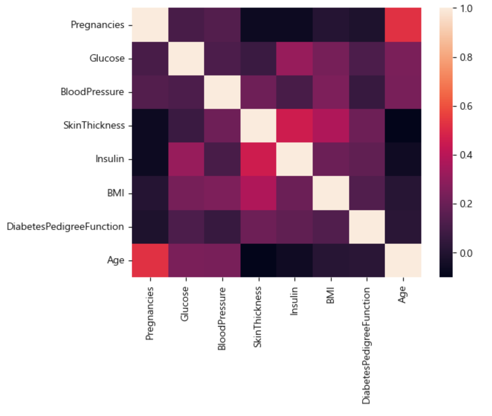
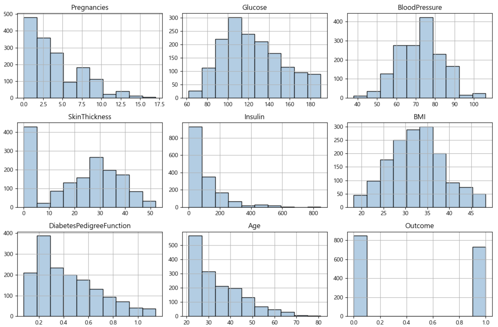
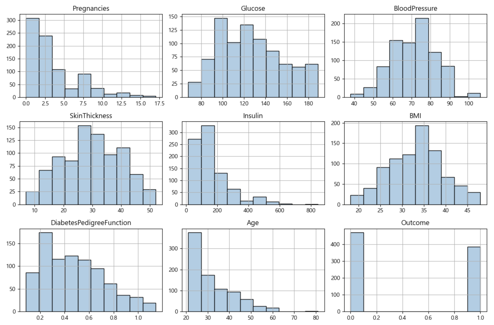
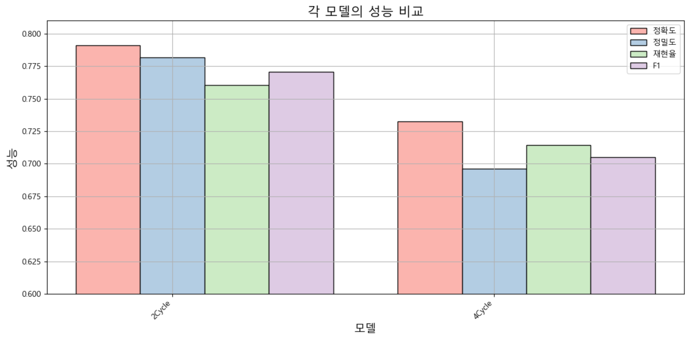
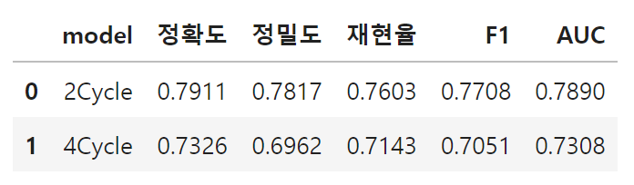
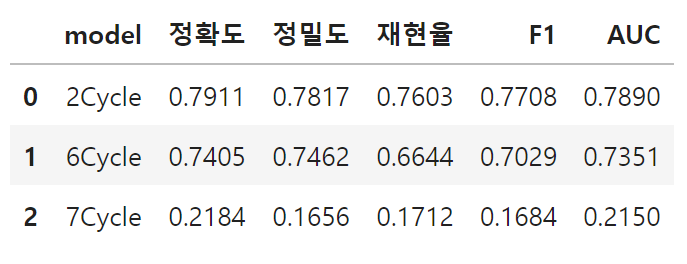
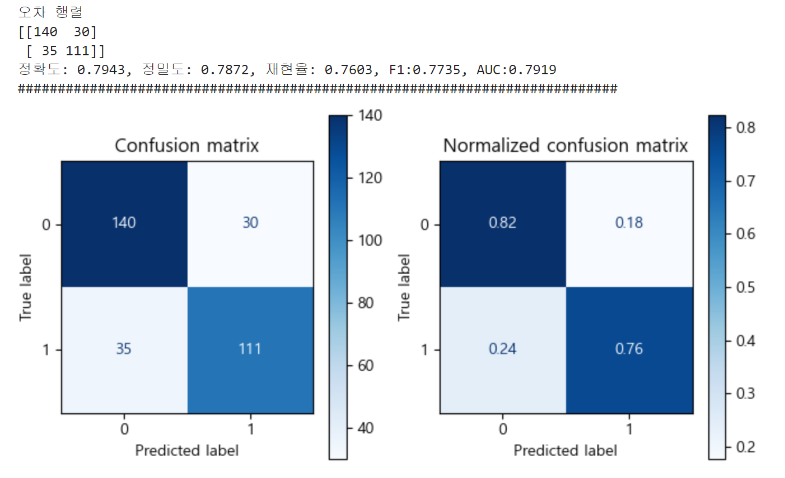
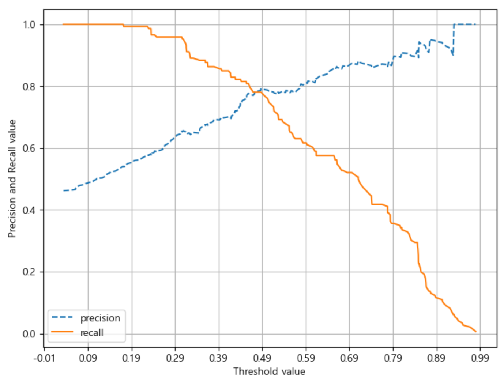
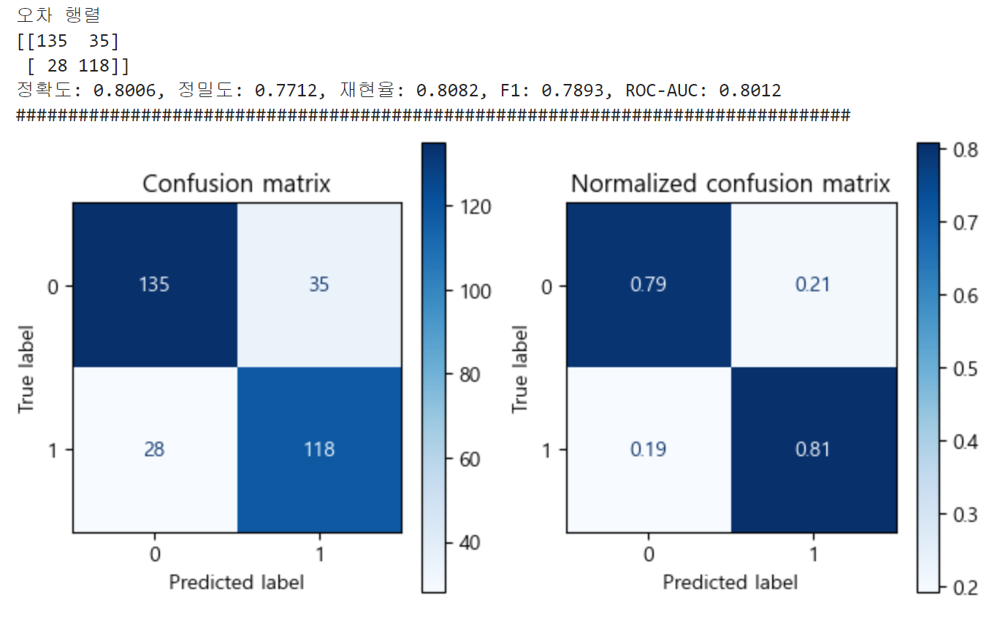
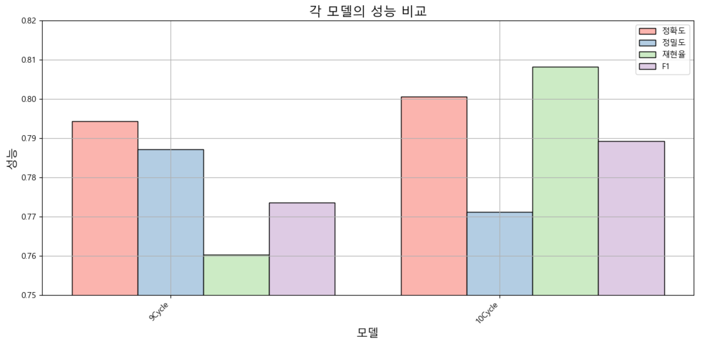

  

  

    

    <b>
      
 Healthcare Diabetes Classifier Project
 
    </b>
     당뇨병 진단 예측
    

  

    

        
        
        
        
        
        
        
      2024. 05. 15.
        
        
        
        
      코리아IT 아카데미 - 송서경
    

  
  
  

  
  
  

<h1> □ 목차</h1>
 

    <a style="color: inherit;" href='#Ⅰ. 개요'>
      
Ⅰ. 개요
  
    </a>
    
1. 목적

    
2. 분석 방법

      
    <a style="color: inherit;" href='#Ⅱ. 분석 결과'>
      
Ⅱ. 분석 결과
  
    </a>
      
1. 데이터 탐색

    
2. 데이터 전처리

    
3. 훈련

      
    <a style="color: inherit;" href='#Ⅲ. 평가'>
      
Ⅲ. 평가
  
    </a>
    
1. 평가 및 개선

  
  
  
  
  

<h1 id="Ⅰ. 개요">Ⅰ. 개요</h1>

1. 데이터 정보

  
□ 당뇨병 진단 데이터 세트

  

    
○ 데이터 출처

    <a herf="https://www.kaggle.com/datasets/nanditapore/healthcare-diabetes">kaggle - Healthcare Diabetes Dataset</a>
  

    

  

    
○ 데이터 정보

    - 파일이름: 당뇨병 진단 데이터 세트  
    - 파일 형식: CSV 파일  
    - 구분: 이진 분류 데이터 세트  
    - 형태: 2768 rows × 10 columns
  

  
  

2. 목적

  
□ 분석 목적

  
○ 다양한 건강 지표와 당뇨병의 관계를 탐색하고 당뇨병 발생 여부를 분석함으로써  &nbsp;&nbsp;&nbsp;&nbsp;당뇨병 발생 여부를 예측하는 모델을 생성

  
○ 예측 모델을 통해 환자의 당뇨병 예방 및 관리의 질 향상

  

3. 분석 방법

  
□ 분석 절차

  

    
○ 분석 프로세스

    - 데이터 분석은 총 4가지 과정을 거쳐 진행함.
      
    <table>
      <tr>
          <td>데이터 탐색</td>
          <td>데이터 전처리</td>
          <td>데이터 훈련</td>
          <td>데이터 평가</td>
      </tr>
      <tr>
          <td>데이터 이해, 문제 인식 및 해결안 도출</td>
          <td>전처리를 통한 데이터의 질 향상</td>
          <td>데이터 훈련을 통해 예측 모델 구축</td>
          <td>데이터 품질 측정 및 개선</td>
      </tr>
    </table>
  

  
  

  
□ 분석 방법

  

  
○ 탐색

  - 데이터 정보 확인을 통한 데이터 이해, 문제 인식 및 해결안 도출
  

    

  

    
○ 전처리

    - 불필요한 데이터 제거, 결측치, 이상치 등 제거를 통한 데이터 질 향상
  

    

  

    
○ 훈련

    - 데이터 훈련 모델을 통한 예측 모델 구축
    <table>
      <tr>
          <td>연번</td>
          <td>모델</td>
      </tr>
      <tr>
          <td>1</td>
          <td>LogisticRegression</td>
      </tr>
    </table>
  

  
    
  
  

    
○ 평가

    - OLS, VIF 등 다양한 평가 지표를 통한 데이터 품질 측정 및 개선  
    - 데이터 평가 점수 산출 방식
    <table>
        <tr>
            <td>연번</td>
            <td> 평가지표</td>
            <td>산출 코드</td>
        </tr>
        <tr>
            <td>1</td>
            <td>accuracy (정확도)</td>
            <td>accuracy_score(y_test , prediction)</td>
        </tr>
        <tr>
            <td>2</td>
            <td>precision (정밀도)</td>
            <td>precision_score(y_test , prediction)</td>
        </tr>
        <tr>
            <td>3</td>
            <td>recall (재현율)</td>
            <td>recall_score(y_test , prediction)</td>
        </tr>
        <tr>
            <td>4</td>
            <td>f1</td>
            <td>f1_score(y_test, prediction)</td>
        </tr>
        <tr>
            <td>5</td>
            <td>roc_auc</td>
            <td>roc_auc_score(y_test, prediction)</td>
        </tr>
    </table>
  

  
  

  
□ 데이터 시나리오

  <table>
    <tr>
        <td>True Positive (TP)</td>
        <td>모델이 양성 환자를 양성으로 올바르게 분류한 경우</td>
    </tr>
    <tr>
        <td>False Positive (FP)</td>
        <td>모델이 음성 환자를 양성으로 잘못 분류한 경우(오진, error I)</td>
    </tr>
    <tr>
        <td>True Negative (TN)</td>
        <td>모델이 음성 환자를 음성으로 올바르게 분류한 경우</td>
    </tr>
    <tr>
        <td>False Negative (FN)</td>
        <td>모델이 양성 환자를 음성으로 잘못 분류한 경우(놓침, error II)</td>
    </tr>
  </table>
   
  정밀도 (Precision): 모델이 양성으로 예측한 환자 중에서 실제로 양성인 환자의 비율을 나타낸다.  
  즉, 음성 클래스로 예측한 결과 중 얼마나 많은 것이 진짜 음성인지 측정한다.
    
  재현율 (Recall): 실제 양성 환자 중에서 모델이 양성으로 정확하게 예측한 환자의 비율을 나타낸다.  
  즉, 모델이 얼마나 많은 양성 환자를 "놓치지 않고" 감지했는지 측정한다.  
    
  양성인 환자를 놓치지 않는 것이 중요하다고 판단되므로, <b>임계치를 낮춰서 재현율을 높여주는 것이 적합하다.</b>

  
  
  
  
  

<h1 id="Ⅱ. 분석 결과">Ⅱ. 분석 결과</h1>

1. 데이터 탐색

  
□ 데이터 기본 정보

  

    
○ 데이터 정보

    <table>
      <tr>
          <td>연번</td>
          <td>컬럼</td>
          <td>내용</td>
          <td>결측치</td>
          <td>타입</td>
      </tr>
      <tr>
          <td>1</td>
          <td>Id</td>
          <td>각 데이터 항목의 고유 식별자</td>
          <td>2768 non-null</td>
          <td>int64</td>
      </tr>
      <tr>
          <td>2</td>
          <td>Pregnancies</td>
          <td>임신 횟수</td>
          <td>2768 non-null</td>
          <td>int64</td>
      </tr>
      <tr>
          <td>3</td>
          <td>Glucose</td>
          <td>경구 포도당 내성 테스트에서 2시간 동안의 혈장 포도당 농도</td>
          <td>2768 non-null</td>
          <td>int64</td>
      </tr>
      <tr>
          <td>4</td>
          <td>BloodPressure</td>
          <td>확장기 혈압(mmHg)</td>
          <td>2768 non-null</td>
          <td>int64</td>
      </tr>
      <tr>
          <td>5</td>
          <td>SkinThickness</td>
          <td>삼두근 피부주름 두께(mm)</td>
          <td>2768 non-null</td>
          <td>int64</td>
      </tr>
      <tr>
          <td>6</td>
          <td>Insulin</td>
          <td>2시간 혈청 인슐린(mu U/ml)</td>
          <td>2768 non-null</td>
          <td>int64</td>
      </tr>
      <tr>
          <td>7</td>
          <td>BMI</td>
          <td>체질량 지수(체중(kg) / 키(m^2))</td>
          <td>2768 non-null</td>
          <td>float64</td>
      </tr>
      <tr>
          <td>8</td>
          <td>DiabetesPedigreeFunction</td>
          <td>당뇨병의 유전적 점수인 당뇨병 혈통 기능</td>
          <td>2768 non-null</td>
          <td>float64</td>
      </tr>
      <tr>
          <td>9</td>
          <td>Age</td>
          <td>나이(년)</td>
          <td>2768 non-null</td>
          <td>int64</td>
      </tr>
      <tr>
          <td>10</td>
          <td>Outcome</td>
          <td>당뇨병의 존재(1) 또는 부재(0)를 나타내는 이진 분류</td>
          <td>2768 non-null</td>
          <td>int64</td>
      </tr>
    </table>
    - 2768개 데이터가 존재하며, 0개의 열로 이루어짐  
    - float64 2개, int64 8개 열이 존재함  
      
      
    
○ 데이터 결측치, 중복행

    - 데이터 결측치 확인 결과 NaN, Null 값 모두 존재하지 않는 것으로 나타남  
    - 중복행 확인 결과 중복행이 존재하지 않는 것으로 나타남  
    - 따라서, 별도의 결측치 및 중복행 제거는 진행하지 않음
      
      
    
○ 데이터 분포

    
      
    - 데이터 분포 확인 결과 이상치로 확인되는 데이터가 보여 수치형 데이터의 이상치 제거가 필요하다고 판단됨  
    - 이상치 제거 후 분포가 고르지 않은 데이터 존재 시 분포 변환이 필요함  
    * 수치형 데이터: 'Glucose', 'BloodPressure', 'SkinThickness', 'BMI', 'DiabetesPedigreeFunction'
      
      
    
○ OLS(최소자승법)

    
      
    - OLS 성능 지표 확인 결과 R2 스코어가 0.18, Durbin-Watson이 0.284으로 나타남  
    - P>|t| 에서도 문제가 있는 것으로 나타남  
    - 이러한 결과로 보아 현재 데이터는 전처리가 필요하다고 판단됨
      
      
    
○ VIF

    
      
    - 현재 일부 피처에서 다중 공산성 문제를 띄고 있는 데이터가 확인됨  
    - 데이터 전처리가 필요할 것으로 보이며, 피처 제거 시 상관관계를 확인한 뒤 제거가 필요함
      
      
    
○ 상관 관계

    
      
    <table>
      <tr>
          <td>연번</td>
          <td>컬럼</td>
          <td>관계성</td>
      </tr>
      <tr>
          <td>1</td>
          <td>Glucose</td>
          <td>0.467377</td>
      </tr>
      <tr>
          <td>2</td>
          <td>BMI</td>
          <td>0.296021</td>
      </tr>
      <tr>
          <td>3</td>
          <td>Age</td>
          <td>0.256421</td>
      </tr>
      <tr>
          <td>4</td>
          <td>Pregnancies</td>
          <td>0.237826</td>
      </tr>
      <tr>
          <td>5</td>
          <td>DiabetesPedigreeFunction</td>
          <td>0.166408</td>
      </tr>
      <tr>
          <td>6</td>
          <td>Insulin</td>
          <td>0.120951</td>
      </tr>
      <tr>
          <td>7</td>
          <td>BloodPressure</td>
          <td>0.077920</td>
      </tr>
      <tr>
          <td>8</td>
          <td>SkinThickness</td>
          <td>0.074868</td>
      </tr>
    </table>
    - Glucose이 약 0.4673의 수치로 타겟과 가장 높은 관계를 가진 것으로 나타남
    - SkinThickness이 약 0.07486의 수치로 타겟과 가장 낮은 관계를 가진 것으로 나타남
    - 타겟과 상관관계가 낮은 피처를 제거하여 다중 공산성 등의 문제를 해결할 수 있을 것이라 판단됨

  

    
    

  
□ 타겟 데이터 정보

  

    
○ 타겟 데이터 분포

    
      
    - 당뇨병 발생 여부를 예측하는 모델을 생성하기 위해 당뇨병의 존재 또는 부재를 나타내는 <b>"Outcome"</b> 컬럼을 타겟 데이터로 지정  
    - 타겟 데이터는 음성(0), 양성(1)의 고유값을 가지며 이진분류 데이로 나타남  
    - 분포는 음성이 65.6%, 양성이 64.4%로 나타났으며, 음성이 비율이 더 높은것으로 나타남에 따라 타겟 under sampling 처리가 필요할 것으로 보임
  

  
  
  

2. 데이터 전처리

  
□ 데이터 전처리

  

    
○ 타겟 비중 (under sampling)

    <code>
      Outcome0 = pre_h_df[pre_h_df.Outcome == 0].sample(952, random_state=124)  
      Outcome1 = pre_h_df[pre_h_df.Outcome == 1]  
      pre_h_df = pd.concat([Outcome0, Outcome1]).reset_index(drop=True)
    </code>  
     
    - 언더 샘플링을 통해 타겟 데이터의 비중을 고르게 맞춰줌
      
      
    
○ 이상치 제거

    <code>from sklearn.preprocessing import StandardScaler</code>
      
    <code>std_pre_h_df = pre_h_df.copy()</code>
    <code>columns = ['Glucose', 'BloodPressure', 'SkinThickness', 'BMI', 'DiabetesPedigreeFunction']</code>
      
    <code>for column in columns:</code>
    <code>std = StandardScaler()</code>
    <code>result = std.fit_transform(pre_h_df[[column]])</code>
    <code>std_pre_h_df[column] = result</code>
      
    <code>for column in columns:</code>
    <code>std_pre_h_df = std_pre_h_df[std_pre_h_df[column].between(-1.96, 1.96)]</code>
      
    <code>pre_h_df = pre_h_df.iloc[std_pre_h_df.index].reset_index(drop=True)</code>
      
    
      
    - 이상치 제거 후 전체적인 데이터 분포가 고르게 나타났으나, SkinThickness와 lnsulin에서 0에 가까운 데이터가 많이 발생하는 이상치를 확인함
      
    <code>test_h_df = pre_h_df[~(pre_h_df.SkinThickness < 5)]</code>
      
    <code>test_h_df = test_h_df[~(test_h_df.Insulin < 5)].reset_index(drop=True)</code>
      
    
    
    
      
    - 이상치 제거 후 전체적인 데이터 분포는 고르게 나타나는 것으로 확인했으나, 오히려 성능이 저하된 것을 확인함  
    - 따라서, SkinThickness와 lnsulin의 특정 데이터는 제거하지 않고 진행함
      
      
    
○ 차원축소

    
    
      
    - 차원축소 PCA(6Cycle), LDA(7Cycle) 결과 오히려 성능이 저하됨에 따라 차원 축소는 진행하지 않음
  

  
  
  

3. 데이터 훈련

  
□ 데이터 훈련

  

    
○ LogisticRegression

    <code>from sklearn.model_selection import train_test_split</code>
    <code>from sklearn.linear_model import LogisticRegression</code>
    <code>from imblearn.over_sampling import SMOTE</code>
      
    <code>features, targets = pre_h_df.iloc[:, :-1], pre_h_df.iloc[:, -1]</code>
      
    <code>X_train, X_test, y_train, y_test = train_test_split(features, targets, test_size=0.2, stratify=targets, random_state=124)</code>
      
    <code>lg = LogisticRegression(solver='liblinear', penalty='l2', random_state=124)</code>
      
    <code>lg.fit(X_train, y_train)</code>
      
    - LogisticRegression 모델에 l2 규제를 사용하여 훈련을 진행함
  

  
  
  
  
  

<h1 id="Ⅲ. 평가">Ⅲ. 평가</h1>

1. 데이터 분석 결과 및 개선

  
□ 데이터 분석 결과 및 개선방안

  

    
○ LogisticRegression

    
    
    <code>LogisticRegression(solver='liblinear', penalty='l2', random_state=124)</code>
      
    - 정확도가 0.7943, 정밀도 0.7872, 재현율 0.7603, F1 0.7735인 예측 모델이 생성됨  
    - 양성인 환자를 놓치지 않는 것이 중요하여 재현율이 높아야 하는데, 현재 모델에서는 정밀도가 더 우세한 것으로 나타남  
    - 임계치 조정을 통해 재현율 점수를 더 향상해야 함
  

  
  

  
□ 데이터 개선

  

    
○ 임계치 조정

    
      
    - 정확도가 0.8006, 정밀도 0.7712, 재현율 0.8082, F1 0.7893인 예측 모델이 생성됨  
    - 임계치를 0.455으로 조정하여 훈련한 결과, 재현율이 상승하였고 정밀도가 이전보다 하락함
  

    

  

    
○ 결과

    
      
    * 9Cycle-임계치 조정 전, 10Cycle-임계치 조정 후
      
    - 이전보다 더 높은 성능의 모델임을 확인하였으므로 임계치가 0.455인 LogisticRegression 모델이 적합하다는 것을 확인함
  

