# Healthcare Diabetes Classifier Project
당뇨병 진단 예측

<br>


<br>

2024.05.15.

<br></br>
<br></br>
<br></br>
<br></br>
<br></br>

# Ⅰ. 프로젝트 개요
## 1. 프로젝트 목표
정확한 당뇨병 진단을 통해 환자가 적절한 치료와 생활 습관 개선을 신속하게 받을 수 있도록 돕기 위해 정확하게 당뇨병 진단 예측할 수 있는 모델 구현

<br></br>
<br></br>

## 2. 프로젝트 기대효과
✔ 환자의 건강 관리 향상
당뇨병을 조기에 정확하게 진단하여 초기에 적절한 치료와 생활 습관 개선을 받을 수 있음

<br>

✔ 의료 자원 효율화  
정확한 진단 예측 모델을 통해 불필요한 검사와 진단 절차를 줄일 수 있어 의료 자원의 효율적인 배분 및 의료 비용 절감 가능

<br></br>
<br></br>

## 3. 데이터 흐름
### ○ 데이터 분석 프로세스

<br>

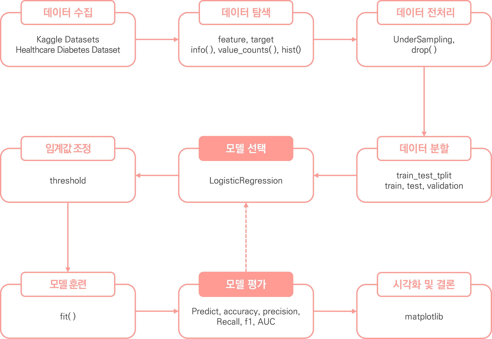


<br></br>
<br></br>

## 4. 데이터 수집
✔ 데이터 정보  
Kaggle의 Healthcare Diabetes Dataset 데이터 세트 활용 (CSV 파일) 
https://www.kaggle.com/datasets/nanditapore/healthcare-diabetes

<br>

✔ 총 데이터 개수: 2768개 데이터

<br>

✔ feature (9개 feature)

| 컬럼명                       | 컬럼 설명                              |
|:-------------------------:|:----------------------------------:|
| Id                        | 각 데이터 항목의 고유 식별자                   |
| Pregnancies               | 임신 횟수                              |
| Glucose                   | 경구 포도당 내성 테스트에서 2시간 동안의 혈장 포도당 농도  |
| BloodPressure             | 장기 혈압(mmHg)                        |
| SkinThickness             | 삼두근 피부주름 두께(mm)                    |
| Insulin                   | 2시간 혈청 인슐린(mu U/ml)                |
| BMI                       | 체질량 지수(체중(kg) / 키(m^2))            |
| DiabetesPedigreeFunction  | 당뇨병의 유전적 점수인 당뇨병 혈통 기능             |
| Age                       | 나이(년)                              |

<br>

✔ target (1개 target)  

| 컬럼명                          | 컬럼 설명              |
|:----------------------------:|:------------------:|
| Outcome  | 당뇨병의 존재(1) 또는 부재(0)를 나타내는 이진 분류  |

<br></br>
<br></br>

## 5. 시나리오
✔ 당뇨병 이 음성환자인지 양성 환자인지 분류하는 의료진단

|                     |                                          |
|:-------------------:|:----------------------------------------:|
| True Negative (TN)  | 양성 환자를 양성으로 올바르게 분류한 경우                  |
| False Negative (FN) | 모델이 음성 환자를 음성으로 올바르게 분류한 경우              |
| True Positive (TP)  | 델이 음성 환자를 양성으로 잘못 분류한 경우 (오진, error I)   |
| False Positive (FP) | 모델이 양성 환자를 음성으로 잘못 분류한 경우 (놓침, error II) |

|                  |                                                                                     |
|:----------------:|:-----------------------------------------------------------------------------------:|
| 정밀도 (Precision)  | 모델이 양성으로 예측한 환자 중에서 실제로 양성인 환자의 비율을 나타냄. 즉, 음성 클래스로 예측한 결과 중 얼마나 많은 것이 진짜 음성인지 측정   |
| 재현율 (Recall)     | 실제 양성 환자 중에서 모델이 양성으로 정확하게 예측한 환자의 비율을 나타냄. 즉, 모델이 얼마나 많은 양성 환자를 "놓치지 않고" 감지했는지 측정  |

<br></br>

### ○ 분석
✔ 양성 환자 놓치지 않는 것이 중요하므로, 임계치를 낮춰서 재현율을 높여주는 것이 적합함

<br></br>
<br></br>
<br></br>
<br></br>
<br></br>

# Ⅱ. 데이터 탐색 및 전처리

## 1. 데이터 탐색
### ○ head

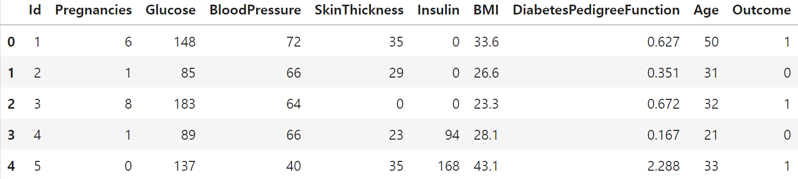
<details>
  <summary>code</summary>

  ```
  # 상위 5개 데이터 확인
  h_df.head()
  ```
</details>

<br></br>

### ○ tail

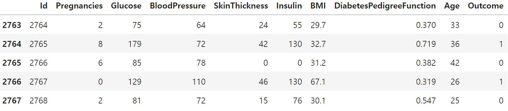
<details>
  <summary>code</summary>

  ```
  # 하위 5개 데이터 확인
  h_df.tail()
  ```
</details>

<br></br>

### ○ 종속변수 비중

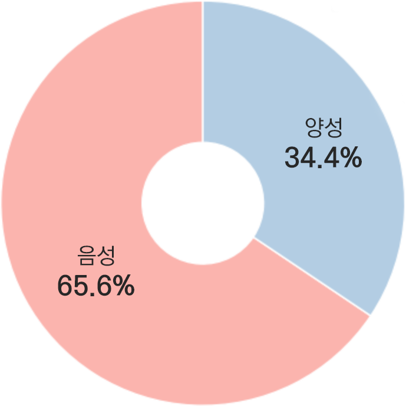

<br></br>

### ○ 데이터 분포


<details>
  <summary>code</summary>

  ```
  # 데이터 분포 확인
  pre_h_df.hist(figsize=(12, 8), color=cmap(np.array([1])), edgecolor='black')

  plt.tight_layout()
  plt.show()
  ```
</details>

<br></br>

### ○ 분석
✔ 이중분류 데이터 세트로 확인

✔ 양성 보다 음성 비율이 더 높은 것으로 나타남

<br></br>
<br></br>

## 2. 전처리
### ○ 결측치
✔ 결측치는 존재하지 않는 것으로 확인

<details>
  <summary>code</summary>

  ```
  # 결측치 확인
  h_df.isna().sum()
  ```
</details>

<br></br>

### ○ null 값
✔ null 값은 존재하지 않는 것으로 확인

<details>
  <summary>code</summary>

  ```
  # null 값 확인
  h_df.isnull().sum()
  ```
</details>

<br></br>

### ○ 중복행
✔ 중복행은 존재하지 않는 것으로 확인

<details>
  <summary>code</summary>

  ```
  # 중복행 확인
  h_df.duplicated().sum()
  ```
</details>

<br></br>

### ○ 컬럼 제거
✔ 분석 및 훈련에 불필요한 ID 피처를 제거하여 진행

<details>
  <summary>code</summary>

  ```
  # 불필요한 데이터 세트 제거 (id 컬럼)
  pre_h_df = h_df.drop(labels='Id', axis=1)
  pre_h_df
  ```
</details>

<br></br>

### ○ UnderSampling
✔ UnderSamplig을 사용하여 음성의 데이터를 양성과 동일하게 함

<details>
  <summary>code</summary>

  ```
  # 언더 샘플링
  Outcome0 = pre_h_df[pre_h_df.Outcome == 0].sample(952, random_state=124)
  Outcome1 = pre_h_df[pre_h_df.Outcome == 1]
  pre_h_df = pd.concat([Outcome0, Outcome1]).reset_index(drop=True)
  ```
</details>

<br></br>
<br></br>
<br></br>
<br></br>
<br></br>

# Ⅲ 머신러닝
## 1. 평가 지표
<table>
    <tr>
        <td>연번</td>
        <td> 평가지표</td>
        <td>산출 코드</td>
    </tr>
    <tr>
        <td>1</td>
        <td>accuracy (정확도)</td>
        <td>accuracy_score(y_test , prediction)</td>
    </tr>
    <tr>
        <td>2</td>
        <td>precision (정밀도)</td>
        <td>precision_score(y_test , prediction)</td>
    </tr>
    <tr>
        <td>3</td>
        <td>recall (재현율)</td>
        <td>recall_score(y_test , prediction)</td>
    </tr>
    <tr>
        <td>4</td>
        <td>f1</td>
        <td>f1_score(y_test, prediction)</td>
    </tr>
    <tr>
        <td>5</td>
        <td>roc_auc</td>
        <td>roc_auc_score(y_test, prediction)</td>
    </tr>
    </table>

<details>
  <summary>code</summary>

  ```
  from sklearn.metrics import accuracy_score, precision_score , recall_score , confusion_matrix, ConfusionMatrixDisplay, f1_score, roc_auc_score
  import matplotlib.pyplot as plt

  def get_evaluation(y_test, prediction, classifier=None, X_test=None):
      confusion = confusion_matrix(y_test, prediction)
      accuracy = accuracy_score(y_test , prediction)
      precision = precision_score(y_test , prediction)
      recall = recall_score(y_test , prediction)
      f1 = f1_score(y_test, prediction)
      roc_auc = roc_auc_score(y_test, prediction)

      print('오차 행렬')
      print(confusion)
      print('정확도: {0:.4f}, 정밀도: {1:.4f}, 재현율: {2:.4f}, F1:{3:.4f}, AUC:{4:.4f}'.format(accuracy , precision ,recall, f1, roc_auc))
      print("#" * 75)
      
      if classifier is not None and  X_test is not None:
          fig, axes = plt.subplots(nrows=1, ncols=2, figsize=(8,4))
          titles_options = [("Confusion matrix", None), ("Normalized confusion matrix", "true")]

          for (title, normalize), ax in zip(titles_options, axes.flatten()):
              disp = ConfusionMatrixDisplay.from_estimator(classifier, X_test, y_test, ax=ax, cmap=plt.cm.Blues, normalize=normalize)
              disp.ax_.set_title(title)
          plt.show()
  ```
</details>

<br></br>
<br></br>

## 2. 1Cycle
### ○ Logistic Regression

<details>
  <summary>code</summary>

  ```
  from sklearn.model_selection import train_test_split
  from sklearn.linear_model import LogisticRegression
  from imblearn.over_sampling import SMOTE

  # 데이터 세트 분리
  # 피처, 타겟 데이터 분리
  features, targets = pre_h_df.iloc[:, :-1], pre_h_df.iloc[:, -1]

  # 문제/정답 및 훈련/테스트 데이터 분리 
  X_train, X_test, y_train, y_test = \
  train_test_split(features, targets, test_size=0.2, stratify=targets, random_state=124)

  # 객체 생성
  # solver: 최적화에 사용되는 알고리즘 (liblinear: 작은 데이터 세트 사용)
  # penalty: 규제 유형 (l2 = L2 규제)
  lg = LogisticRegression(solver='liblinear', penalty='l2', random_state=124)

  # 훈련
  lg.fit(X_train, y_train)

  # 예측
  prediction = lg.predict(X_test)
  ```
</details>

<br></br>

### ○ 예측 및 평가  
#### 오차행렬
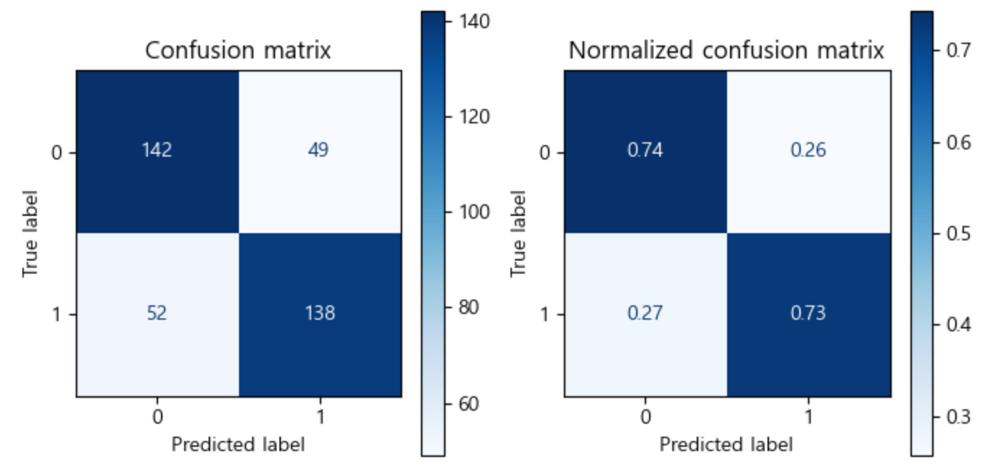

정확도: 0.7349, 정밀도: 0.7380, 재현율: 0.7263, F1:0.7321, AUC:0.7349
<details>
  <summary>code</summary>

  ```
  # 예측
  prediction = l_r.predict(X_test)
  # 평가
  get_evaluation(y_test, prediction)
  ```
</details>

<br>

#### ROC


<details>
  <summary>code</summary>

  ```
  from sklearn.metrics import roc_curve

  def roc_curve_plot(y_test , proba_class1):
  #     임계값에 따른 FPR, TPR 값
      fprs, tprs, thresholds = roc_curve(y_test, proba_class1)

  #     ROC Curve를 plot 곡선으로 그림. 
      plt.plot(fprs , tprs, label='ROC')
  #     가운데 대각선 직선을 그림. 
  #     TPR과 FPR이 동일한 비율로 떨어진다는 것은 모델이 양성과 음성을 구별하지 못한다는 것을 의미한다.
  #     다른 분류기를 판단하기 위한 기준선으로 사용되며, 
  #     대각선에 가까울 수록 예측에 사용하기 힘든 모델이라는 뜻이다.
      plt.plot([0, 1], [0, 1], 'k--', label='Standard')
      
      # X축(FPR)의 Scale을 0.1 단위로 변경
      start, end = plt.xlim()
      plt.xticks(np.round(np.arange(start, end, 0.1),2))
      plt.xlim(0,1); plt.ylim(0,1)
      plt.xlabel('FPR( 1 - Sensitivity )'); plt.ylabel('TPR( Recall )')
      plt.legend()
      plt.show()
      
  roc_curve_plot(y_test, prediction)
  ```
</details>

<br></br>
<br></br>

## 3. 2Cycle
### ○ 기술 통계량 확인

| features                 | count  | mean       | std        | min    | 25%     | 50%     | 75%      | max     |
|:------------------------:|:------:|:----------:|:----------:|:------:|:-------:|:-------:|:--------:|:-------:|
| Pregnancies              | 1904.0 | 3.945378   | 3.468068   | 0.000  | 1.000   | 3.000   | 6.0000   | 17.00   |
| Glucose                  | 1904.0 | 126.065126 | 32.992682  | 0.000  | 102.000 | 123.000 | 147.0000 | 199.00  |
| BloodPressure            | 1904.0 | 69.558298  | 19.410702  | 0.000  | 64.000  | 72.000  | 80.0000  | 122.00  |
| SkinThickness            | 1904.0 | 21.270483  | 16.440816  | 0.000  | 0.000   | 24.000  | 33.0000  | 110.00  |
| Insulin                  | 1904.0 | 84.969013  | 118.537943 | 0.000  | 0.000   | 30.500  | 140.0000 | 846.00  |
| BMI                      | 1904.0 | 32.886817  | 8.054113   | 0.000  | 28.000  | 32.800  | 37.4000  | 80.60   |
| DiabetesPedigreeFunction | 1904.0 | 0.487416   | 0.336787   | 0.078  | 0.246   | 0.391   | 0.6475   | 2.42    |
| Age                      | 1904.0 | 33.975315  | 11.749707  | 21.000 | 24.000  | 30.000  | 41.0000  | 81.00   |
| Outcome                  | 1904.0 | 0.500000   | 0.500131   | 0.000  | 0.000   | 0.500   | 1.0000   | 1.00    |


<details>
  <summary>code</summary>

  ```
  # 데이터 기술 통계량 확인
  pre_h_df.describe().T
  ```
</details>

<br></br>

### ○ 분석
✔  기술 통계량 확인 후 평균값과 중앙값이 차이나는 'Glucose', 'BloodPressure', 'SkinThickness', 'BMI', 'DiabetesPedigreeFunction' 컬럼의 이상치만 제거하기로 함

<br></br>

### ○ 이상치 제거
✔ StandardScaler를 통해 데이터 변환 후 이상치 제거

<details>
  <summary>code</summary>

  ```
  # 수치형 데이터 이상치 제거
  from sklearn.preprocessing import StandardScaler

  std_pre_h_df = pre_h_df.copy()
  columns = ['Glucose', 'BloodPressure', 'SkinThickness', 'BMI', 'DiabetesPedigreeFunction']

  for column in columns:
      # 표준화 객체 생성
      std = StandardScaler()
      # 데이터 표준화 변환
      result = std.fit_transform(pre_h_df[[column]])
      # 표준화 데이터 프레임 생성
      std_pre_h_df[column] = result

  for column in columns:
      # 타겟 데이터 이상치 제거
      std_pre_h_df = std_pre_h_df[std_pre_h_df[column].between(-1.96, 1.96)]

  # 이상치 제거 후 유지되는 인덱스를 대조하여 원본 데이터 이상치 제거
  pre_h_df = pre_h_df.iloc[std_pre_h_df.index].reset_index(drop=True)

  pre_h_df
  ```
</details>

<br></br>

### ○ 데이터 분포
✔ 이상치 제거 후 데이터 분포 확인


<details>
  <summary>code</summary>

  ```
  # 데이터 분포 확인
  pre_h_df.hist(figsize=(12, 8), color=cmap(np.array([1])), edgecolor='black')

  plt.tight_layout()
  plt.show()
  ```
</details>

<br></br>

### ○ 훈련 및 예측, 평가  

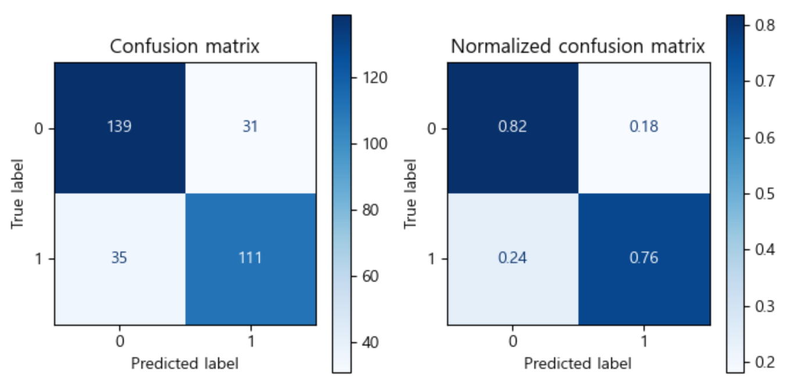

<br>

정확도: 0.7911, 정밀도: 0.7817, 재현율: 0.7603, F1:0.7708, AUC:0.7890

<details>
  <summary>code</summary>

  ```
  from sklearn.model_selection import train_test_split
  from sklearn.linear_model import LogisticRegression
  from imblearn.over_sampling import SMOTE

  # 데이터 세트 분리
  # 피처, 타겟 데이터 분리
  features, targets = pre_h_df.iloc[:, :-1], pre_h_df.iloc[:, -1]

  # 문제/정답 및 훈련/테스트 데이터 분리 
  X_train, X_test, y_train, y_test = \
  train_test_split(features, targets, test_size=0.2, stratify=targets, random_state=124)

  # 객체 생성
  # solver: 최적화에 사용되는 알고리즘 (liblinear: 작은 데이터 세트 사용)
  # penalty: 규제 유형 (l2 = L2 규제)
  lg = LogisticRegression(solver='liblinear', penalty='l2', random_state=124)

  # 훈련
  lg.fit(X_train, y_train)

  # 예측
  prediction = lg.predict(X_test)

  get_evaluation(y_test, prediction, lg, X_test)
  ```
</details>


<br></br>

### ○ 분석
✔ 이상치 제거 후 성능이 향상된 것을 확인함

✔ 최소-최대 스케일링(min-max scaling)을 통해 값을 정규화하여 성능 차이를 비교하기로 함

<br></br>
<br></br>

## 4. 3Cycle
### ○ 훈련 및 예측, 평가  
✔ 최소-최대 스케일링(min-max scaling)을 통해 값을 정규화

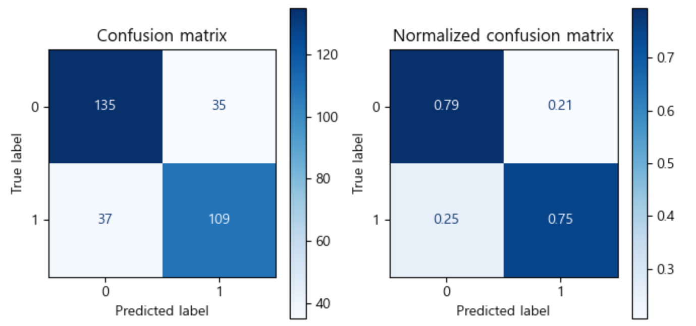

<br>

정확도: 0.7722, 정밀도: 0.7569, 재현율: 0.7466, F1:0.7517, AUC:0.7703

<details>
  <summary>code</summary>

  ```
  from sklearn.model_selection import train_test_split
  from sklearn.linear_model import LogisticRegression
  from imblearn.over_sampling import SMOTE
  from sklearn.preprocessing import MinMaxScaler
  from sklearn.pipeline import Pipeline
  from sklearn.model_selection import GridSearchCV
  from sklearn.model_selection import KFold

  # 데이터 세트 분리
  # 피처, 타겟 데이터 분리
  features, targets = pre_h_df.iloc[:, :-1], pre_h_df.iloc[:, -1]

  # 문제/정답 및 훈련/테스트 데이터 분리 
  X_train, X_test, y_train, y_test = \
  train_test_split(features, targets, test_size=0.2, stratify=targets, random_state=124)

  # 파이프라인 구축
  lg_pipe = Pipeline([('min', MinMaxScaler()), ('lg', LogisticRegression(solver='liblinear', penalty='l2', random_state=124))])

  # 훈련
  lg_pipe.fit(X_train, y_train)

  # 예측
  prediction = lg_pipe.predict(X_test)
  ```
</details>


<br></br>

### ○ 분석
✔ Min-Max Scaling 시 이전 보다 성능이 저하됨에 따라 해당 전처리를 진행하지 않기로 함.

✔ 피처 이상치 제거 후 성능 평가를 진행하기로 함.

<br></br>
<br></br>

## 5. 4Cycle
### ○ 특정 피처 이상치 제거
✔ 특정 피처에서 값이 튀는 이상치를 제거

<details>
  <summary>code</summary>

  ```
  # SkinThickness 이상치 제거
  test_h_df = pre_h_df[~(pre_h_df.SkinThickness < 5)]

  # Insulin 이상치 제거
  test_h_df = test_h_df[~(test_h_df.Insulin < 5)].reset_index(drop=True)
  ```
</details>

<br></br>

### ○ 이상치 제거 후 분포


<details>
  <summary>code</summary>

  ```
  # 데이터 분포 확인
  test_h_df.hist(figsize=(12, 8), color=cmap(np.array([1])), edgecolor='black')

  plt.tight_layout()
  plt.show()
  ```
</details>

<br></br>

### ○ 훈련 및 예측, 평가  
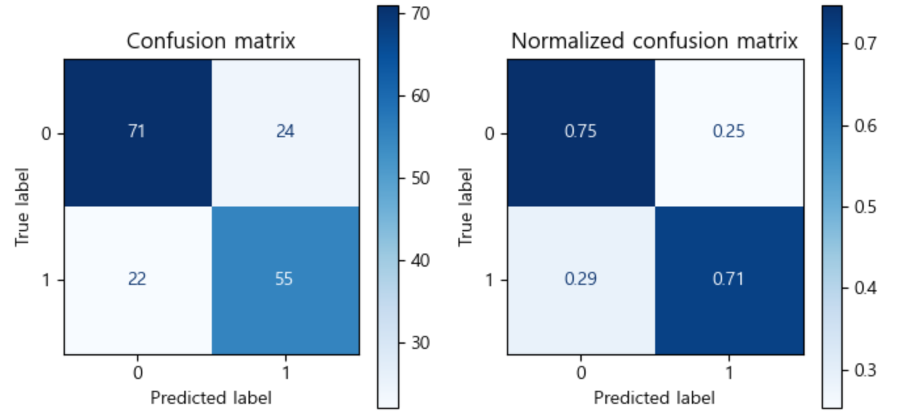

<br>

정확도: 0.7326, 정밀도: 0.6962, 재현율: 0.7143, F1:0.7051, AUC:0.7308

<details>
  <summary>code</summary>

  ```
  from sklearn.model_selection import train_test_split
  from sklearn.linear_model import LogisticRegression

  # 데이터 세트 분리
  # 피처, 타겟 데이터 분리
  features, targets = test_h_df.iloc[:, :-1], test_h_df.iloc[:, -1]

  # 문제/정답 및 훈련/테스트 데이터 분리 
  X_train, X_test, y_train, y_test = \
  train_test_split(features, targets, stratify=targets, test_size=0.2, random_state=124)

  # 객체 생성
  lg = LogisticRegression(solver='liblinear', penalty='l2', random_state=124)

  # 훈련
  lg.fit(X_train, y_train)

  # 예측
  prediction = lg.predict(X_test)

  get_evaluation(y_test, prediction, lg, X_test)
  ```
</details>

<br></br>

### ○ 분석
✔ 특정 피처 이상치 제거 시 오히려 성능이 저하되는 것을 확인함

✔ 해당 전처리는 진행하지 않는 것으로 하며, 분포 변환을 별도로 진행하기로 함

<br></br>
<br></br>

## 6. 5Cycle
### ○ PowerTransformer
✔ 분포가 고르지 않은 일부 피처의 분포 변환

<details>
  <summary>code</summary>

  ```
  from sklearn.preprocessing import PowerTransformer

  # 분포가 고르지 않은 일부 피처의 분포 변환
  columns = ['Insulin']

  # 객체 생성
  ptf = PowerTransformer(standardize=False)

  for column in columns:
      # 분포 변환
      pre_h_df[column] = ptf.fit_transform(pre_h_df[[column]])

  pre_h_df
  ```
</details>

<br></br>

### ○ 훈련 및 예측, 평가  
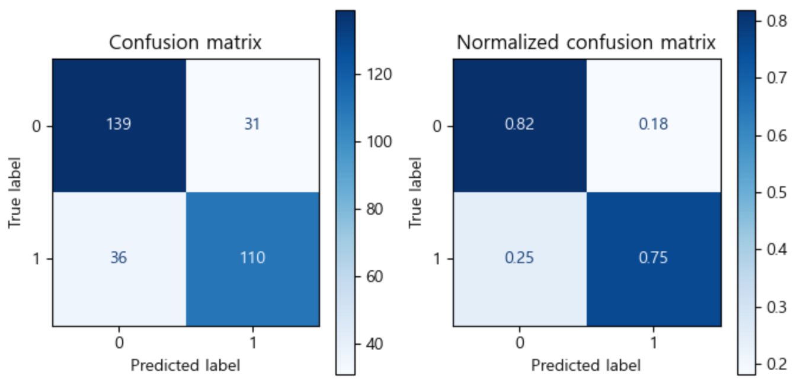

<br>

정확도: 0.7880, 정밀도: 0.7801, 재현율: 0.7534, F1:0.7666, AUC:0.7855

<details>
  <summary>code</summary>

  ```
  from sklearn.model_selection import train_test_split
  from sklearn.linear_model import LogisticRegression

  # 데이터 세트 분리
  # 피처, 타겟 데이터 분리
  features, targets = pre_h_df.iloc[:, :-1], pre_h_df.iloc[:, -1]

  # 문제/정답 및 훈련/테스트 데이터 분리 
  X_train, X_test, y_train, y_test = \
  train_test_split(features, targets, stratify=targets, test_size=0.2, random_state=124)

  # 객체 생성
  lg = LogisticRegression(solver='liblinear', penalty='l2', random_state=124)

  # 훈련
  lg.fit(X_train, y_train)

  # 예측
  prediction = lg.predict(X_test)

  get_evaluation(y_test, prediction, lg, X_test)
  ```
</details>

<br></br>

### ○ 분석
✔ 분포 변환 후 성능이 근소하게 하락함에 따라 해당 전처리를 진행하지 않는 것으로 함

✔ 차원축소 후 성능 평가를 진행하려 함

<br></br>
<br></br>

## 7. 6Cycle
### ○ PCA

✔ 5차원 축소

<details>
  <summary>code</summary>

  ```
  from sklearn.model_selection import train_test_split

  # 데이터 세트 분리
  # 피처, 타겟 데이터 분리
  features, targets = pre_h_df.iloc[:, :-1], pre_h_df.iloc[:, -1]

  # 문제/정답 및 학습/테스트 데이터 분리
  X_train, X_test, y_train, y_test = \
  train_test_split(features, targets, stratify=targets, test_size=0.2, random_state=124)

  # 학습 및 테스트 데이터로 병합
  train_df = pd.concat([X_train, y_train], axis=1).reset_index(drop=True)
  test_df = pd.concat([X_test, y_test], axis=1).reset_index(drop=True)

  from sklearn.decomposition import PCA

  # 차원 축소 객체 생성
  # n_components: 얼마나 차원축소할 건지 작성
  pca = PCA(n_components=5)

  # 타겟을 제외하고 피처만 차원 축소
  pca_train = pca.fit_transform(train_df.iloc[:, :-1])
  pca_test = pca.fit_transform(test_df.iloc[:, :-1])

  # 크기 확인
  print(pca_train.shape, pca_test.shape)

  # train
  # 컬럼명 설정
  pca_columns = [f'pca{i + 1}' for i in range(pca_train.shape[1])]

  # 타겟 데이터 추가
  pca_train_df = pd.DataFrame(pca_train, columns=pca_columns)

  # 타겟 데이터 추가
  pca_train_df.loc[:, 'target'] = train_df['Outcome']

  # test
  # 컬럼명 설정
  pca_columns = [f'pca{i + 1}' for i in range(pca_test.shape[1])]

  # 차원 축소 데이터 프레임 생성
  pca_test_df = pd.DataFrame(pca_test, columns=pca_columns)
  # 타겟 데이터 추가
  pca_test_df.loc[:, 'target'] = test_df['Outcome']
  ```
</details>

<br></br>

### ○ PCA - 보존율 확인
✔ 보존율: 0.9976

<details>
  <summary>code</summary>

  ```
  # 보존률 확인
  # 각각의 피처가 얼만큼 설명하고 있는지
  print(pca.explained_variance_ratio_)
  print(pca.explained_variance_ratio_.sum())
  ```
</details>

<br></br>

### ○ PCA - 훈련 및 예측, 평가  
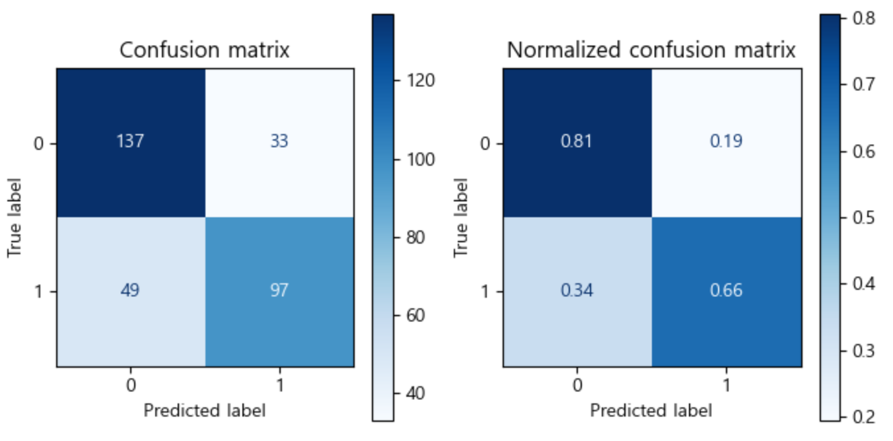

<br>

정확도: 0.7405, 정밀도: 0.7462, 재현율: 0.6644, F1:0.7029, AUC:0.7351

<details>
  <summary>code</summary>

  ```
  from sklearn.model_selection import train_test_split
  from sklearn.linear_model import LogisticRegression

  # 데이터 세트 분리
  # 피처, 타겟 데이터 분리
  features, targets = pca_train_df.iloc[:, :-1], pca_train_df.iloc[:, -1]

  # 테스트 데이터 세트 분리
  X_test, y_test = pca_test_df.iloc[:, :-1], pca_test_df.iloc[:, -1]

  # 객체 생성
  lg = LogisticRegression(solver='liblinear', penalty='l2', random_state=124)

  # 훈련
  lg.fit(features, targets)

  # 예측
  prediction = lg.predict(X_test)

  get_evaluation(y_test, prediction, lg, X_test)
  ```
</details>

<br></br>

### ○ LDA

✔ 1차원 축소

<details>
  <summary>code</summary>

  ```
  from sklearn.model_selection import train_test_split

  # 데이터 세트 분리
  # 피처, 타겟 데이터 분리
  features, targets = pre_h_df.iloc[:, :-1], pre_h_df.iloc[:, -1]

  # 문제/정답 및 학습/테스트 데이터 분리
  X_train, X_test, y_train, y_test = \
  train_test_split(features, targets, stratify=targets, test_size=0.2, random_state=124)

  # 학습 및 테스트 데이터로 병합
  train_df = pd.concat([X_train, y_train], axis=1).reset_index(drop=True)
  test_df = pd.concat([X_test, y_test], axis=1).reset_index(drop=True)

  from sklearn.discriminant_analysis import LinearDiscriminantAnalysis

  # 차원 축소 객체 생성
  # n_components: 얼마나 차원축소할 건지 작성
  lda = LinearDiscriminantAnalysis(n_components=1)

  # 타겟을 제외하고 피처만 차원 축소
  lda_train = lda.fit_transform(train_df.iloc[:, :-1], train_df.iloc[:, -1])
  lda_test = lda.fit_transform(test_df.iloc[:, :-1], test_df.iloc[:, -1])

  # 크기 확인
  print(lda_train.shape, lda_test.shape)

  # train
  # 컬럼명 설정
  lda_columns = [f'lda{i + 1}' for i in range(lda_train.shape[1])]

  # 차원 축소 데이터 프레임 생성
  lda_train_df = pd.DataFrame(lda_train, columns=lda_columns)
  # 타겟 데이터 추가
  lda_train_df.loc[:, 'target'] = train_df['Outcome']

  # test
  # 컬럼명 설정
  lda_columns = [f'lda{i + 1}' for i in range(lda_test.shape[1])]

  # 차원 축소 데이터 프레임 생성
  lda_test_df = pd.DataFrame(lda_test, columns=lda_columns)
  # 타겟 데이터 추가
  lda_test_df.loc[:, 'target'] = test_df['Outcome']
  ```
</details>

<br></br>

### ○ LDA - 보존율 확인
✔ 보존율: 1.0

<details>
  <summary>code</summary>

  ```
  # 보존률 확인
  # 각각의 피처가 얼만큼 설명하고 있는지
  print(lda.explained_variance_ratio_)
  print(lda.explained_variance_ratio_.sum())
  ```
</details>

<br></br>

### ○ LDA - 훈련 및 예측, 평가  
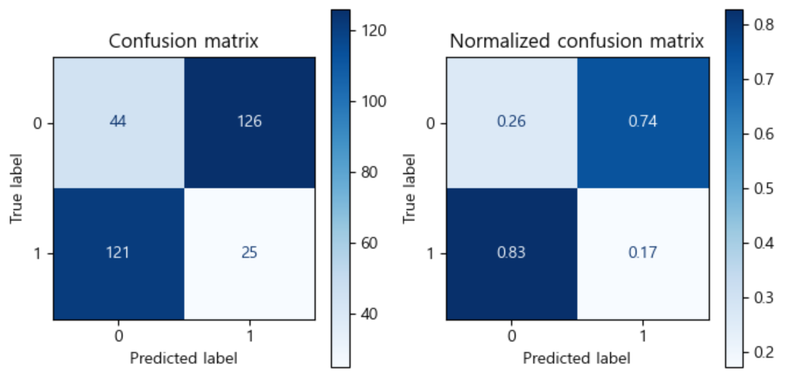

<br>

정확도: 0.7405, 정밀도: 0.7462, 재현율: 0.6644, F1:0.7029, AUC:0.7351

<details>
  <summary>code</summary>

  ```
  from sklearn.model_selection import train_test_split
  from sklearn.linear_model import LogisticRegression

  # 데이터 세트 분리
  # 피처, 타겟 데이터 분리
  features, targets = lda_train_df.iloc[:, :-1], lda_train_df.iloc[:, -1]

  # 테스트 데이터 세트 분리
  X_test, y_test = lda_test_df.iloc[:, :-1], lda_test_df.iloc[:, -1]

  # 객체 생성
  lg = LogisticRegression(solver='liblinear', penalty='l2', random_state=124)

  # 훈련
  lg.fit(features, targets)

  # 예측
  prediction = lg.predict(X_test)

  get_evaluation(y_test, prediction, lg, X_test)
  ```
</details>

<br></br>

### ○ 분석
✔ 차원축소 진행 후 성능이 많이 하락한 것을 확인할 수 있음

✔ 상관관계, 다중 공산성 등을 확인하여 전처리 진행 후 성능 평가를 진행하고자 함

<br></br>
<br></br>

## 8. 7Cycle
### ○ OLS

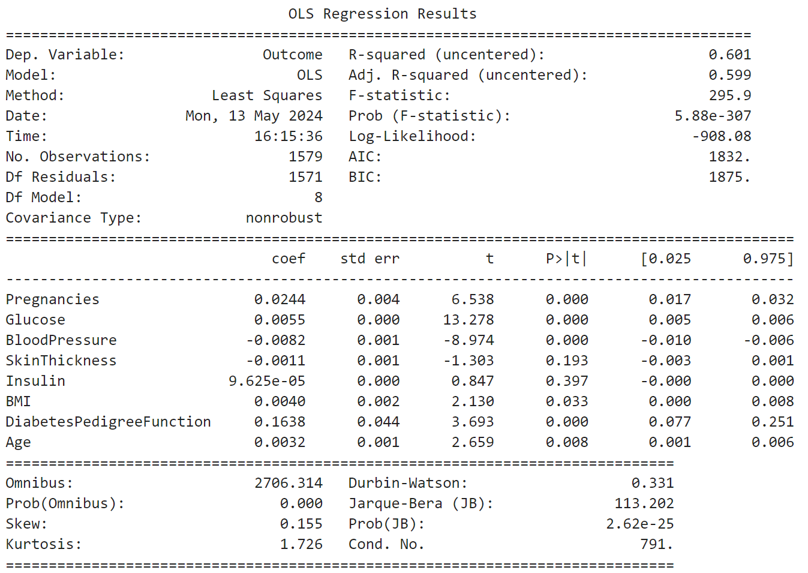

<details>
  <summary>code</summary>

  ```
  from statsmodels.api import OLS

  # 데이터 세트 분리
  # 피처, 타겟 데이터 분리
  features, targets = pre_h_df.iloc[:, :-1], pre_h_df.iloc[:, -1]

  # 객체 생성
  model = OLS(targets, features)
  # 훈련 및 정보 출력
  print(model.fit().summary())
  ```
</details>

<br></br>

### ○ VIF

| vif_score | features                  |
|:---------:|:-------------------------:|
| 3.298600  | Pregnancies               |
| 23.676345 | Glucose                   |
| 37.887663 | BloodPressure             |
| 4.412035  | SkinThickness             |
| 2.372232  | Insulin                   |
| 32.986982 | BMI                       |
| 4.202315  | DiabetesPedigreeFunction  |
| 15.639765 | Age                       |

<details>
  <summary>code</summary>

  ```
  from statsmodels.stats.outliers_influence import variance_inflation_factor

  def get_vif(features):
      vif = pd.DataFrame()
      vif['vif_score'] = [variance_inflation_factor(features.values, i) for i in range(features.shape[1])]
      vif['features'] = features.columns
      return vif

  # 다중 공산성 확인
  get_vif(features)
  ```
</details>

<br></br>

### ○ 상관관계
DiabetesPedigreeFunction
| features                  | corr    |
|:-------------------------:|:-------:|
| Glucose                   | 0.502442  |
| Age                       | 0.298462  |
| BMI                       | 0.291449  |
| Pregnancies               | 0.266905  |
| BloodPressure  | 0.190834  |
| DiabetesPedigreeFunction                   | 0.167986  |
| Insulin             | 0.161790  |
| SkinThickness             | 0.060222  |

<details>
  <summary>code</summary>

  ```
  # 상관관계 확인
  pre_h_df.corr()['Outcome'].sort_values(ascending=False)[1:]
  ```
</details>

<br></br>

### ○ 상관관계 (히트맵)

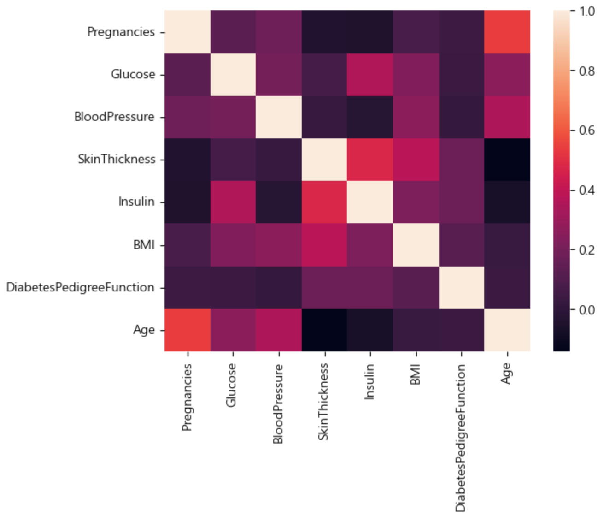

<details>
  <summary>code</summary>

  ```
  import seaborn as sns

  sns.heatmap(features.corr())
  plt.show()
  ```
</details>

<br></br>

### ○ 분석
✔ 종속변수와 상관관계가 가장 낮은 SkinThickness를 제거

<br></br>

### ○ 훈련 및 예측, 평가  
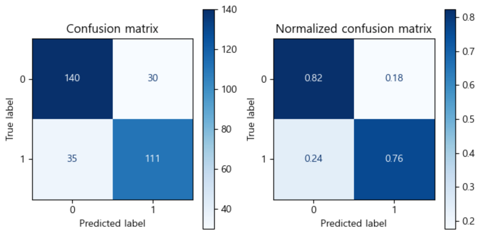

<br>

정확도: 0.7943, 정밀도: 0.7872, 재현율: 0.7603, F1:0.7735, AUC:0.7919

<details>
  <summary>code</summary>

  ```
  from sklearn.model_selection import train_test_split
  from sklearn.linear_model import LogisticRegression
  from imblearn.over_sampling import SMOTE

  # 데이터 세트 분리
  # 피처, 타겟 데이터 분리
  features, targets = pre_h_df.iloc[:, :-1], pre_h_df.iloc[:, -1]

  # 문제/정답 및 훈련/테스트 데이터 분리 
  X_train, X_test, y_train, y_test = \
  train_test_split(features, targets, test_size=0.2, stratify=targets, random_state=124)

  # 객체 생성
  # solver: 최적화에 사용되는 알고리즘 (liblinear: 작은 데이터 세트 사용)
  # penalty: 규제 유형 (l2 = L2 규제)
  lg = LogisticRegression(solver='liblinear', penalty='l2', random_state=124)

  # 훈련
  lg.fit(X_train, y_train)

  # 예측
  prediction = lg.predict(X_test)

  get_evaluation(y_test, prediction, lg, X_test)
  ```
</details>

<br></br>

### ○ 분석
✔ 상관관계 등 다양한 지표 확인 후 관계가 낮은 피처를 제거한 결과 성능이 향상된 것을 확인함

✔ 전처리된 데이터를 토대로 임계값을 조정하려 함

<br></br>
<br></br>

## 9. 8Cycle
### ○ Precision-Recall Curve
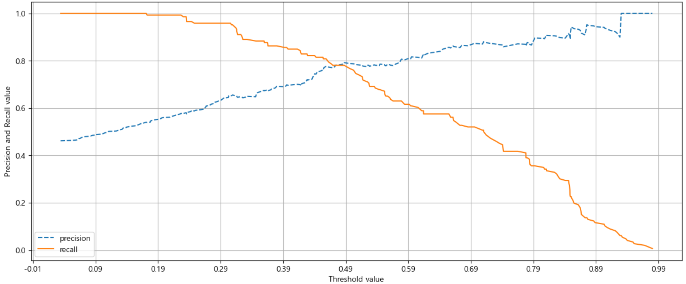

<details>
  <summary>code</summary>

  ```
  import matplotlib.pyplot as plt
  import matplotlib.ticker as ticker
  from sklearn.metrics import precision_recall_curve

  def precision_recall_curve_plot(y_test , prediction_proba_class1):

      precisions, recalls, thresholds = precision_recall_curve(y_test, prediction_proba_class1)
      
      # X축: threshold
      # Y축: 정밀도, 재현율 
      # 정밀도는 점선으로 표시
      plt.figure(figsize=(15,6))
      threshold_boundary = thresholds.shape[0]
      plt.plot(thresholds, precisions[0:threshold_boundary], linestyle='--', label='precision')
      plt.plot(thresholds, recalls[0:threshold_boundary],label='recall')
      
      # X축(threshold)의 Scale을 0 ~ 1 단위로 변경
      start, end = plt.xlim()
      plt.xticks(np.round(np.arange(start, end, 0.1),2))
      
      plt.xlabel('Threshold value'); plt.ylabel('Precision and Recall value')
      plt.legend()
      plt.grid()
      plt.show()
      
  precision_recall_curve_plot(y_test, lg.predict_proba(X_test)[:, 1] )
  ```
</details>

<br></br>

### ○ 임계값 확인
<details>
  <summary>code</summary>

  ```
  # 임계값 확인
  _, _, thresholds = precision_recall_curve(y_test, lg.predict_proba(X_test)[:, 1])
  thresholds
  ```
</details>

<br></br>

### ○ 임계값 조정
<details>
  <summary>code</summary>

  ```
  from sklearn.preprocessing import Binarizer
  def get_evaluation_by_thresholds(y_test, prediction_proba_class1, thresholds):
      
      for threshold in thresholds:
          binarizer = Binarizer(threshold=threshold).fit(prediction_proba_class1) 
          custom_prediction = binarizer.transform(prediction_proba_class1)
          print('임곗값:', threshold)
          get_evaluation(y_test, custom_prediction)
  ```
</details>
<details>
  <summary>code</summary>

  ```
  # 임계값 조정
  get_evaluation_by_thresholds(y_test, lg.predict_proba(X_test)[:, 1].reshape(-1, 1), thresholds)
  ```
</details>

<br></br>

### ○ 분석
임곗값: 0.45512107042853733  
오차 행렬  
[[136  34]  
 [ 28 118]]  
**정확도: 0.8038, 정밀도: 0.7763, 재현율: 0.8082, F1:0.7919, AUC:0.8041**

<br>

✔ 재현율을 높여주는 임계값 선택

<br></br>

### ○ 훈련 및 예측, 평가  

정확도: 0.8006, 정밀도: 0.7712, 재현율: 0.8082, F1: 0.7893, ROC-AUC: 0.8012

<details>
  <summary>code</summary>

  ```
  from sklearn.metrics import accuracy_score, precision_score, recall_score, f1_score, roc_auc_score, confusion_matrix, ConfusionMatrixDisplay

  # 타겟 데이터와 예측 객체를 전달받는다.
  def get_evaluation_by_custom_proba(y_test, prediction, visualize=False):
  #     오차 행렬
      confusion = confusion_matrix(y_test, prediction)
  #     정확도
      accuracy = accuracy_score(y_test , prediction)
  #     정밀도
      precision = precision_score(y_test , prediction)
  #     재현율
      recall = recall_score(y_test , prediction)
  #     F1 score
      f1 = f1_score(y_test, prediction)
  #     ROC-AUC
      roc_auc = roc_auc_score(y_test, prediction)
      
      print('오차 행렬')
      print(confusion)
      print('정확도: {0:.4f}, 정밀도: {1:.4f}, 재현율: {2:.4f}, F1: {3:.4f}, ROC-AUC: {4:.4f}'.format(accuracy, precision, recall, f1, roc_auc))
      print("#" * 80)
      
      if visualize:
          fig, axes = plt.subplots(nrows=1, ncols=2, figsize=(8,4))
          titles_options = [("Confusion matrix", None), ("Normalized confusion matrix", "true")]

          for (title, normalize), ax in zip(titles_options, axes.flatten()):
              disp = ConfusionMatrixDisplay.from_predictions(y_test, prediction, ax=ax, cmap=plt.cm.Blues, normalize=normalize)
              disp.ax_.set_title(title)
          plt.show()
  ```
</details>
<details>
  <summary>code</summary>

  ```
  binarizer = Binarizer(threshold=0.455)
  custom_prediction = binarizer.fit_transform(lg.predict_proba(X_test)[:, 1].reshape(-1, 1))
  get_evaluation_by_custom_proba(y_test, custom_prediction, True)
  ```
</details>

<br></br>

### ○ 오차행렬  


<br></br>

### ○ ROC
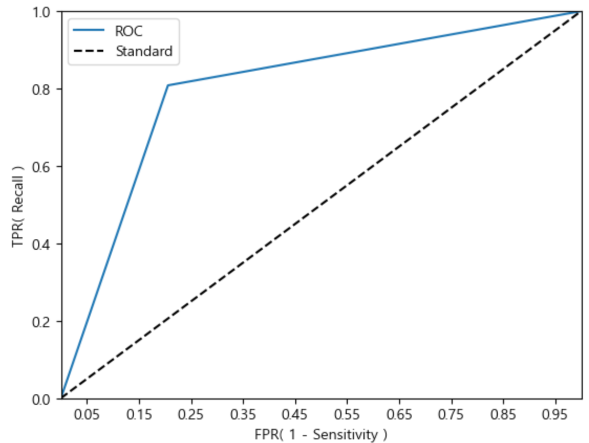

<br></br>

### ○ 분석
✔ 재현율을 높이기 위해 임계값을 조정한 결과 정밀도는 약간 하락하였지만, 전체적인 수치는 향상된 것을 확인함

✔ 정확도가 0.8정도가 나오는 것으로 보아 신뢰성이 있는 모델이라고 판단됨.

<br></br>
<br></br>
<br></br>
<br></br>
<br></br>

# Ⅳ 결론
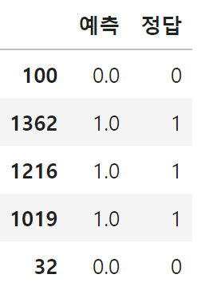

<br></br>

### ○ 분석
✔ 최종 모델을 통해 예측을 진행한 결과 정확하게 예측하고 있음을 확인함