# Medical Insurance Regression Project
의료 보험비 회귀 예측

<br>


<br>

2024.05.15.

<br></br>
<br></br>
<br></br>
<br></br>
<br></br>

# Ⅰ. 프로젝트 개요
## 1. 프로젝트 목표
의료보험 청구 비용의 정확성과 효율성을 향상시키기 위해 의료보험 비용을 정확히 예측할 수 있는 모델 구현

<br></br>
<br></br>

## 2. 프로젝트 기대효과
✔ 비용 예측 정확성 향상  
정확성 향상으로 청구 비용을 신뢰성 있게 예측함으로 보험 회사는 재정적 안정성을 향상

<br>

✔ 고객 맞춤형 서비스 제공  
신규 고객의 비용을 예측하여 맞춤형 보험 상품과 서비스를 제공함으로써, 고객 만족도를 높이고 신규 고객을 효과적으로 유치

<br></br>
<br></br>

## 3. 데이터 흐름
### ○ 데이터 분석 프로세스

<br>

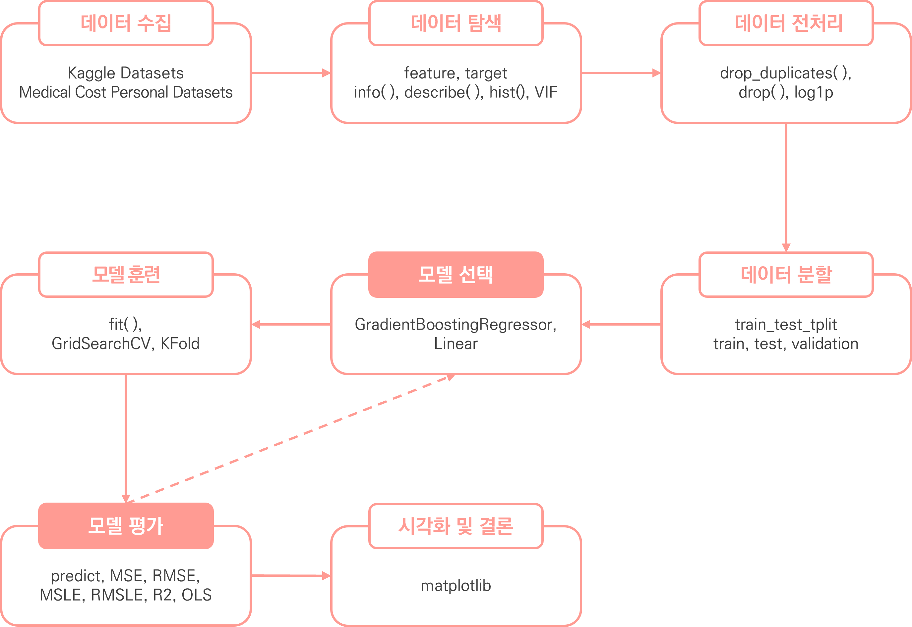


<br></br>
<br></br>

## 4. 데이터 수집
✔ 데이터 정보  
Kaggle의 Medical Cost Personal Datasets 데이터 세트 활용 (CSV 파일)  
https://www.kaggle.com/datasets/mirichoi0218/insurance/data

<br>

✔ 총 데이터 개수: 2772개 데이터

<br>

✔ feature (6개 feature)

| 컬럼명       | 컬럼 설명                                    |
|:---------:|:----------------------------------------:|
| age       | 주요 수혜자의 나이                               |
| sex       | 보험계약자 성별(여성, 남성)                         |
| bmi       | 신체에 대한 이해를 제공하는 체질량지수 (이상적으로  18.5~24.9) |
| children  | 건강보험 적용 자녀 수 / 부양가족 수                    |
| smoker    | 흡연                                       |
| regoin    | 미국 내 수혜자의 주거 지역 (북동부, 남동부, 남서부, 북서부)     |

<br>

✔ target (1개 target)  

| 컬럼명                          | 컬럼 설명              |
|:----------------------------:|:------------------:|
| charges  | 건강보험에서 청구하는 개인의료비  |

<br></br>
<br></br>
<br></br>
<br></br>
<br></br>

# Ⅱ. 데이터 탐색 및 전처리

## 1. 데이터 탐색
### ○ head

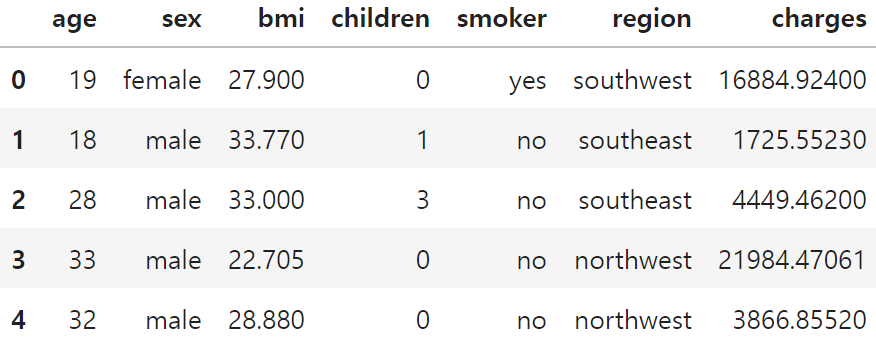
<details>
  <summary>code</summary>

  ```
  # 상위 5개 데이터 확인
  m_df.head()
  ```
</details>

<br></br>

### ○ tail

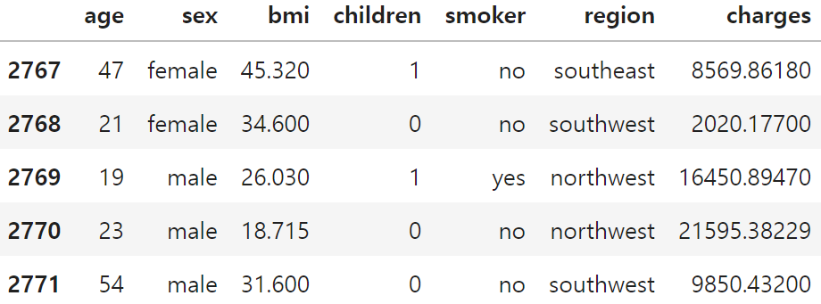
<details>
  <summary>code</summary>

  ```
  # 하위 5개 데이터 확인
  m_df.tail()
  ```
</details>

<br></br>

### ○ 범주형 데이터 비중

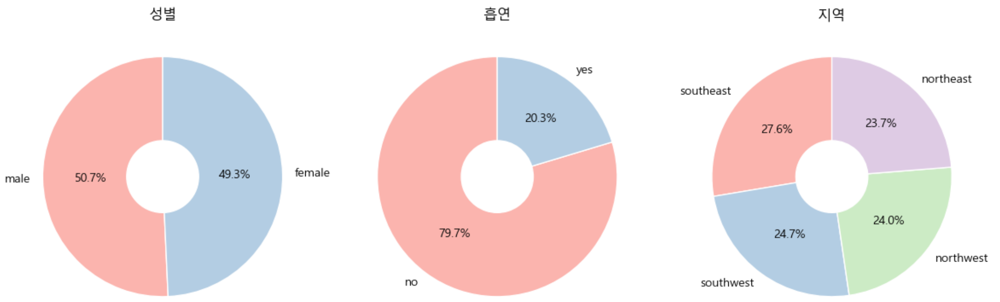

<br></br>

### ○ 수치형 데이터 분포


<br></br>

### ○ 분석
✔ 상/하위 다섯개 데이터를 확인한 결과 object 형식의 데이터 확인

✔ 성별 및 지역 비중은 거의 유사하나 흡연자의 비중이 차이남을 확인

✔ BMI를 제외한 모든 컬럼의 분포가 고르지 못한 것을 확인


<br></br>
<br></br>

## 2. 전처리
### ○ 결측치
✔ 결측치는 존재하지 않는 것으로 확인

<details>
  <summary>결측치 확인 code</summary>

  ```
  # 결측치 확인
  m_df.isna().sum()
  ```
</details>

<br></br>

### ○ 중복행
✔ 1435개 중복행 제거

<details>
  <summary>중복행 확인 code</summary>

  ```
  # 중복행 확인
  m_df.duplicated().sum()
  ```
</details>
<details>
  <summary>중복행 제거 code</summary>

  ```
  # 중복행 제거
  pre_m_df = m_df.drop_duplicates().reset_index(drop=True)
  # 중복행 제거 확인
  pre_m_df.duplicated().sum()
  ```
</details>

<br></br>

### ○ LabelEncoder
✔ 데이터 정보 확인 결과 object 형식의 3개 열이 확인됨  
✔ LabelEncoder를 통해 정수로 변환함

<details>
  <summary>LabelEncoder code</summary>

  ```
  from sklearn.preprocessing import LabelEncoder

  # 데이터 프레임 복제
  enc_m_df = pre_m_df.copy()
  encoders = {}

  # 문자열 컬럼 추출
  columns = ['sex', 'region', 'smoker']

  # 반복하여 컬럼 인코딩 처리:
  for column in columns:
      # 레이블인코더 객체 생성
      encoder = LabelEncoder()
      # 문자열 데이터 정수로 형변환
      result = encoder.fit_transform(enc_m_df[column])
      # 형변환 값으로 대체
      enc_m_df[column] = result
      # 원본 데이터 담기
      encoders[column] = encoder.classes_

  # 원본 데이터 확인
  print(encoders)
  ```
</details>

<br></br>
<br></br>
<br></br>
<br></br>
<br></br>

# Ⅲ 머신러닝
## 1. 평가 지표
<table>
  <tr>
      <td>연번</td>
      <td> 평가지표</td>
      <td>산출 코드</td>
  </tr>
  <tr>
      <td>1</td>
      <td>MSE</td>
      <td>mean_squared_error(y_test, prediction)</td>
  </tr>
  <tr>
      <td>2</td>
      <td>RMSE</td>
      <td>np.sqrt(MSE)</td>
  </tr>
  <tr>
      <td>3</td>
      <td>R2</td>
      <td>r2_score(y_test, prediction)</td>
  </tr>
</table>

<details>
  <summary>code</summary>

  ```
  import numpy as np
  from sklearn.metrics import mean_squared_log_error, mean_squared_error, r2_score

  def get_evaluation(y_test, prediction):
      MSE = mean_squared_error(y_test, prediction)
      RMSE = np.sqrt(MSE)
      R2 = r2_score(y_test, prediction)
      print('MSE: {:.4f}, RMSE: {:.4f}, R2: {:.4f}'\
          .format(MSE, RMSE, R2))
  ```
</details>

<br></br>
<br></br>

## 2. 1Cycle
### ○ 선형 회귀 - 훈련

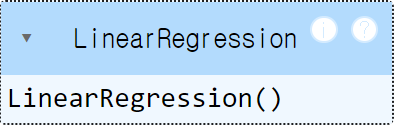

<details>
  <summary>code</summary>

  ```
  import numpy as np
  from sklearn.linear_model import LinearRegression
  from sklearn.model_selection import train_test_split

  # 데이터 세트 분리
  # 피처, 타겟 데이터 분리
  features, targets = enc_m_df.iloc[:, :-1], enc_m_df.iloc[:, -1]

  # 학습/테스트 및 문제/정답 데이터 세트 분리a
  X_train, X_test, y_train, y_test = \
  train_test_split(features, targets, test_size=0.2, random_state=124)

  # 선형 회귀 모델
  l_r = LinearRegression()
  # 훈련
  l_r.fit(X_train, y_train)
  ```
</details>

<br></br>

### ○ 선형 회귀 - 예측 및 평가  
MSE: 36313339.4238, RMSE: 6026.0550, R2: 0.7724
<details>
  <summary>code</summary>

  ```
  # 예측
  prediction = l_r.predict(X_test)
  # 평가
  get_evaluation(y_test, prediction)
  ```
</details>

<br></br>

### ○ 다중 회귀 - 훈련


<details>
  <summary>code</summary>

  ```
  import numpy as np
  from sklearn.linear_model import LinearRegression
  from sklearn.model_selection import train_test_split
  from sklearn.preprocessing import PolynomialFeatures

  # 데이터 세트 분리
  # 피처, 타겟 데이터 분리
  features, targets = enc_m_df.iloc[:, :-1], enc_m_df.iloc[:, -1]

  # 차원 확장 (3차원)
  poly_features = PolynomialFeatures(degree=3).fit_transform(features)

  # 학습/테스트 및 문제/정답 데이터 세트 분리
  X_train, X_test, y_train, y_test = \
  train_test_split(poly_features, targets, test_size=0.2, random_state=124)

  # 선형 회귀 모델
  l_r = LinearRegression()
  # 훈련
  l_r.fit(X_train, y_train)
  ```
</details>

<br></br>

### ○ 다중 회귀 - 예측 및 평가  
MSE: 26287759.2292, RMSE: 5127.1590, R2: 0.8352
<details>
  <summary>code</summary>

  ```
  # 예측
  prediction = l_r.predict(X_test)
  # 평가
  get_evaluation(y_test, prediction)
  ```
</details>

<br></br>

### ○ 회귀 모델 - 훈련 및 예측, 평가  
DecisionTreeRegressor  
MSE: 36015820.4909, RMSE: 6001.3182, R2: 0.7742

<br>

RandomForestRegressor  
MSE: 23702452.1780, RMSE: 4868.5164, R2: 0.8514

<br>

GradientBoostingRegressor  
MSE: 21460319.2537, RMSE: 4632.5284, R2: 0.8655

<br>

XGBRegressor  
MSE: 26010709.3759, RMSE: 5100.0695, R2: 0.8369

<br>

LGBMRegressor  
MSE: 23057650.3301, RMSE: 4801.8382, R2: 0.855

<details>
  <summary>code</summary>

  ```
  from sklearn.tree import DecisionTreeRegressor
  from sklearn.ensemble import RandomForestRegressor
  from sklearn.ensemble import GradientBoostingRegressor
  from xgboost import XGBRegressor
  from lightgbm import LGBMRegressor
  from sklearn.model_selection import train_test_split

  # 데이터 세트 분리
  # 피처, 타겟 데이터 분리
  features, targets = enc_m_df.iloc[:, :-1], enc_m_df.iloc[:, -1]

  # 학습/테스트 및 문제/정답 데이터 세트 분리
  X_train, X_test, y_train, y_test = \
  train_test_split(features, targets, test_size=0.2, random_state=124)

  # 회귀 모델 담기
  dt_r = DecisionTreeRegressor(random_state=124)
  rf_r = RandomForestRegressor(random_state=124, n_estimators=1000)
  gb_r = GradientBoostingRegressor(random_state=124)
  xgb_r = XGBRegressor(random_state=124)
  lgb_r = LGBMRegressor(random_state=124)

  models = [dt_r, rf_r, gb_r, xgb_r, lgb_r]

  # 모델 별 학습 진행:
  for model in models:
      # 모델 학습
      model.fit(X_train, y_train)
      # 예측
      prediction = model.predict(X_test)
      # 모델명 출력 (모델명과 평가 결과가 같이 출력되도록)
      print(model.__class__.__name__)
      # 평가
      get_evaluation(y_test, prediction)
  ```
</details>

<br></br>

### ○ 분석
✔ 선형 패턴을 지니고 있다고 판단되나 회귀 모델 분석 시 R2 점수가 0.74로 상승함에 따라 완전한 선형은 아니고 비선형의 패턴도 띄고 있음을 확인함

✔ 회귀 모델 중 GradientBoostingRegressor을 사용하였을 때, 가장 좋은 성능을 보임에 따라 해당 모델을 선택하는 것이 적합하다고 판단됨

<br></br>
<br></br>

## 3. 2Cycle
### ○ 이상치 제거
✔ StandardScaler를 통해 데이터 변환 후 이상치 제거

<details>
  <summary>code</summary>

  ```
  # 타겟 데이터 이상치 제거
  from sklearn.preprocessing import StandardScaler

  # 표준화 객체 생성
  std = StandardScaler()
  # 데이터 표준화 변환
  std_result = std.fit_transform(enc_m_df[['charges']])
  # 표준화 데이터 프레임 생성
  std_m_df = pd.DataFrame(std_result, columns=['charges'])

  # 타겟 데이터 이상치 제거
  std_m_df = enc_m_df[std_m_df.charges.between(-1.96, 1.96)]

  # 이상치 제거후 유지되는 인덱스를 대조하여 원본 데이터 이상치 제거
  pstd_m_df = enc_m_df.iloc[std_m_df.index].reset_index(drop=True)
  ```
</details>

<br></br>

### ○ 종속 변수 분포
✔ 이상치 제거 후 종속 변수 분포 확인


<details>
  <summary>code</summary>

  ```
  # 종속 변수 분포 확인
  pstd_m_df.charges.hist(color=cmap(np.array([1])), edgecolor='black')
  ```
</details>

<br></br>

### ○ 훈련 및 예측, 평가  

GradientBoostingRegressor  
MSE: 15433277.2944, RMSE: 3928.5210, R2: 0.6713

<details>
  <summary>code</summary>

  ```
  from sklearn.ensemble import GradientBoostingRegressor
  from sklearn.model_selection import train_test_split

  # 데이터 세트 분리
  # 피처, 타겟 데이터 분리
  features, targets = pstd_m_df.iloc[:, :-1], pstd_m_df.iloc[:, -1]

  # 학습/테스트 및 문제/정답 데이터 세트 분리
  X_train, X_test, y_train, y_test = \
  train_test_split(features, targets, test_size=0.2, random_state=124)

  # 회귀 모델 담기
  gb_r = GradientBoostingRegressor(random_state=124)

  # 모델 학습
  gb_r.fit(X_train, y_train)

  # 예측
  prediction = gb_r.predict(X_test)

  # 모델명 출력 (모델명과 평가 결과가 같이 출력되도록)
  print(gb_r.__class__.__name__)
  # 평가
  get_evaluation(y_test, prediction)
  ```
</details>


<br></br>

### ○ 분석
✔  이상치 제거 후 성능이 더 저하됨에 따라 이상치 제거를 진행하지 않기로 함

<br></br>
<br></br>

## 4. 3Cycle
### ○ 로그 변환

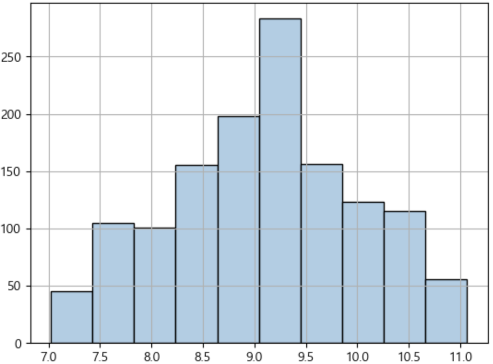

<details>
  <summary>code</summary>

  ```
  # 데이터 프레임 복제
  log_m_df = enc_m_df.copy()

  # 로그 변환
  log_m_df.charges = np.log1p(log_m_df.charges)
  log_m_df
  ```
</details>

<br></br>

### ○ 로그 변환 - 훈련 및 예측, 평가
GradientBoostingRegressor  
MSE: 0.1519, RMSE: 0.3897, R2: 0.8271

<details>
  <summary>code</summary>

  ```
  from sklearn.ensemble import GradientBoostingRegressor
  from sklearn.model_selection import train_test_split

  # 데이터 세트 분리
  # 피처, 타겟 데이터 분리
  features, targets = log_m_df.iloc[:, :-1], log_m_df.iloc[:, -1]

  # 학습/테스트 및 문제/정답 데이터 세트 분리
  X_train, X_test, y_train, y_test = \
  train_test_split(features, targets, test_size=0.2, random_state=124)

  # 회귀 모델 담기
  gb_r = GradientBoostingRegressor(random_state=124)

  # 모델 학습
  gb_r.fit(X_train, y_train)

  # 예측
  prediction = gb_r.predict(X_test)

  # 모델명 출력 (모델명과 평가 결과가 같이 출력되도록)
  print(gb_r.__class__.__name__)
  # 평가
  get_evaluation(y_test, prediction)
  ```
</details>

<br></br>

### ○ PowerTransformer

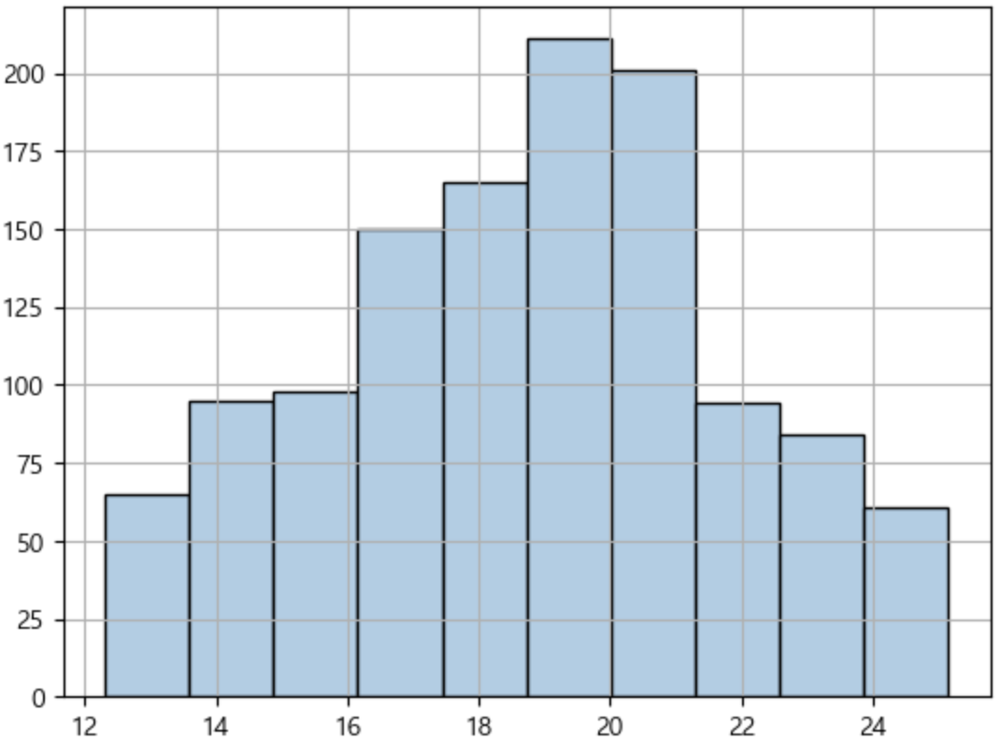

<details>
  <summary>code</summary>

  ```
  from sklearn.preprocessing import PowerTransformer

  # 정규분포에 가깝게 변환 객체 생성
  ptf = PowerTransformer(standardize=False)
  # 변환 후 결과 저장
  result = ptf.fit_transform(pstd_m_df[['charges']])

  # 데이터 프레임 복제
  yeo_m_df = pstd_m_df.copy()

  # 변환된 데이터로 새로운 타겟 데이터 생성
  yeo_m_df['Target_yeo'] = result

  # 사용이 끝난 컬럼 제거
  yeo_m_df = yeo_m_df.drop(labels='charges', axis=1)
  yeo_m_df
  ```
</details>

<br></br>

### ○ PowerTransformer - 훈련 및 예측, 평가
GradientBoostingRegressor  
MSE: 1.9374, RMSE: 1.3919, R2: 0.7429

<details>
  <summary>code</summary>

  ```
  from sklearn.ensemble import GradientBoostingRegressor
  from sklearn.model_selection import train_test_split

  # 데이터 세트 분리
  # 피처, 타겟 데이터 분리
  features, targets = yeo_m_df.iloc[:, :-1], yeo_m_df.iloc[:, -1]

  # 학습/테스트 및 문제/정답 데이터 세트 분리
  X_train, X_test, y_train, y_test = \
  train_test_split(features, targets, test_size=0.2, random_state=124)

  # 회귀 모델 담기
  gb_r = GradientBoostingRegressor(random_state=124)

  # 모델 학습
  gb_r.fit(X_train, y_train)

  # 예측
  prediction = gb_r.predict(X_test)

  # 모델명 출력 (모델명과 평가 결과가 같이 출력되도록)
  print(gb_r.__class__.__name__)
  # 평가
  get_evaluation(y_test, prediction)
  ```
</details>

<br></br>

### ○ 분석
✔ 로그 및 PowerTransformer 진행 후 성능이 더 저하됐으나 log 변환 후 정규분포에 가까워졌으므로 log 변환을 진행함

<br></br>
<br></br>

## 5. 4Cycle
### ○ OLS

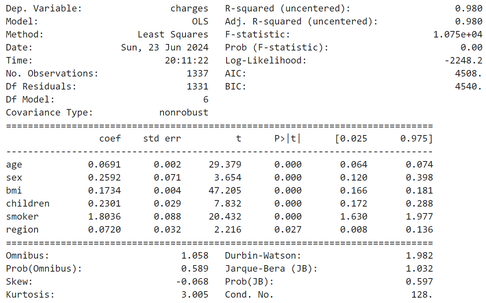

<details>
  <summary>code</summary>

  ```
  from statsmodels.api import OLS

  # 데이터 세트 분리
  # 피처, 타겟 데이터 분리
  features, targets = log_m_df.iloc[:, :-1], log_m_df.iloc[:, -1]

  # OLS 객체 생성
  model = OLS(targets, features)
  # 모델 훈련 및 정보 출력
  print(model.fit().summary())
  ```
</details>

<br></br>

### ○ VIF

| vif_score | features  |
|:---------:|:---------:|
| 7.558005  | age       |
| 2.000028  | sex       |
| 10.378567 | bmi       |
| 1.802019  | children  |
| 1.257118  | smoker    |
| 2.924245  | region    |

<details>
  <summary>code</summary>

  ```
  from statsmodels.stats.outliers_influence import variance_inflation_factor

  def get_vif(features):
      vif = pd.DataFrame()
      vif['vif_score'] = [variance_inflation_factor(features, i) for i in range(features.shape[1])]
      vif['features'] = features.columns
      return vif

  # VIF 확인
  get_vif(features)  
  ```
</details>

<br></br>

### ○ 상관관계

| features  | score     |
|:---------:|:---------:|
| smoker    | 0.665751  |
| age       | 0.526900  |
| children  | 0.160316  |
| bmi       | 0.132831  |
| sex       | 0.007022  |
| region    | -0.043386 |

<details>
  <summary>code</summary>

  ```
  # 상관관계 확인
  log_m_df.corr()['charges'].sort_values(ascending=False)[1:]
  ```
</details>

<br></br>

### ○ 상관관계 (히트맵)

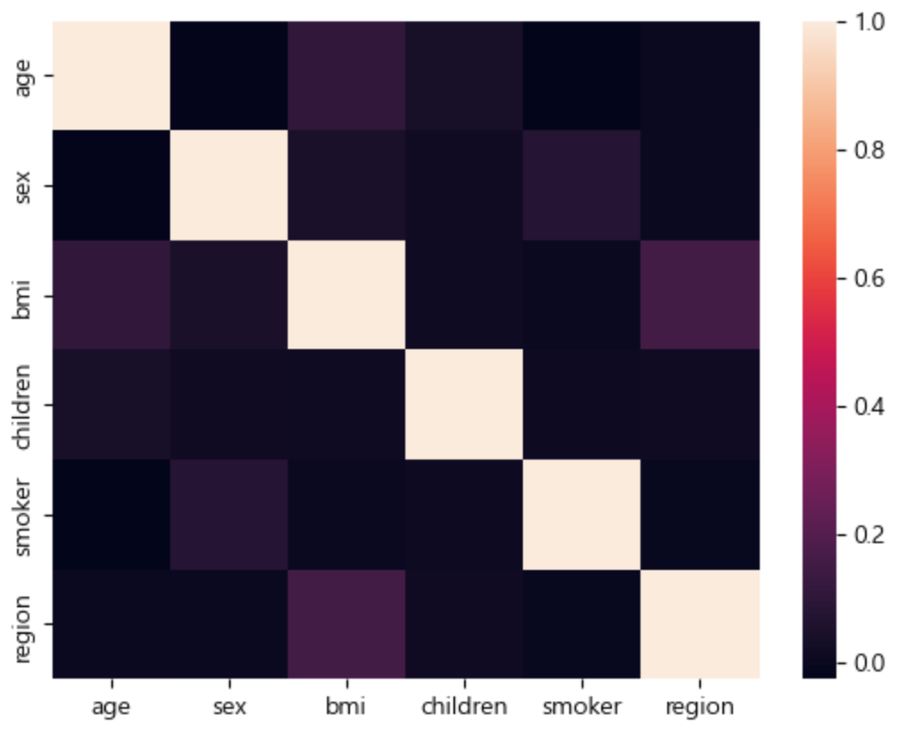

<details>
  <summary>code</summary>

  ```
  import seaborn as sns

  # 상관관계 히트맵 확인
  sns.heatmap(features.corr())
  ```
</details>

<br></br>

### ○ 분석
✔ 약간의 다중공선성 문제가 있는 것으로 나타났으나, age와 bim는 종속변수와 상관관계가 어느정도 있는 것으로 나타나 제거하지 않음

✔ 서로 상관관계가 있는 것으로 보여지는 bmi와 region 중 종속변수와 상관관계가 낮은 region을 제거

<br></br>

### ○ region 제거
✔ 독립변수 간 상관관계를 띄고 종속변수와 상관관계가 낮은 region 제거

<details>
  <summary>code</summary>

  ```
  # region 피처 제거
  dr_m_df = log_m_df.drop(labels='region', axis=1)
  dr_m_df
  ```
</details>

<br></br>

### ○ 훈련 및 예측, 평가
GradientBoostingRegressor  
MSE: 0.1593, RMSE: 0.3991, R2: 0.8186

<details>
  <summary>code</summary>

  ```
  from sklearn.ensemble import GradientBoostingRegressor
  from sklearn.model_selection import train_test_split

  # 데이터 세트 분리
  # 피처, 타겟 데이터 분리
  features, targets = dr_m_df.iloc[:, :-1], dr_m_df.iloc[:, -1]

  # 학습/테스트 및 문제/정답 데이터 세트 분리
  X_train, X_test, y_train, y_test = \
  train_test_split(features, targets, test_size=0.2, random_state=124)

  # 회귀 모델 담기
  gb_r = GradientBoostingRegressor(random_state=124)

  # 모델 학습
  gb_r.fit(X_train, y_train)

  # 예측
  prediction = gb_r.predict(X_test)

  # 모델명 출력 (모델명과 평가 결과가 같이 출력되도록)
  print(gb_r.__class__.__name__)
  # 평가
  get_evaluation(y_test, prediction)
  ```
</details>

<br></br>
<br></br>

## 6. 5Cycle
### ○ GridSearchCV

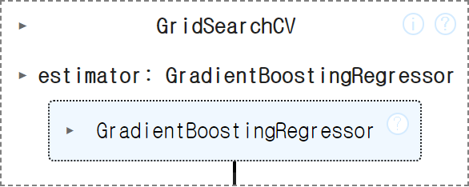

<details>
  <summary>code</summary>

  ```
  from sklearn.model_selection import train_test_split
  from sklearn.ensemble import GradientBoostingRegressor
  from sklearn.model_selection import GridSearchCV
  from sklearn.model_selection import KFold

  # 데이터 세트 분리
  # 피처, 타겟 데이터 분리
  features, targets = dr_m_df.iloc[:, :-1], dr_m_df.iloc[:, -1]

  # 문제/정답 및 학습/훈련 데이터 분리
  X_train, X_test, y_train, y_test = \
  train_test_split(features, targets, test_size=0.2, random_state=124)

  # 검증 데이터 분리
  val_X_train, val_X_test, val_y_train, val_y_test = \
  train_test_split(X_train, y_train, test_size=0.2, random_state=124)

  # 가장 성능이 우수한 모델 담기
  kf_gb_r = GradientBoostingRegressor(random_state=124)

  # 파라미터 값 조정
  parameters = {'max_depth': [3, 4], 'min_samples_split': [50, 60, 70], 'n_estimators': [40, 50, 60]}

  # 교차검증
  # n_splits: 데이터를 몇 개의 폴드로 나눌지를 결정 (일반적으로 5 또는 10)
  # shuffle: 분할 전 데이터 혼합 여부 
  kfold = KFold(n_splits=10, random_state=124, shuffle=True)

  # 학습 및 교차 검증 모델 설정
  grid_kf_gb_r = GridSearchCV(kf_gb_r, param_grid=parameters, cv=kfold, n_jobs=-1)

  # 훈련
  grid_kf_gb_r.fit(X_train, y_train)
  ```
</details>

<br></br>

### ○ 최적의 파라미터

| max_depth | min_samples_split | n_estimators |
|:--------------:|:-----------------:|:------------:|
| 3              | 50                | 50           |

<details>
  <summary>code</summary>

  ```
  # 훈련 결과 확인
  result_df = pd.DataFrame(grid_kf_gb_r.cv_results_)[['params', 'mean_test_score', 'rank_test_score']]
  display(result_df)
  ```
</details>

<br></br>

### ○ 예측 및 평가  
MSE: 0.1515, RMSE: 0.3892, R2: 0.8275

<details>
  <summary>code</summary>

  ```
  # 최적의 모델 담기
  kf_gb_r = grid_kf_gb_r.best_estimator_

  # 예측
  prediction = kf_gb_r.predict(X_test)
  # 평가
  get_evaluation(y_test, prediction)
  ```
</details>

<br></br>

### ○ 분석
✔ 최적의 하이퍼파라미터 값을 찾아 훈련한 결과 성능이 향상된 것을 확인함

<br></br>

### ○ cross val score
[0.88047807, 0.74437218, 0.89394136, 0.83687768, 0.80734487]

<details>
  <summary>code</summary>

  ```
  from sklearn.model_selection import cross_val_score

  # 점수 확인
  score = cross_val_score(kf_gb_r, features, targets)
  score
  ```
</details>

<br></br>

### ○ 과적합 확인
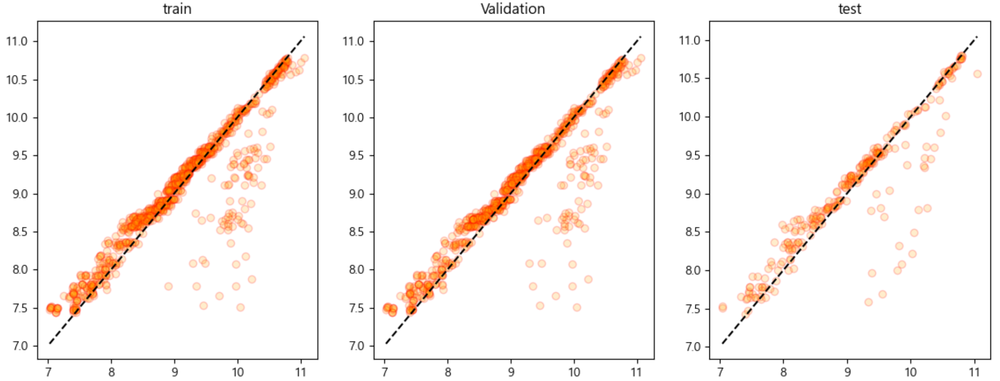

<br>

train  
MSE: 0.1179, RMSE: 0.3434, R2: 0.8586 

<br>

validation  
MSE: 0.1264, RMSE: 0.3555, R2: 0.8489

<br>

test  
MSE: 0.1515, RMSE: 0.3892, R2: 0.8275 


<details>
  <summary>code</summary>

  ```
  import matplotlib.pyplot as plt

  fig, ax = plt.subplots(1, 3, figsize=(14, 5))

  # 예측
  prediction = kf_gb_r.predict(X_train)
  # 평가
  get_evaluation(y_train, prediction)

  ax[0].scatter(y_train, prediction, edgecolors='red', c='orange', alpha=0.2)
  ax[0].plot([y_train.min(), y_train.max()], [y_train.min(), y_train.max()], 'k--')
  ax[0].set_title('train')

  # 예측
  prediction = kf_gb_r.predict(val_X_train)
  # 평가
  get_evaluation(val_y_train, prediction)

  ax[1].scatter(val_y_train, prediction, edgecolors='red', c='orange', alpha=0.2)
  ax[1].plot([val_y_train.min(), val_y_train.max()], [val_y_train.min(), val_y_train.max()], 'k--')
  ax[1].set_title('Validation')

  # 예측
  prediction = kf_gb_r.predict(X_test)
  # 평가
  get_evaluation(y_test, prediction)

  ax[2].scatter(y_test, prediction, edgecolors='red', c='orange', alpha=0.2)
  ax[2].plot([y_test.min(), y_test.max()], [y_test.min(), y_test.max()], 'k--')
  ax[2].set_title('test')

  plt.show()
  ```
</details>

<br></br>

### ○  torch
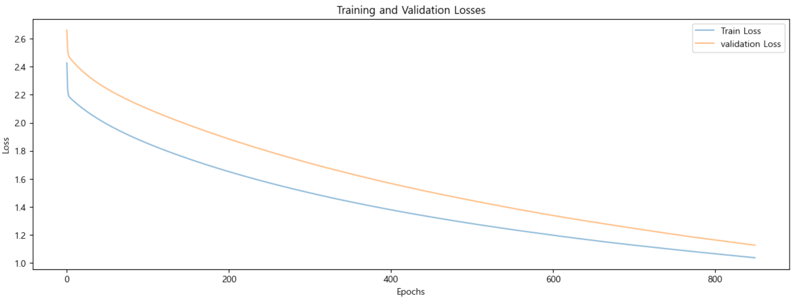

<details>
  <summary>code</summary>

  ```
  from sklearn.model_selection import train_test_split
  import torch
  from torch.nn import Linear
  from torch.nn.functional import mse_loss
  from torch.optim import SGD

  # 랜덤 값 지정
  torch.manual_seed(124)

  # 데이터 세트 분리
  # 피처, 타겟 데이터 분리
  features, targets = dr_m_df.iloc[:, :-1], dr_m_df.iloc[:, -1]

  # 문제/정답 및 학습/훈련 데이터 분리
  X_train, X_test, y_train, y_test = \
  train_test_split(features, targets, test_size=0.2, random_state=124)

  # 검증 데이터 분리
  X_train_train, X_val_train, y_train_train, y_val_train = \
  train_test_split(X_train, y_train, test_size=0.2, random_state=124)

  # 텐서로 변경 (차원 조정)
  X_train_train = torch.FloatTensor(X_train_train.values)
  X_val_train = torch.FloatTensor(X_val_train.values)

  y_train_train = torch.FloatTensor(y_train_train.values).view(-1,1)
  y_val_train = torch.FloatTensor(y_val_train.values).view(-1,1)
  ```
</details>
<details>
  <summary>code</summary>

  ```
  W_train = torch.zeros((5, 1), requires_grad=True)
  b_train = torch.zeros(1, requires_grad=True)

  # 경사 하강법 (최적화 알고리즘)
  optimizer_train = SGD([W_train, b_train], lr=5e-6)
  # loss list
  train_losses= []

  # 반복 횟수
  epochs = 850000

  for epoch in range(1, epochs + 1):
      # 가설 선언
      H_train = X_train_train.matmul(W_train)  + b_train
      # 손실 함수
      train_loss = torch.mean((H_train - y_train_train) ** 2)

      # 다음 기울기를 위해 기존 기울기 초기화
      optimizer_train.zero_grad()
      # 손실 함수 미분 후 기울기 계산
      train_loss.backward()
      # W, b 업데이트
      optimizer_train.step()

      if epoch % 1000 == 0:
          # 손실값 저장
          train_losses.append(train_loss.item())
          
          # 모든 W값을 문자열로 만듦
          w_str = ", ".join([f"W{i+1}: {w.item():.4f}" for i, w in enumerate(W_train)])

      # 출력
      if epoch % 10000 == 0:
          # 전체 문자열 포맷
          print(f"{epoch}/{epochs}: {w_str}, \nb: {b_train.item():.4f}, loss: {train_loss.item():.4f}")
  ```
</details>
<details>
  <summary>code</summary>

  ```
  W_val = torch.zeros((5, 1), requires_grad=True)
  b_val = torch.zeros(1, requires_grad=True)

  # 경사 하강법 (최적화 알고리즘)
  optimizer_val = SGD([W_val, b_val], lr=5e-6)
  # loss list
  val_losses = []

  # 반복 횟수
  epochs = 850000

  for epoch in range(1, epochs + 1):
      # 가설 선언
      H_val = X_val_train.matmul(W_val) + b_val
      # 손실 함수
      val_loss = torch.mean((H_val - y_val_train) ** 2)

      # 다음 기울기를 위해 기존 기울기 초기화
      optimizer_val.zero_grad()
      # 손실 함수 미분 후 기울기 계산
      val_loss.backward()
      # W, b 업데이트
      optimizer_val.step()

      if epoch % 1000 == 0:
          # 손실값 저장
          val_losses.append(val_loss.item())
          
          # 모든 W값을 문자열로 만듦
          w_str = ", ".join([f"W{i+1}: {w.item():.4f}" for i, w in enumerate(W_val)])

      # 출력
      if epoch % 10000 == 0:
          # 전체 문자열 포맷
          print(f"{epoch}/{epochs}: {w_str}, \nb: {b_val.item():.4f}, loss: {val_loss.item():.4f}")
  ```
</details>
<details>
  <summary>그래프 code</summary>

  ```
  # 손실 그래프 그리기
  plt.figure(figsize=(15, 5))
  plt.plot(train_losses, label='Train Loss', alpha=0.5)
  plt.plot(val_losses, label='validation Loss', alpha=0.5)

  plt.xlabel('Epochs')
  plt.ylabel('Loss')
  plt.title('Training and Validation Losses')

  plt.legend()
  plt.show()
  ```
</details>

<br></br>

### ○ 분석
✔ 훈련 및 검증, 테스트 데이터의 R2 점수, Pytorch의 loss 값도 거의 유사하게 나타남에 따라 과적합이 발생하지 않았다고 판단하며 해당 모델을 채택함