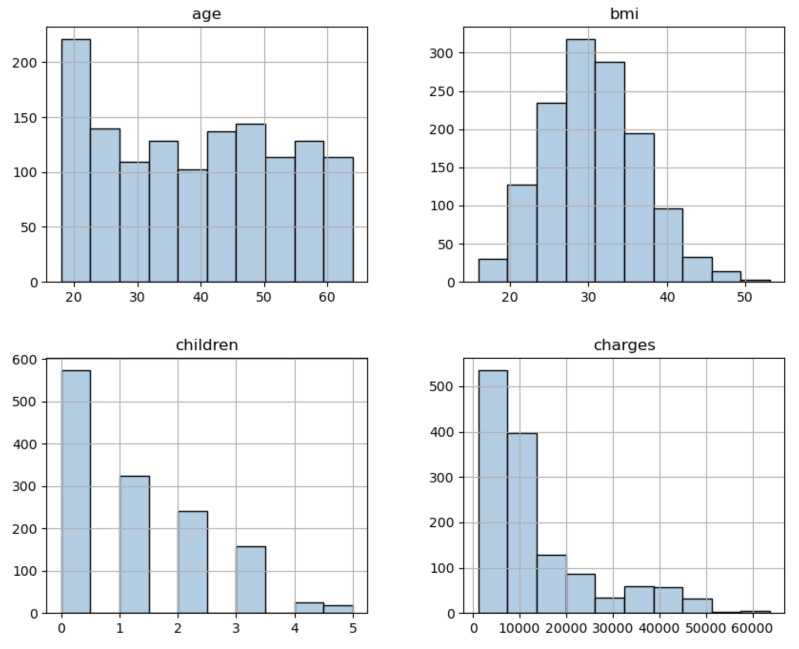
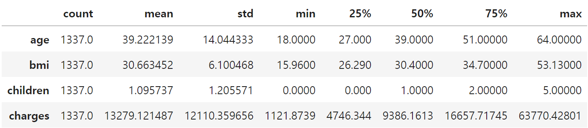
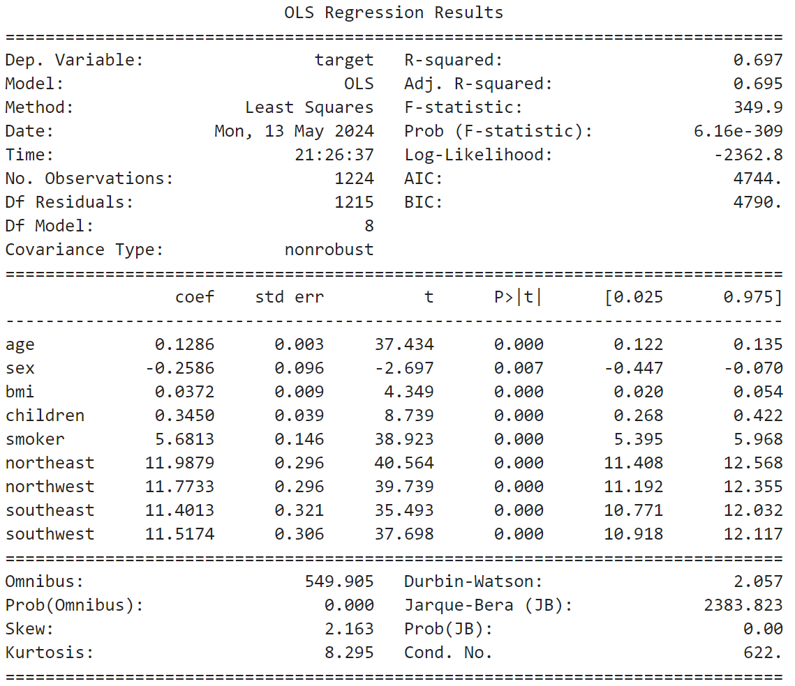
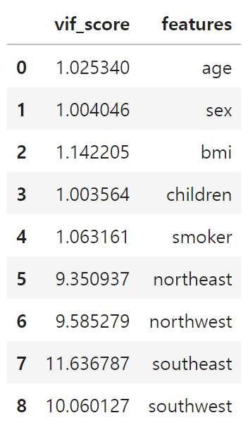
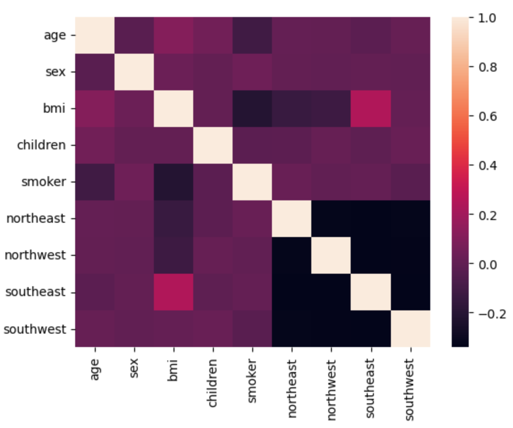
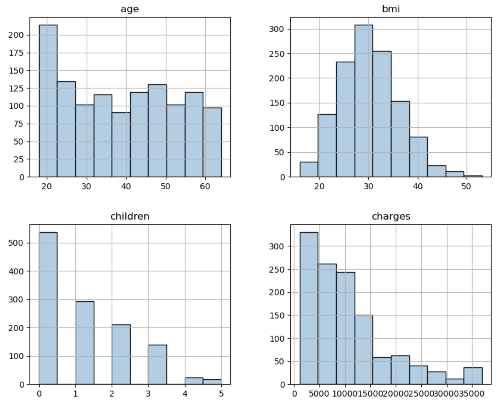

  

  

    

    <b>
      
 Medical Insurance Regression Project
 
    </b>
     의료 보험비 회귀 예측
    

  

    

        
        
        
        
        
        
        
      2024. 05. 15.
        
        
        
        
      코리아IT 아카데미 - 송서경
    

  
  
  

  
  
  

<h1> □ 목차</h1>

    <a style="color: inherit;" href='#Ⅰ. 개요'>
      
Ⅰ. 개요
  
    </a>
    
1. 목적

    
2. 분석 방법

      
    <a style="color: inherit;" href='#Ⅱ. 분석 결과'>
      
Ⅱ. 분석 결과
  
    </a>
      
1. 데이터 탐색

    
2. 데이터 전처리

    
3. 훈련

      
    <a style="color: inherit;" href='#Ⅲ. 평가'>
      
Ⅲ. 평가
  
    </a>
    
1. 평가 및 개선

  
  
  
  
  

<h1 id="Ⅰ. 개요">Ⅰ. 개요</h1>

## 1. 데이터 정보
### □ 의료 보험비 데이터 세트
#### ○ 데이터 출처
kaggle - Medical Cost Personal Datasets  
https://www.kaggle.com/datasets/mirichoi0218/insurance/data

  

#### ○ 데이터 정보
- 파일이름: 의료 보험비 데이터 세트
- 파일 형식: CSV 파일
- 구분: 회귀 데이터 세트
- 형태: 2772 rows × 7 columns

  
  

## 2. 목적
### □ 분석 목적
○ 다양한 지표와 보험비의 관계를 탐색하고 건강보험에서 청구하는 의료보험 비용을 예측하는 모델 생성

  
  

## 3. 분석 방법
### □ 분석 절차
#### ○ 분석 프로세스
<table>
  <tr>
      <td>데이터 탐색</td>
      <td>데이터 전처리</td>
      <td>데이터 훈련</td>
      <td>데이터 평가</td>
  </tr>
  <tr>
      <td>데이터 이해, 문제 인식 및 해결안 도출</td>
      <td>전처리를 통한 데이터의 질 향상</td>
      <td>데이터 훈련을 통해 예측 모델 구축</td>
      <td>데이터 품질 측정 및 개선</td>
  </tr>
</table>

  
  

### □ 분석 방법
#### ○ 탐색
- 데이터 정보 확인을 통한 데이터 이해, 문제 인식 및 해결안 도출

  

#### ○ 전처리
- 불필요한 데이터 제거, 결측치, 이상치 등 제거를 통한 데이터 질 향상

  

#### ○ 훈련
- 데이터 훈련 모델을 통한 예측 모델 구축
<table>
  <tr>
      <td>연번</td>
      <td>모델</td>
  </tr>
  <tr>
      <td>1</td>
      <td>GradientBoostingRegressor</td>
  </tr>
</table>

  

#### ○ 평가
- OLS, VIF 등 다양한 평가 지표를 통한 데이터 품질 측정 및 개선
- 데이터 평가 점수 산출 방식
<table>
  <tr>
      <td>연번</td>
      <td> 평가지표</td>
      <td>산출 코드</td>
  </tr>
  <tr>
      <td>1</td>
      <td>MSE</td>
      <td>mean_squared_error(y_test, prediction)</td>
  </tr>
  <tr>
      <td>2</td>
      <td>RMSE</td>
      <td>np.sqrt(MSE)</td>
  </tr>
  <tr>
      <td>3</td>
      <td>MSLE</td>
      <td>mean_squared_log_error(y_test, prediction)</td>
  </tr>
  <tr>
      <td>4</td>
      <td>RMSLE</td>
      <td>np.sqrt(MSLE)</td>
  </tr>
  <tr>
      <td>5</td>
      <td>R2</td>
      <td>r2_score(y_test, prediction)</td>
  </tr>
</table>

  
  
  
  
  

<h1 id="Ⅱ. 분석 결과">Ⅱ. 분석 결과</h1>

## 1. 데이터 탐색
### □ 데이터 기본 정보
#### ○ 데이터 정보
<table>
  <tr>
      <td>연번</td>
      <td>컬럼</td>
      <td>내용</td>
      <td>결측치</td>
      <td>타입</td>
  </tr>
  <tr>
      <td>1</td>
      <td>age</td>
      <td>주요 수혜자의 나이</td>
      <td>2772 non-null</td>
      <td>int64</td>
  </tr>
  <tr>
      <td>2</td>
      <td>sex</td>
      <td>보험계약자 성별, 여성, 남성</td>
      <td>2772 non-null</td>
      <td>object</td>
  </tr>
  <tr>
      <td>3</td>
      <td>bmi</td>
      <td>신체에 대한 이해를 제공하는 체질량지수</td>
      <td>2772 non-null</td>
      <td>float64</td>
  </tr>
  <tr>
      <td>4</td>
      <td>children</td>
      <td>건강보험 적용 자녀 수 / 부양가족 수</td>
      <td>2772 non-null</td>
      <td>int64</td>
  </tr>
  <tr>
      <td>5</td>
      <td>smoker</td>
      <td>흡연</td>
      <td>2772 non-null</td>
      <td>object</td>
  </tr>
  <tr>
      <td>6</td>
      <td>region</td>
      <td>미국 내 수혜자의 주거 지역, 북동부, 남동부, 남서부, 북서부</td>
      <td>2772 non-null</td>
      <td>object</td>
  </tr>
  <tr>
      <td>7</td>
      <td>charges</td>
      <td>건강보험에서 청구하는 개인의료비</td>
      <td>2772 non-null</td>
      <td>float64</td>
  </tr>
</table>

- 2772개 데이터가 존재하며, 7개의 열로 이루어짐
- float64 2개, int64 2개, object3개 열이 존재함

  

#### ○ 데이터 결측치, 중복행
 - 데이터 결측치 확인 결과 NaN, Null 값 모두 존재하지 않는 것으로 나타났으므로 결측치 제거를 진행하지 않음
- 중복행 확인 결과 중복행이 1435개 존재하므로 중복행 제거를 진행함

  

#### ○ 데이터 분포

- 데이터 분포 확인 결과 이상치로 확인되는 데이터가 보여 타겟 데이터의 이상치 제거가 필요하다고 판단됨
- 이상치 제거 후 분포가 고르지 않다면 분포 변환이 필요함  

  

#### ○ OLS(최소자승법)

- OLS 성능 지표 확인 결과 R2 스코어가 0.697, Durbin-Watson이 2.057으로 나타남
- P>|t| 에서도 문제가 없는 것으로 나타남  

  

#### ○ VIF

- 현재 일부 피처에서 다중 공산성 문제를 띄고 있는 데이터가 확인됨  
- 데이터 전처리가 필요할 것으로 보이며, 피처 제거 시 상관관계를 확인한 뒤 제거가 필요함

  

#### ○ 상관 관계

<table>
    <tr>
        <td>연번</td>
        <td>컬럼</td>
        <td>상관관계</td>
    </tr>
    <tr>
        <td>1</td>
        <td>smoker</td>
        <td>0.546188</td>
    </tr>
    <tr>
        <td>2</td>
        <td>age</td>
        <td>0.542972</td>
    </tr>
    <tr>
        <td>3</td>
        <td>children</td>
        <td>0.151047</td>
    </tr>
    <tr>
        <td>4</td>
        <td>northeast</td>
        <td>0.063126</td>
    </tr>
    <tr>
        <td>5</td>
        <td>northwest</td>
        <td>0.015186</td>
    </tr>
    <tr>
        <td>6</td>
        <td>bmi</td>
        <td>-0.017568</td>
    </tr>
    <tr>
        <td>7</td>
        <td>sex</td>
        <td>-0.034228</td>
    </tr>
    <tr>
        <td>8</td>
        <td>southwest</td>
        <td>-0.034363</td>
    </tr>
    <tr>
        <td>9</td>
        <td>southeast</td>
        <td>-0.043222</td>
    </tr>
</table>

- smoker가 약 0.5461의 수치로 타겟과 가장 높은 관계를 가진 것으로 나타남
- northwest가 약 00.0151의 수치로 타겟과 가장 낮은 관계를 가진 것으로 나타남
- 타겟과 상관관계가 낮은 피처를 제거하여 다중 공산성 등의 문제를 해결할 수 있을 것이라 판단됨

  
  
  

## 2. 데이터 전처리
### □ 데이터 전처리
#### ○ 이상치 제거
<code>
from sklearn.preprocessing import StandardScaler

std = StandardScaler()

result = std.fit_transform(pre_m_df[['charges']])

std_pre_m_df = pd.DataFrame(result, columns=['charges'])
</code>

- 이상치 제거 후 전체적인 데이터 분포가 고르게 나타났으나, SkinThickness와 lnsulin에서 0에 가까운 데이터가 많이 발생하는 이상치를 확인함

2. 데이터 전처리

  
□ 데이터 전처리

  

    
○ 타겟 비중 (under sampling)

    <code>
      Outcome0 = pre_h_df[pre_h_df.Outcome == 0].sample(952, random_state=124)  
      Outcome1 = pre_h_df[pre_h_df.Outcome == 1]  
      pre_h_df = pd.concat([Outcome0, Outcome1]).reset_index(drop=True)
    </code>  
     
    - 언더 샘플링을 통해 타겟 데이터의 비중을 고르게 맞춰줌
      
      
    
○ 이상치 제거

    <code>from sklearn.preprocessing import StandardScaler</code>
      
    <code>std_pre_h_df = pre_h_df.copy()</code>
    <code>columns = ['Glucose', 'BloodPressure', 'SkinThickness', 'BMI', 'DiabetesPedigreeFunction']</code>
      
    <code>for column in columns:</code>
    <code>std = StandardScaler()</code>
    <code>result = std.fit_transform(pre_h_df[[column]])</code>
    <code>std_pre_h_df[column] = result</code>
      
    <code>for column in columns:</code>
    <code>std_pre_h_df = std_pre_h_df[std_pre_h_df[column].between(-1.96, 1.96)]</code>
      
    <code>pre_h_df = pre_h_df.iloc[std_pre_h_df.index].reset_index(drop=True)</code>
      
    
      
    - 이상치 제거 후 전체적인 데이터 분포가 고르게 나타났으나, SkinThickness와 lnsulin에서 0에 가까운 데이터가 많이 발생하는 이상치를 확인함
      
    <code>test_h_df = pre_h_df[~(pre_h_df.SkinThickness < 5)]</code>
      
    <code>test_h_df = test_h_df[~(test_h_df.Insulin < 5)].reset_index(drop=True)</code>
      
    
    
    
      
    - 이상치 제거 후 전체적인 데이터 분포는 고르게 나타나는 것으로 확인했으나, 오히려 성능이 저하된 것을 확인함  
    - 따라서, SkinThickness와 lnsulin의 특정 데이터는 제거하지 않고 진행함
      
      
    
○ 차원축소

    
    
      
    - 차원축소 PCA(6Cycle), LDA(7Cycle) 결과 오히려 성능이 저하됨에 따라 차원 축소는 진행하지 않음
  

  
  
  

3. 데이터 훈련

  
□ 데이터 훈련

  

    
○ LogisticRegression

    <code>from sklearn.model_selection import train_test_split</code>
    <code>from sklearn.linear_model import LogisticRegression</code>
    <code>from imblearn.over_sampling import SMOTE</code>
      
    <code>features, targets = pre_h_df.iloc[:, :-1], pre_h_df.iloc[:, -1]</code>
      
    <code>X_train, X_test, y_train, y_test = train_test_split(features, targets, test_size=0.2, stratify=targets, random_state=124)</code>
      
    <code>lg = LogisticRegression(solver='liblinear', penalty='l2', random_state=124)</code>
      
    <code>lg.fit(X_train, y_train)</code>
      
    - LogisticRegression 모델에 l2 규제를 사용하여 훈련을 진행함
  

  
  
  
  
  

<h1 id="Ⅲ. 평가">Ⅲ. 평가</h1>

1. 데이터 분석 결과 및 개선

  
□ 데이터 분석 결과 및 개선방안

  

    
○ LogisticRegression

    
    
    <code>LogisticRegression(solver='liblinear', penalty='l2', random_state=124)</code>
      
    - 정확도가 0.7943, 정밀도 0.7872, 재현율 0.7603, F1 0.7735인 예측 모델이 생성됨  
    - 양성인 환자를 놓치지 않는 것이 중요하여 재현율이 높아야 하는데, 현재 모델에서는 정밀도가 더 우세한 것으로 나타남  
    - 임계치 조정을 통해 재현율 점수를 더 향상해야 함
  

  
  

  
□ 데이터 개선

  

    
○ 임계치 조정

    
      
    - 정확도가 0.8006, 정밀도 0.7712, 재현율 0.8082, F1 0.7893인 예측 모델이 생성됨  
    - 임계치를 0.455으로 조정하여 훈련한 결과, 재현율이 상승하였고 정밀도가 이전보다 하락함
  

    

  

    
○ 결과

    
      
    * 9Cycle-임계치 조정 전, 10Cycle-임계치 조정 후
      
    - 이전보다 더 높은 성능의 모델임을 확인하였으므로 임계치가 0.455인 LogisticRegression 모델이 적합하다는 것을 확인함
  

