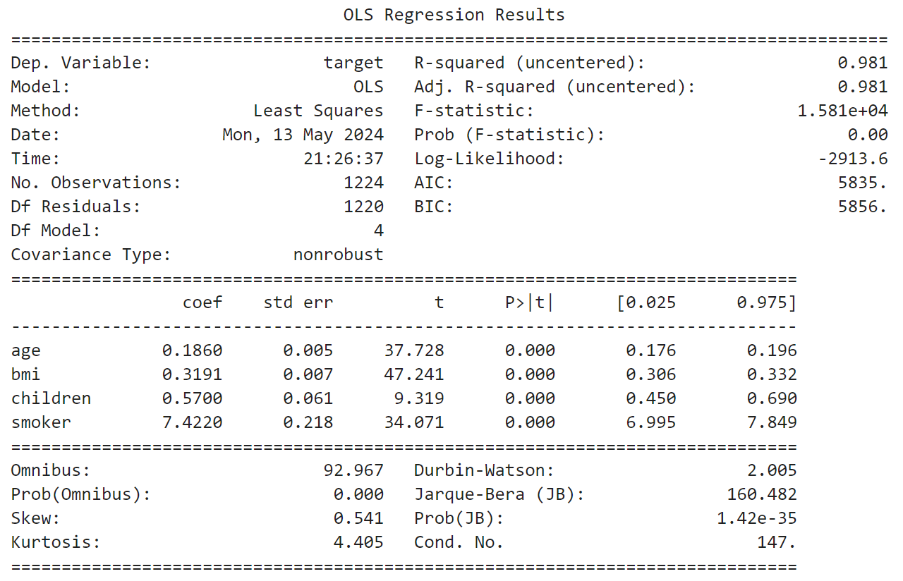
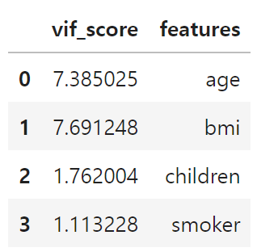
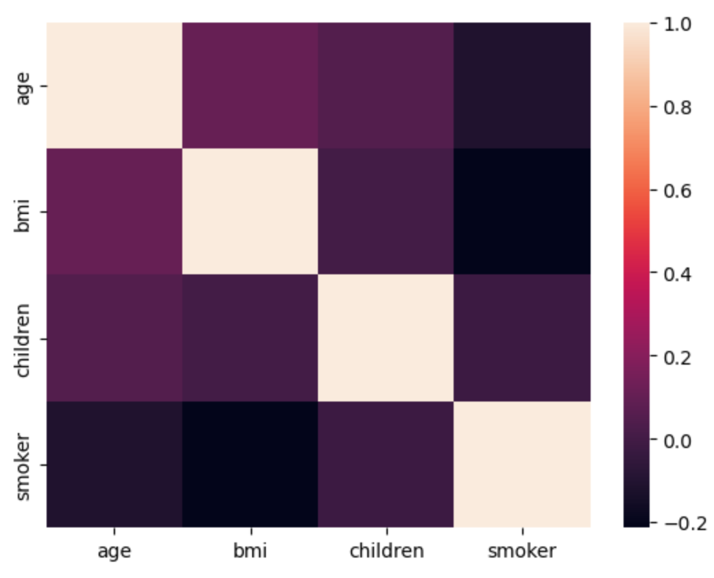
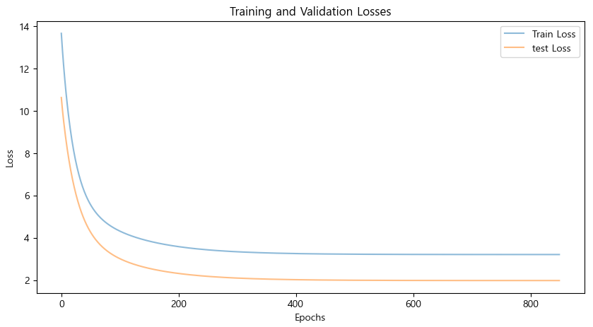
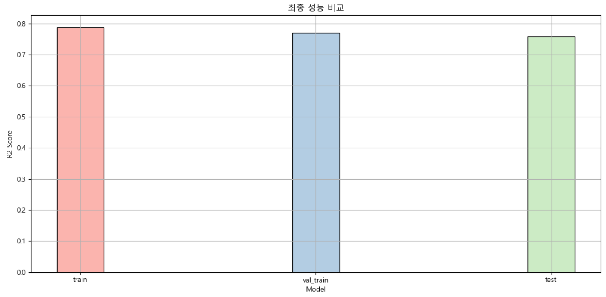
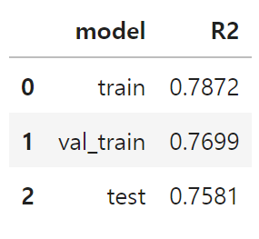
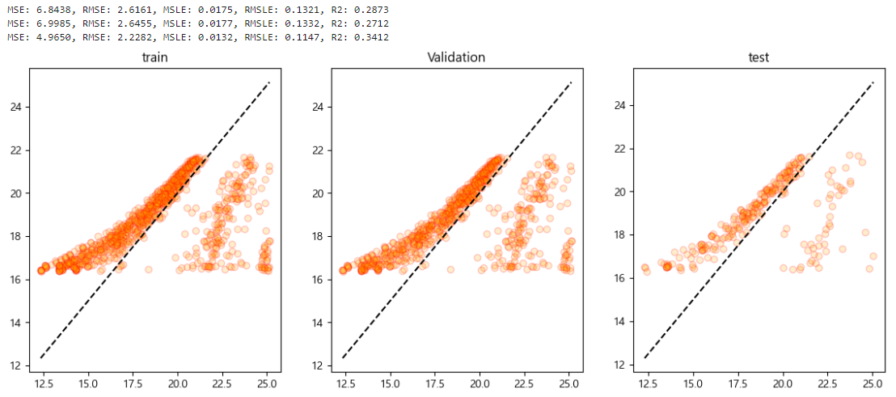
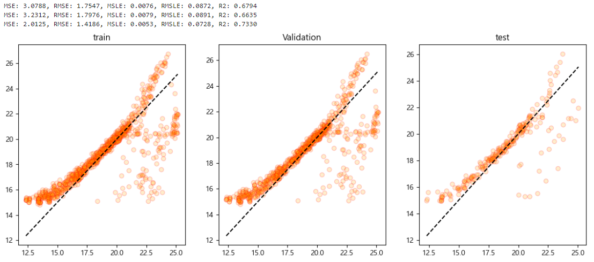

<br></br>

<div>
  <hr>
    <div style='text-align: center'>
    <b>
      <p style='font-size: 30px'> Medical Insurance Regression Project</p> 
    </b>
    <span style='font-size: 25px'> 의료 보험비 회귀 예측</span>
    </div>
  <hr>
    <div style='text-align: center'>
      <br></br>
      <br></br>
      <br></br>
      <br></br>
      <br></br>
      <br></br>
      <br></br>
      <span style='font-size: 25px'>2024. 05. 15.</span>
      <br></br>
      <br></br>
      <br></br>
      <br></br>
      <span style='font-size: 20px'>코리아IT 아카데미 - 송서경</span>
    </div>
</div>

<br></br>
<br></br>
<br></br>
<hr>
<br></br>
<br></br>
<br></br>

<h1> □ 목차</h1>
<div>
    <a style="color: inherit;" href='#Ⅰ. 개요'>
      <p style='font-size: 23px'>Ⅰ. 개요</p> <br>
    </a>
    <p style='font-size: 20px; margin-left: 20px; margin-top: -30px;'>1. 목적</p>
    <p style='font-size: 20px; margin-left: 20px;'>2. 분석 방법</p>
    <br></br>
    <a style="color: inherit;" href='#Ⅱ. 분석 결과'>
      <p style='font-size: 23px'>Ⅱ. 분석 결과</p> <br>
    </a>
      <p style='font-size: 20px; margin-left: 20px; margin-top: -30px;'>1. 데이터 탐색</p>
    <p style='font-size: 20px; margin-left: 20px;'>2. 데이터 전처리</p>
    <p style='font-size: 20px; margin-left: 20px;'>3. 훈련</p>
    <br></br>
    <a style="color: inherit;" href='#Ⅲ. 평가'>
      <p style='font-size: 23px'>Ⅲ. 평가</p> <br>
    </a>
    <p style='font-size: 20px; margin-left: 20px; margin-top: -30px;'>1. 평가 및 개선</p>
</div>

<br></br>
<br></br>
<br></br>
<br></br>
<br></br>

<h1 id="Ⅰ. 개요">Ⅰ. 개요</h1>

## 1. 데이터 정보
### □ 의료 보험비 데이터 세트
#### ○ 데이터 출처
kaggle - Medical Cost Personal Datasets  
https://www.kaggle.com/datasets/mirichoi0218/insurance/data

<br></br>

#### ○ 데이터 정보
- 파일이름: 의료 보험비 데이터 세트
- 파일 형식: CSV 파일
- 구분: 회귀 데이터 세트
- 형태: 2772 rows × 7 columns

<br></br>
<br></br>

## 2. 목적
### □ 분석 목적
○ 다양한 지표와 보험비의 관계를 탐색하고 건강보험에서 청구하는 의료보험 비용을 예측하는 모델 생성

<br></br>
<br></br>

## 3. 분석 방법
### □ 분석 절차
#### ○ 분석 프로세스
<table>
  <tr>
      <td>데이터 탐색</td>
      <td>데이터 전처리</td>
      <td>데이터 훈련</td>
      <td>데이터 평가</td>
  </tr>
  <tr>
      <td>데이터 이해, 문제 인식 및 해결안 도출</td>
      <td>전처리를 통한 데이터의 질 향상</td>
      <td>데이터 훈련을 통해 예측 모델 구축</td>
      <td>데이터 품질 측정 및 개선</td>
  </tr>
</table>

<br></br>
<br></br>

### □ 분석 방법
#### ○ 탐색
- 데이터 정보 확인을 통한 데이터 이해, 문제 인식 및 해결안 도출

<br></br>

#### ○ 전처리
- 불필요한 데이터 제거, 결측치, 이상치 등 제거를 통한 데이터 질 향상

<br></br>

#### ○ 훈련
- 데이터 훈련 모델을 통한 예측 모델 구축
<table>
  <tr>
      <td>연번</td>
      <td>모델</td>
  </tr>
  <tr>
      <td>1</td>
      <td>GradientBoostingRegressor</td>
  </tr>
</table>

<br></br>

#### ○ 평가
- OLS, VIF 등 다양한 평가 지표를 통한 데이터 품질 측정 및 개선
- 데이터 평가 점수 산출 방식
<table>
  <tr>
      <td>연번</td>
      <td> 평가지표</td>
      <td>산출 코드</td>
  </tr>
  <tr>
      <td>1</td>
      <td>MSE</td>
      <td>mean_squared_error(y_test, prediction)</td>
  </tr>
  <tr>
      <td>2</td>
      <td>RMSE</td>
      <td>np.sqrt(MSE)</td>
  </tr>
  <tr>
      <td>3</td>
      <td>MSLE</td>
      <td>mean_squared_log_error(y_test, prediction)</td>
  </tr>
  <tr>
      <td>4</td>
      <td>RMSLE</td>
      <td>np.sqrt(MSLE)</td>
  </tr>
  <tr>
      <td>5</td>
      <td>R2</td>
      <td>r2_score(y_test, prediction)</td>
  </tr>
</table>

<br></br>
<br></br>
<br></br>
<br></br>
<br></br>

<h1 id="Ⅱ. 분석 결과">Ⅱ. 분석 결과</h1>

## 1. 데이터 탐색
### □ 데이터 기본 정보
#### ○ 데이터 정보
<table>
  <tr>
      <td>연번</td>
      <td>컬럼</td>
      <td>내용</td>
      <td>결측치</td>
      <td>타입</td>
  </tr>
  <tr>
      <td>1</td>
      <td>age</td>
      <td>주요 수혜자의 나이</td>
      <td>2772 non-null</td>
      <td>int64</td>
  </tr>
  <tr>
      <td>2</td>
      <td>sex</td>
      <td>보험계약자 성별, 여성, 남성</td>
      <td>2772 non-null</td>
      <td>object</td>
  </tr>
  <tr>
      <td>3</td>
      <td>bmi</td>
      <td>신체에 대한 이해를 제공하는 체질량지수</td>
      <td>2772 non-null</td>
      <td>float64</td>
  </tr>
  <tr>
      <td>4</td>
      <td>children</td>
      <td>건강보험 적용 자녀 수 / 부양가족 수</td>
      <td>2772 non-null</td>
      <td>int64</td>
  </tr>
  <tr>
      <td>5</td>
      <td>smoker</td>
      <td>흡연</td>
      <td>2772 non-null</td>
      <td>object</td>
  </tr>
  <tr>
      <td>6</td>
      <td>region</td>
      <td>미국 내 수혜자의 주거 지역, 북동부, 남동부, 남서부, 북서부</td>
      <td>2772 non-null</td>
      <td>object</td>
  </tr>
  <tr>
      <td>7</td>
      <td>charges</td>
      <td>건강보험에서 청구하는 개인의료비</td>
      <td>2772 non-null</td>
      <td>float64</td>
  </tr>
</table>

- 2772개 데이터가 존재하며, 7개의 열로 이루어짐
- float64 2개, int64 2개, object3개 열이 존재함

<br></br>

#### ○ 데이터 결측치, 중복행
 - 데이터 결측치 확인 결과 NaN, Null 값 모두 존재하지 않는 것으로 나타났으므로 결측치 제거를 진행하지 않음
- 중복행 확인 결과 중복행이 1435개 존재하므로 중복행 제거를 진행함

<br></br>

#### ○ 데이터 분포


- 데이터 분포 확인 결과 이상치로 확인되는 데이터가 보여 타겟 데이터의 이상치 제거가 필요하다고 판단됨
- 이상치 제거 후 분포가 고르지 않다면 분포 변환이 필요함 <br>

<br></br>

#### ○ OLS(최소자승법)


- OLS 성능 지표 확인 결과 R2 스코어가 0.697, Durbin-Watson이 2.057으로 나타남
- P>|t| 에서도 문제가 없는 것으로 나타남 <br>

<br></br>

#### ○ VIF


- 현재 일부 피처에서 다중 공산성 문제를 띄고 있는 데이터가 확인됨 <br>
- 데이터 전처리가 필요할 것으로 보이며, 피처 제거 시 상관관계를 확인한 뒤 제거가 필요함

<br></br>

#### ○ 상관 관계

<table>
    <tr>
        <td>연번</td>
        <td>컬럼</td>
        <td>상관관계</td>
    </tr>
    <tr>
        <td>1</td>
        <td>smoker</td>
        <td>0.546188</td>
    </tr>
    <tr>
        <td>2</td>
        <td>age</td>
        <td>0.542972</td>
    </tr>
    <tr>
        <td>3</td>
        <td>children</td>
        <td>0.151047</td>
    </tr>
    <tr>
        <td>4</td>
        <td>northeast</td>
        <td>0.063126</td>
    </tr>
    <tr>
        <td>5</td>
        <td>northwest</td>
        <td>0.015186</td>
    </tr>
    <tr>
        <td>6</td>
        <td>bmi</td>
        <td>-0.017568</td>
    </tr>
    <tr>
        <td>7</td>
        <td>sex</td>
        <td>-0.034228</td>
    </tr>
    <tr>
        <td>8</td>
        <td>southwest</td>
        <td>-0.034363</td>
    </tr>
    <tr>
        <td>9</td>
        <td>southeast</td>
        <td>-0.043222</td>
    </tr>
</table>

- smoker가 약 0.5461의 수치로 타겟과 가장 높은 관계를 가진 것으로 나타남
- northwest가 약 00.0151의 수치로 타겟과 가장 낮은 관계를 가진 것으로 나타남
- 타겟과 상관관계가 낮은 피처를 제거하여 다중 공산성 등의 문제를 해결할 수 있을 것이라 판단됨

<br></br>
<br></br>
<br></br>

## 2. 데이터 전처리
### □ 데이터 전처리
#### ○ 이상치 제거
```
from sklearn.preprocessing import StandardScaler

# 표준화 객체 생성
std = StandardScaler()

# 데이터 표준화 변환
result = std.fit_transform(pre_m_df[['charges']])

# 표준화 데이터 프레임 생성
std_pre_m_df = pd.DataFrame(result, columns=['charges'])
```


- 이상치 제거 후 타겟 데이터 분포가 고르게 나타남

<br></br>

#### ○ LabelEncoder
```
from sklearn.preprocessing import LabelEncoder

# 데이터 프레임 복제
enc_m_df = pre_m_df.copy()
encoders = {}

# 문자열 컬럼 추출
columns = ['sex', 'smoker']

# 반복하여 컬럼 인코딩 처리:
for column in columns:
    # 레이블인코더 객체 생성
    encoder = LabelEncoder()

    # 문자열 데이터 정수로 형변환
    result = encoder.fit_transform(enc_m_df[column])

    # 형변환 값으로 대체
    enc_m_df[column] = result

    # 원본 데이터 담기
    encoders[column] = encoder.classes_
```

- LabelEncoder를 통해 sex, smoker의 데이터 값을 object에서 int로 형변환

<br></br>

#### ○ OneHotEncoder
```
import numpy as np
from sklearn.preprocessing import OneHotEncoder

# 원 핫 인코더 객체 생성
# sparse_output: False = 밀집행렬(실제 값으로 채워진 행렬) 반환
one_hot_encoder = OneHotEncoder(sparse_output=False)

# 지역 피처 인코딩 처리
result = one_hot_encoder.fit_transform(enc_m_df[['region']])

# 인코딩 값 데이터 프레임으로 생성하고 정수로 형변환한 뒤, 기존 데이터 프레임과 병합
enc_m_df = pd.concat([enc_m_df, pd.DataFrame(result, columns=one_hot_encoder.categories_).astype(np.int8)], axis=1)

# 사용이 끝난 데이터 제거
enc_m_df = enc_m_df.drop(labels='region', axis=1)

# 원 핫 인코딩 컬럼명 변경
enc_m_df.rename(columns={
    ('northeast',): 'northeast',
    ('northwest',): 'northwest',
    ('southeast',): 'southeast',
    ('southwest',): 'southwest',
}, inplace=True)
```

- 데이터끼리의 순서가 정해지지 않은 데이터를 OneHotEncoder를 통해 정수로 변환

<br></br>

#### ○ 피처 제거
##### ○ OLS


##### ○ VIF


##### ○ 상관관계

<table>
  <tr>
      <td>연번</td>
      <td>컬럼</td>
      <td>상관관계</td>
  </tr>
  <tr>
      <td>1</td>
      <td>smoker</td>
      <td>0.546188</td>
  </tr>
  <tr>
      <td>2</td>
      <td>age</td>
      <td>0.542972</td>
  </tr>
  <tr>
      <td>3</td>
      <td>children</td>
      <td>0.151047</td>
  </tr>
  <tr>
      <td>4</td>
      <td>bmi</td>
      <td>-0.017568</td>
  </tr>
</table>

- 상관관계가 낮은 피처 제거 후 R2 값이 상승하였고 다중 공산성이 해소된 것을 확인함

<br></br>
<br></br>
<br></br>

## 3. 데이터 훈련
### □ 데이터 훈련
```
from sklearn.model_selection import GridSearchCV
from sklearn.ensemble import GradientBoostingRegressor
from sklearn.model_selection import train_test_split
from sklearn.model_selection import KFold

# 데이터 세트 분리
# 피처, 타겟 데이터 분리
features, targets = enc_m_df.iloc[:, :-1], enc_m_df.iloc[:, -1]

# 학습/테스트 및 문제/정답 데이터 세트 분리
X_train, X_test, y_train, y_test = \
train_test_split(features, targets, test_size=0.2, random_state=124)

# 가장 성능으로 높았던 모델 가져오기
gb_r = GradientBoostingRegressor(random_state=124)

# 파라미터 값 조정
parameters = {'max_depth': [3, 4, 5], 'min_samples_split': [50, 60, 70], 'n_estimators': [40, 50, 60]}

# 교차검증
# n_splits: 데이터를 몇 개의 폴드로 나눌지를 결정 (일반적으로 5 또는 10)
# shuffle: 분할 전 데이터 혼합 여부 
kfold = KFold(n_splits=10, random_state=124, shuffle=True)

# 하이퍼 파라미터 조정
grid_cv_gb_r = GridSearchCV(gb_r, param_grid=parameters, cv=kfold, n_jobs=-1)

# 훈련
grid_cv_gb_r.fit(X_train, y_train)
```

- GradientBoostingRegressor 모델을 사용함
- KFold와 GridSearchCV를 통해 파라미터 값을 조정하여 훈련 진행

<br></br>
<br></br>
<br></br>
<br></br>
<br></br>

<h1 id="Ⅲ. 평가">Ⅲ. 평가</h1>

## 1. 데이터 훈련 결과 및 평가
### □ 데이터 훈련 평가
#### ○ cross val score
```
[0.81853009, 0.65259246, 0.82374275, 0.75693076, 0.74001037]
```
- cross val score은 0.7583으로 나타남

<br></br>

#### ○ 최종 성능 확인



- 과적합 확인을 위해 예측값과 실제값을 비교하였을 때 과적합 문제가 없다고 판단됨.
- 오차가 나타나는 구간은 smoker 피처에서 범주형 데이터의 분포 차이로 인해 나타난 것으로 보여지며, 데이터가 부족한 데이터를 더 수집하게 되면 더 좋은 성능을 기대할 수 있을 것이라 생각됨.

<br></br>
<br></br>

### □ 데이터 훈련 결과
#### ○ 데이터 훈련 결과



- 데이터 훈련 결과 아래의 파라미터를 가지는 GradientBoostingRegressor의 모델이 가장 적합하다는 것을 확인함.
- {'max_depth': 3, 'min_samples_split': 60, 'n_estimators': 40}

<br></br>
<br></br>

### □ 규제
#### ○ lasso


<br></br>

#### ○ ridge


#### ○ 규제 결과
- 규제 결과 lasso(l1) 보다 ridge(l2)이 더 성능이 좋은 것으로 나타남
