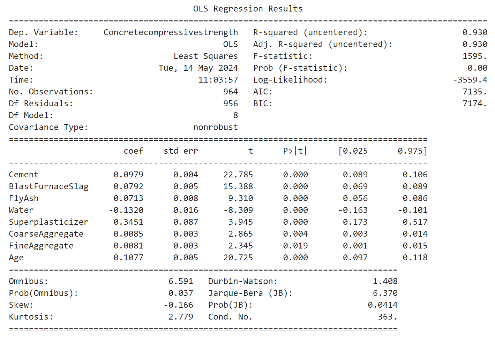
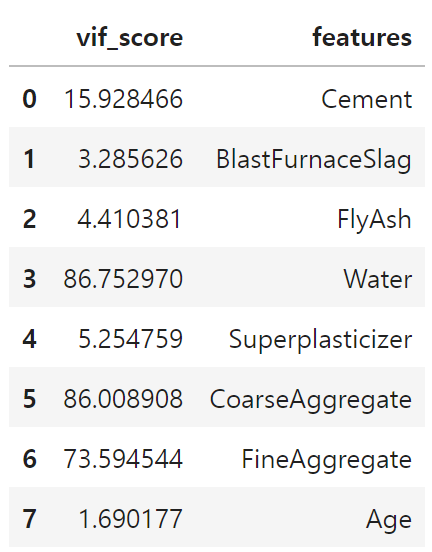
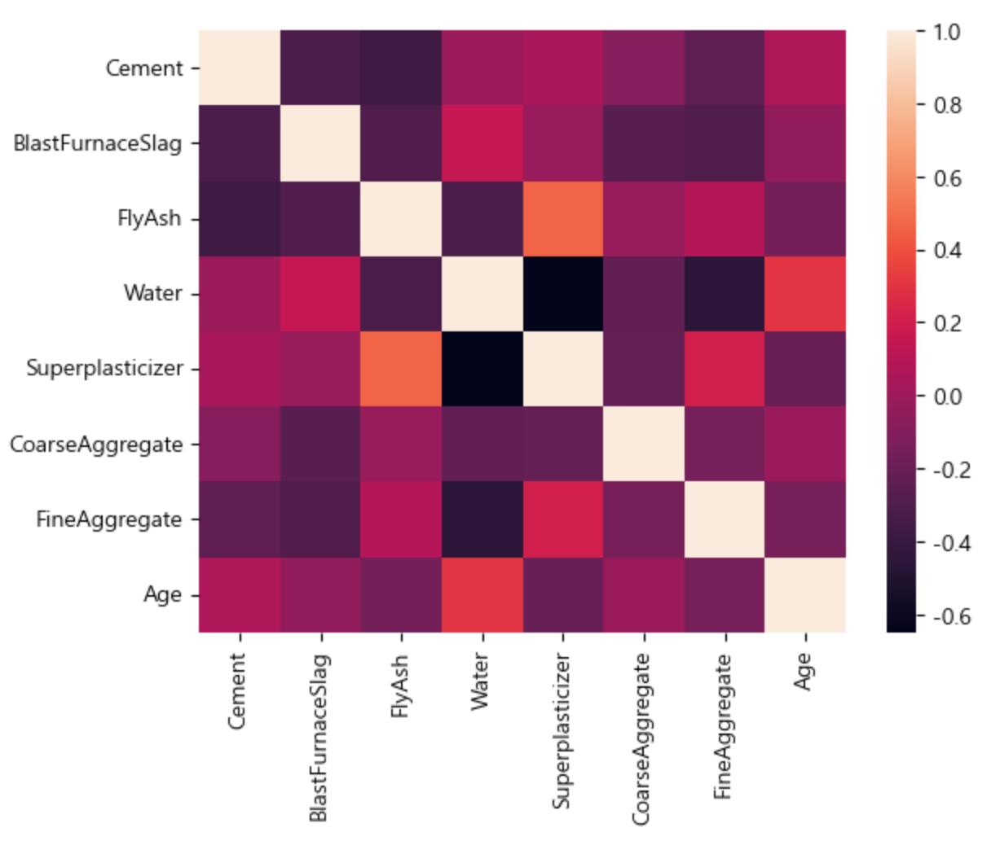
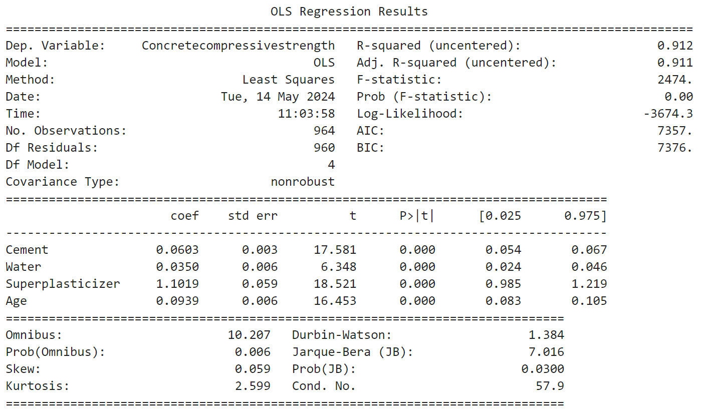
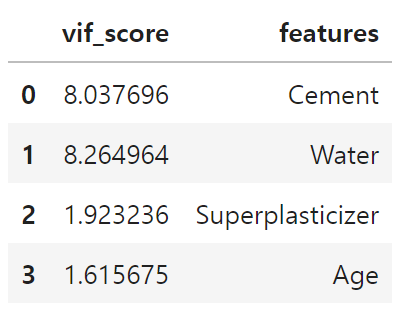
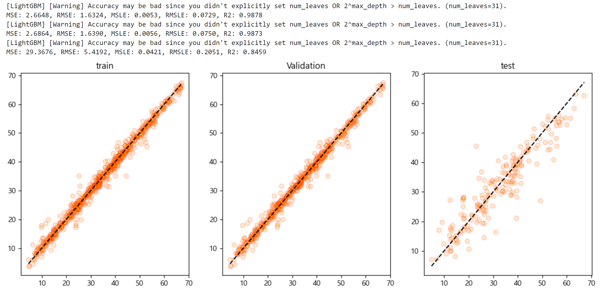

<br></br>

<div>
  <hr>
    <div style='text-align: center'>
    <b>
      <p style='font-size: 30px'>Concrete Compressive Strength Regression Project</p> 
    </b>
    <span style='font-size: 25px'>콘크리트 압축 강도 회귀 분석</span>
    </div>
  <hr>
    <div style='text-align: center'>
      <br></br>
      <br></br>
      <br></br>
      <br></br>
      <br></br>
      <br></br>
      <br></br>
      <span style='font-size: 25px'>2024. 05. 15.</span>
      <br></br>
      <br></br>
      <br></br>
      <br></br>
      <span style='font-size: 20px'>코리아IT 아카데미 - 송서경</span>
    </div>
</div>

<br></br>
<br></br>
<br></br>
<hr>
<br></br>
<br></br>
<br></br>

<h1> □ 목차</h1>
<div>
    <a style="color: inherit;" href='#Ⅰ. 개요'>
      <p style='font-size: 23px'>Ⅰ. 개요</p> <br>
    </a>
    <p style='font-size: 20px; margin-left: 20px; margin-top: -30px;'>1. 목적</p>
    <p style='font-size: 20px; margin-left: 20px;'>2. 분석 방법</p>
    <br></br>
    <a style="color: inherit;" href='#Ⅱ. 분석 결과'>
      <p style='font-size: 23px'>Ⅱ. 분석 결과</p> <br>
    </a>
      <p style='font-size: 20px; margin-left: 20px; margin-top: -30px;'>1. 데이터 탐색</p>
    <p style='font-size: 20px; margin-left: 20px;'>2. 데이터 전처리</p>
    <p style='font-size: 20px; margin-left: 20px;'>3. 훈련</p>
    <br></br>
    <a style="color: inherit;" href='#Ⅲ. 평가'>
      <p style='font-size: 23px'>Ⅲ. 평가</p> <br>
    </a>
    <p style='font-size: 20px; margin-left: 20px; margin-top: -30px;'>1. 평가 및 개선</p>
</div>

<br></br>
<br></br>
<br></br>
<br></br>
<br></br>

<h1 id="Ⅰ. 개요">Ⅰ. 개요</h1>

## 1. 데이터 정보
### □ 의료 보험비 데이터 세트
#### ○ 데이터 출처
kaggle - Concrete Compressive Strength
https://www.kaggle.com/datasets/niteshyadav3103/concrete-compressive-strength

<br></br>

#### ○ 데이터 정보
- 파일이름: 콘크리트 압축 강도 데이터 세트
- 파일 형식: CSV 파일
- 구분: 회귀 데이터 세트
- 형태: 1030 rows × 9 columns

<br></br>
<br></br>

## 2. 목적
### □ 분석 목적
○ 다양한 지표와 콘크리트의 관계를 탐색하고 콘크리트 압축 강도를 예측하는 모델 생성
○ 예측 모델을 통해 콘크리트 상품성 및 관리의 질 향상

<br></br>
<br></br>

## 3. 분석 방법
### □ 분석 절차
#### ○ 분석 프로세스
<table>
  <tr>
      <td>데이터 탐색</td>
      <td>데이터 전처리</td>
      <td>데이터 훈련</td>
      <td>데이터 평가</td>
  </tr>
  <tr>
      <td>데이터 이해, 문제 인식 및 해결안 도출</td>
      <td>전처리를 통한 데이터의 질 향상</td>
      <td>데이터 훈련을 통해 예측 모델 구축</td>
      <td>데이터 품질 측정 및 개선</td>
  </tr>
</table>

<br></br>
<br></br>

### □ 분석 방법
#### ○ 탐색
- 데이터 정보 확인을 통한 데이터 이해, 문제 인식 및 해결안 도출

<br></br>

#### ○ 전처리
- 불필요한 데이터 제거, 결측치, 이상치 등 제거를 통한 데이터 질 향상

<br></br>

#### ○ 훈련
- 데이터 훈련 모델을 통한 예측 모델 구축
<table>
  <tr>
      <td>연번</td>
      <td>모델</td>
  </tr>
  <tr>
      <td>1</td>
      <td>LGBMRegressor</td>
  </tr>
</table>

<br></br>

#### ○ 평가
- OLS, VIF 등 다양한 평가 지표를 통한 데이터 품질 측정 및 개선
- 데이터 평가 점수 산출 방식
<table>
  <tr>
      <td>연번</td>
      <td> 평가지표</td>
      <td>산출 코드</td>
  </tr>
  <tr>
      <td>1</td>
      <td>MSE</td>
      <td>mean_squared_error(y_test, prediction)</td>
  </tr>
  <tr>
      <td>2</td>
      <td>RMSE</td>
      <td>np.sqrt(MSE)</td>
  </tr>
  <tr>
      <td>3</td>
      <td>MSLE</td>
      <td>mean_squared_log_error(y_test, prediction)</td>
  </tr>
  <tr>
      <td>4</td>
      <td>RMSLE</td>
      <td>np.sqrt(MSLE)</td>
  </tr>
  <tr>
      <td>5</td>
      <td>R2</td>
      <td>r2_score(y_test, prediction)</td>
  </tr>
</table>

<br></br>
<br></br>
<br></br>
<br></br>
<br></br>

<h1 id="Ⅱ. 분석 결과">Ⅱ. 분석 결과</h1>

## 1. 데이터 탐색
### □ 데이터 기본 정보
#### ○ 데이터 정보
<table>
  <tr>
      <td>연번</td>
      <td>컬럼</td>
      <td>내용</td>
      <td>결측치</td>
      <td>타입</td>
  </tr>
  <tr>
      <td>1</td>
      <td>Cement</td>
      <td>시멘트 양 (kg/m^3)</td>
      <td>1030 non-null</td>
      <td>float64</td>
  </tr>
  <tr>
      <td>2</td>
      <td>BlastFurnaceSlag</td>
      <td>고로 슬래그 양 (kg/m^3)</td>
      <td>1030 non-null</td>
      <td>float64</td>
  </tr>
  <tr>
      <td>3</td>
      <td>FlyAsh</td>
      <td>플라이 애시(불연재) 양 (kg/m^3)</td>
      <td>1030 non-null</td>
      <td>float64</td>
  </tr>
  <tr>
      <td>4</td>
      <td>Water</td>
      <td>물 양 (kg/m^3)</td>
      <td>1030 non-null</td>
      <td>float64</td>
  </tr>
  <tr>
      <td>5</td>
      <td>Superplasticizer</td>
      <td>고성능 플라스틱화제 양 (kg/m^3)</td>
      <td>1030 non-null</td>
      <td>float64</td>
  </tr>
  <tr>
      <td>6</td>
      <td>CoarseAggregate</td>
      <td>거친 골재 양 (kg/m^3)</td>
      <td>1030 non-null</td>
      <td>float64</td>
  </tr>
  <tr>
      <td>7</td>
      <td>FineAggregate</td>
      <td>미분 골재 양 (kg/m^3)</td>
      <td>1030 non-null</td>
      <td>float64</td>
  </tr>
  <tr>
      <td>8</td>
      <td>Age</td>
      <td>콘크리트의 나이 (일)</td>
      <td>1030 non-null</td>
      <td>int64</td>
  </tr>
  <tr>
      <td>9</td>
      <td>Concretecompressivestrength</td>
      <td>콘크리트의 압축 강도 (MPa)</td>
      <td>1030 non-null</td>
      <td>float64</td>
  </tr>
</table>

- 1030 데이터가 존재하며, 9개의 열로 이루어짐
- float64 8개, int64 1개 열이 존재함

<br></br>

#### ○ 데이터 결측치, 중복행
 - 데이터 결측치 확인 결과 NaN, Null 값 모두 존재하지 않는 것으로 나타났으므로 결측치 제거를 진행하지 않음
- 중복행 확인 결과 중복행이 25개 존재하므로 중복행 제거를 진행함

<br></br>

#### ○ 데이터 분포


- 데이터 분포 확인 결과 이상치로 확인되는 타겟 데이터가 보여 데이터의 이상치 제거가 필요하다고 판단됨
- 이상치 제거 후 분포가 고르지 않다면 분포 변환이 필요함 <br>

<br></br>

#### ○ OLS(최소자승법)


- OLS 성능 지표 확인 결과 R2 스코어가 0.930, Durbin-Watson이 1.408으로 나타남
- P>|t| 에서도 큰 문제가 없는 것으로 나타남 <br>

<br></br>

#### ○ VIF


- 현재 일부 피처에서 다중 공산성 문제를 띄고 있는 데이터가 확인됨 <br>
- 데이터 전처리가 필요할 것으로 보이며, 피처 제거 시 상관관계를 확인한 뒤 제거가 필요함

<br></br>

#### ○ 상관 관계

<table>
    <tr>
        <td>연번</td>
        <td>컬럼</td>
        <td>상관관계</td>
    </tr>
    <tr>
        <td>1</td>
        <td>Cement</td>
        <td>0.435338</td>
    </tr>
    <tr>
        <td>2</td>
        <td>Age</td>
        <td>0.359209</td>
    </tr>
    <tr>
        <td>3</td>
        <td>Superplasticizer</td>
        <td>0.320660</td>
    </tr>
    <tr>
        <td>4</td>
        <td>BlastFurnaceSlag</td>
        <td>0.068309</td>
    </tr>
    <tr>
        <td>5</td>
        <td>FlyAsh</td>
        <td>-0.029009</td>
    </tr>
    <tr>
        <td>6</td>
        <td>CoarseAggregate</td>
        <td>-0.144767</td>
    </tr>
    <tr>
        <td>7</td>
        <td>FineAggregate</td>
        <td>-0.192751</td>
    </tr>
    <tr>
        <td>8</td>
        <td>Water</td>
        <td>-0.200220</td>
    </tr>
</table>

- Cement 약 0.4353의 수치로 타겟과 가장 높은 관계를 가진 것으로 나타남
- FlyAsh 약 -0.029의 수치로 음의 상관관계를 가지며, 타겟과 가장 낮은 관계를 가진 것으로 나타남
- 타겟과 상관관계가 낮은 피처를 제거하여 다중 공산성 등의 문제를 해결할 수 있을 것이라 판단됨

<br></br>
<br></br>
<br></br>

## 2. 데이터 전처리
### □ 데이터 전처리
#### ○ 이상치 제거
```
# 타겟 데이터 이상치 제거
from sklearn.preprocessing import StandardScaler

# 표준화 객체 생성
std = StandardScaler()

# 데이터 표준화 변환
result = std.fit_transform(pre_c_df[['Concretecompressivestrength']])

# 표준화 데이터 프레임 생성
std_c_df = pd.DataFrame(result, columns=['Concretecompressivestrength'])

# 타겟 데이터 이상치 제거
std_c_df = std_c_df[std_c_df.Concretecompressivestrength.between(-1.96, 1.96)]

# 이상치 제거후 유지되는 인덱스를 대조하여 원본 데이터 이상치 제거
pre_c_df = pre_c_df.iloc[std_c_df.index].reset_index(drop=True)
```


- 이상치 제거 후 타겟 데이터 분포가 고르게 나타남

<br></br>

#### ○ 피처 제거
##### ○ OLS


##### ○ VIF


##### ○ 상관관계
<table>
    <tr>
        <td>연번</td>
        <td>컬럼</td>
        <td>상관관계</td>
    </tr>
    <tr>
        <td>1</td>
        <td>Cement</td>
        <td>0.435338</td>
    </tr>
    <tr>
        <td>2</td>
        <td>Age</td>
        <td>0.359209</td>
    </tr>
    <tr>
        <td>3</td>
        <td>Superplasticizer</td>
        <td>0.320660</td>
    </tr>
    <tr>
        <td>4</td>
        <td>Water</td>
        <td>-0.200220</td>
    </tr>
</table>

- 상관관계가 낮은 피처 제거 후 R2 값은 하락하였지만, 다중 공산성이 해소된 것을 확인함

<br></br>
<br></br>
<br></br>

## 3. 데이터 훈련
### □ 데이터 훈련
```
from sklearn.model_selection import train_test_split
from lightgbm import LGBMRegressor
from sklearn.model_selection import KFold
from sklearn.model_selection import GridSearchCV

from sklearn.pipeline import Pipeline
from sklearn.preprocessing import StandardScaler

# 데이터 세트 분리
# 피처, 타겟 데이터 분리
features, targets = pre_c_df.iloc[:, :-1], pre_c_df.iloc[:, -1]

# 문제/정답 및 학습/훈련 데이터 분리
X_train, X_test, y_train, y_test = \
train_test_split(features, targets, test_size=0.2, random_state=124)

# 검증 데이터 분리
val_X_train, val_X_test, val_y_train, val_y_test = \
train_test_split(X_train, y_train, test_size=0.2, random_state=124)

# 파이프 라인 구축
pipe = Pipeline([('std', StandardScaler()), ('lgb_r', LGBMRegressor(random_state=124))])

# 파라미터 값 조정
parameters = {'lgb_r__n_estimators': [250, 300],'lgb_r__learning_rate': [0.2], 'lgb_r__max_depth': [20, 30]}

# 교차검증
kfold = KFold(n_splits=5, random_state=124, shuffle=True)

# 학습 및 교차 검증 모델 설정
std_lgb_r = GridSearchCV(pipe, param_grid=parameters, cv=kfold, n_jobs=-1)

# 훈련
std_lgb_r.fit(X_train, y_train)
```

- LGBMRegressor 모델을 사용함
- KFold와 GridSearchCV를 통해 파라미터 값을 조정하여 훈련 진행
- StandardScaler를 통해 표준화 처리 후 훈련 진행

<br></br>
<br></br>
<br></br>
<br></br>
<br></br>

<h1 id="Ⅲ. 평가">Ⅲ. 평가</h1>

## 1. 데이터 훈련 결과 및 평가
#### ○ 최종 성능 확인


- 과적합 확인을 위해 예측값과 실제값을 비교하였을 때 과적합 문제가 있다고 판단됨.

<br></br>
<br></br>
