# Concrete Compressive Strength Regression Project
콘크리트 압축 강도 회귀 분석

<br>


<br>

2024.05.15.

<br></br>
<br></br>
<br></br>
<br></br>
<br></br>

# Ⅰ. 프로젝트 개요
## 1. 프로젝트 목표
콘크리트 품질 향상 및 설계 시 신뢰성 있는 강도 예측을 위해 콘크리트 압축 강도를 정확히 예측하는 머신러닝 모델 구현

<br></br>
<br></br>

## 2. 프로젝트 기대효과
✔ 콘크리트 품질 향상  
예측을 통해 콘크리트 제조 공정 최적화 및 강도와 내구성을 향상

<br>

✔ 구조물 설계 신뢰성 향상  
신뢰성 있는 강도 예측을 바탕으로 콘크리트로 제작된 다양한 구조물의 설계 및 평가 과정에서 더 정확한 강도 예측 제공

<br></br>
<br></br>

## 3. 데이터 흐름
### ○ 데이터 분석 프로세스

<br>

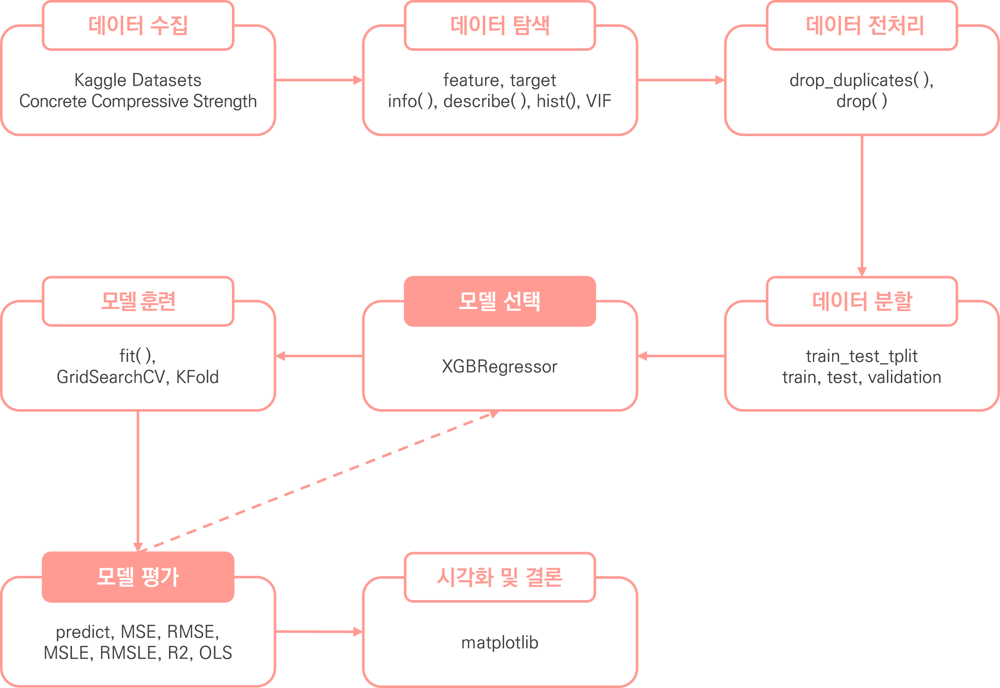


<br></br>
<br></br>

## 4. 데이터 수집
✔ 데이터 정보  
Kaggle의 Concrete Compressive Strength 데이터 세트 활용 (CSV 파일)   
https://www.kaggle.com/datasets/niteshyadav3103/concrete-compressive-strength

<br>

✔ 총 데이터 개수: 1030개 데이터

<br>

✔ feature (8개 feature)

| 컬럼명               | 컬럼 설명                   |
|:-----------------:|:-----------------------:|
| Cement            | 시멘트 양 (kg/m^3)          |
| BlastFurnaceSlag  | 고로 슬래그 양 (kg/m^3)       |
| FlyAsh            | 플라이 애시(불연재) 양 (kg/m^3)  |
| Water             | 물 양 (kg/m^3)            |
| Superplasticizer  | 고성능 플라스틱화제 양 (kg/m^3)   |
| CoarseAggregate   | 거친 골재 양 (kg/m^3)        |
| FineAggregate     | 미분 골재 양 (kg/m^3)        |
| Age               | 콘크리트의 나이 (일)            |

<br>

✔ target (1개 target)

| 컬럼명                          | 컬럼 설명              |
|:----------------------------:|:------------------:|
| Concretecompressivestrength  | 콘크리트의 압축 강도 (MPa)  |


<br></br>
<br></br>
<br></br>
<br></br>
<br></br>

# Ⅱ. 데이터 탐색 및 전처리

## 1. 데이터 탐색
### ○ head

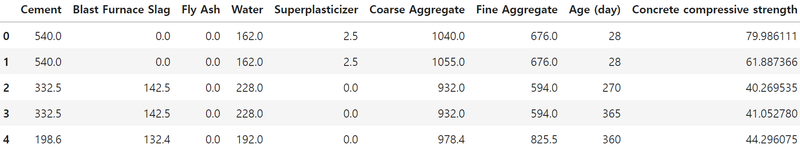
<details>
  <summary>code</summary>

  ```
  # 상위 5개 데이터 확인
  c_df.head()
  ```
</details>

<br></br>

### ○ tail

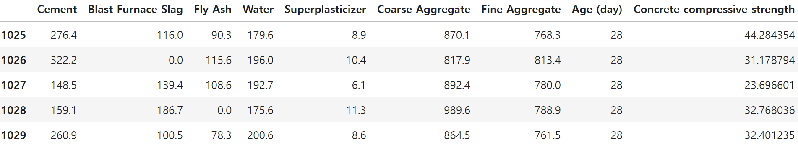
<details>
  <summary>code</summary>

  ```
  # 하위 5개 데이터 확인
  c_df.tail()
  ```
</details>

<br></br>

### ○ 데이터 분포
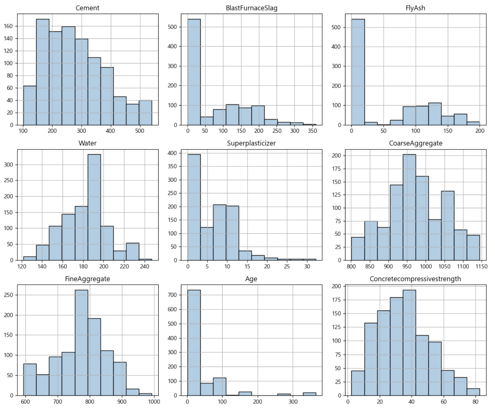
<details>
  <summary>code</summary>

  ```
  # 하위 5개 데이터 확인
  c_df.tail()
  ```
</details>

<br>

✔ 범주형이 없고 모두 수치형 데이터인 것으로 확인
✔ Cement, Water, CoarseAggregate, FineAggregate, Concretecompressivestrength의 분포는 어느정도 고르다고 보여졌으나, 이외의 본푸는 한쪽으로 치우친 것을 확인


<br></br>
<br></br>

## 2. 전처리
### ○ 결측치
✔ 결측치는 존재하지 않는 것으로 확인

<details>
  <summary>code</summary>

  ```
  # 결측치 확인
  c_df.isna().sum()
  ```
</details>

<br></br>

### ○ 중복행
✔ 25개 중복행 제거

<details>
  <summary>중복행 확인 code</summary>

  ```
  # 중복행 확인
  c_df.duplicated().sum()
  ```
</details>
<details>
  <summary>중복행 제거 code</summary>

  ```
  # 중복행 제거 
  pre_c_df = c_df.drop_duplicates().reset_index(drop=True)

  # 중복행 제거 확인
  pre_c_df.duplicated().sum()
  ```
</details>

<br></br>

### ○ 컬럼명 변경
✔ 컬럼의 공백 및 특수문자 제거 등 직관적으로 변경

<details>
  <summary>code</summary>

  ```
# 컬럼명 변경
  pre_c_df.columns = ['Cement', 'BlastFurnaceSlag', 'FlyAsh', 'Water', 'Superplasticizer',
                      'CoarseAggregate', 'FineAggregate', 'Age', 'Concretecompressivestrength']
  ```
</details>

<br></br>
<br></br>
<br></br>
<br></br>
<br></br>

# Ⅲ 머신러닝
## 1. 평가 지표
<table>
  <tr>
      <td>연번</td>
      <td> 평가지표</td>
      <td>산출 코드</td>
  </tr>
  <tr>
      <td>1</td>
      <td>MSE</td>
      <td>mean_squared_error(y_test, prediction)</td>
  </tr>
  <tr>
      <td>2</td>
      <td>RMSE</td>
      <td>np.sqrt(MSE)</td>
  </tr>
  <tr>
      <td>3</td>
      <td>MSLE</td>
      <td>mean_squared_log_error(y_test, prediction)</td>
  </tr>
  <tr>
      <td>4</td>
      <td>RMSLE</td>
      <td>np.sqrt(MSLE)</td>
  </tr>
  <tr>
      <td>5</td>
      <td>R2</td>
      <td>r2_score(y_test, prediction)</td>
  </tr>
</table>

<details>
  <summary>code</summary>

  ```
  import numpy as np
  from sklearn.metrics import mean_squared_error, mean_squared_log_error, r2_score

  def get_evaluation(y_test, prediction):
      MSE = mean_squared_error(y_test, prediction)
      RMSE = np.sqrt(MSE)
      MSLE = mean_squared_log_error(y_test, prediction)
      RMSLE = np.sqrt(MSLE)
      R2 = r2_score(y_test, prediction)
      print('MSE: {:.4f}, RMSE: {:.4f}, MSLE: {:.4f}, RMSLE: {:.4f}, R2: {:.4f}'\
          .format(MSE, RMSE, MSLE, RMSLE, R2))
  ```
</details>

<br></br>
<br></br>

## 2. 1Cycle
### ○ 선형 회귀

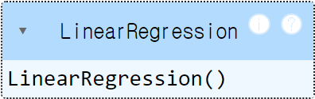
<details>
  <summary>code</summary>

  ```
  import numpy as np
  from sklearn.linear_model import LinearRegression
  from sklearn.model_selection import train_test_split

  # 데이터 세트 분리
  # 피처, 타겟 데이터 분리
  features, targets = pre_c_df.iloc[:, :-1], pre_c_df.iloc[:, -1]

  # 학습/테스트 및 문제/정답 데이터 세트 분리
  X_train, X_test, y_train, y_test = \
  train_test_split(features, targets, test_size=0.2, random_state=124)

  # 선형 회귀 모델
  l_r = LinearRegression()
  # 훈련
  l_r.fit(X_train, y_train)
  ```
</details>


<br></br>

### ○ 선형 회귀 - 예측 및 평가  
MSE: 116.2104, RMSE: 10.7801, MSLE: 0.1057, RMSLE: 0.3250, R2: 0.5442

<details>
  <summary>code</summary>

  ```
  # 예측
  prediction = l_r.predict(X_test)
  # 평가
  get_evaluation(y_test, prediction)
  ```
</details>

<br></br>

### ○ 다중 회귀


<details>
  <summary>code</summary>

  ```
  import numpy as np
  from sklearn.linear_model import LinearRegression
  from sklearn.model_selection import train_test_split
  from sklearn.preprocessing import PolynomialFeatures

  # 데이터 세트 분리
  # 피처, 타겟 데이터 분리
  features, targets = pre_c_df.iloc[:, :-1], pre_c_df.iloc[:, -1]

  # 차수 확장
  poly_features = PolynomialFeatures(degree=3).fit_transform(features)

  # 학습/테스트 및 문제/정답 데이터 세트 분리
  X_train, X_test, y_train, y_test = \
  train_test_split(poly_features, targets, test_size=0.2, random_state=124)

  # 선형 회귀 모델
  l_r = LinearRegression()
  # 훈련
  l_r.fit(X_train, y_train)
  ```
</details>


<br></br>

### ○ 다중 회귀 - 예측 및 평가  
MSE: 39.8814, RMSE: 6.3152, MSLE: 0.0349, RMSLE: 0.1867, R2: 0.8436

<details>
  <summary>code</summary>

  ```
  # 예측
  prediction = l_r.predict(X_test)
  # 평가
  get_evaluation(y_test, prediction)
  ```
</details>

<br></br>

### ○ 회귀 모델 - 훈련, 예측 및 평가
DecisionTreeRegressor  
MSE: 36.8723, RMSE: 6.0723, MSLE: 0.0425, RMSLE: 0.2063, R2: 0.8554

<br>

RandomForestRegressor  
MSE: 21.9056, RMSE: 4.6803, MSLE: 0.0231, RMSLE: 0.1518, R2: 0.9141

<br>

GradientBoostingRegressor  
MSE: 22.1132, RMSE: 4.7025, MSLE: 0.0239, RMSLE: 0.1546, R2: 0.9133

<br>

XGBRegressor  
MSE: 14.9316, RMSE: 3.8641, MSLE: 0.0177, RMSLE: 0.1332, R2: 0.9414

<br>

LGBMRegressor  
MSE: 17.0718, RMSE: 4.1318, MSLE: 0.0213, RMSLE: 0.1461, R2: 0.9330

<details>
  <summary>code</summary>

  ```
  from sklearn.tree import DecisionTreeRegressor
  from sklearn.ensemble import RandomForestRegressor
  from sklearn.ensemble import GradientBoostingRegressor
  from xgboost import XGBRegressor
  from lightgbm import LGBMRegressor
  from sklearn.model_selection import train_test_split

  # 데이터 세트 분리
  # 피처, 타겟 데이터 분리
  features, targets = pre_c_df.iloc[:, :-1], pre_c_df.iloc[:, -1]

  # 학습/테스트 및 문제/정답 데이터 세트 분리
  X_train, X_test, y_train, y_test = \
  train_test_split(features, targets, test_size=0.2, random_state=124)

  # 회귀 모델 담기
  dt_r = DecisionTreeRegressor(random_state=124)
  rf_r = RandomForestRegressor(random_state=124, n_estimators=1000)
  gb_r = GradientBoostingRegressor(random_state=124)
  xgb_r = XGBRegressor(random_state=124)
  lgb_r = LGBMRegressor(random_state=124)

  models = [dt_r, rf_r, gb_r, xgb_r, lgb_r]

  # 모델 별 학습 진행:
  for model in models:
      # 모델 학습
      model.fit(X_train, y_train)
      # 예측
      prediction = model.predict(X_test)
      # 모델명 출력 (모델명과 평가 결과가 같이 출력되도록)
      print(model.__class__.__name__)
      # 평가
      get_evaluation(y_test, prediction)
  ```
</details>

<br></br>

### ○ 분석

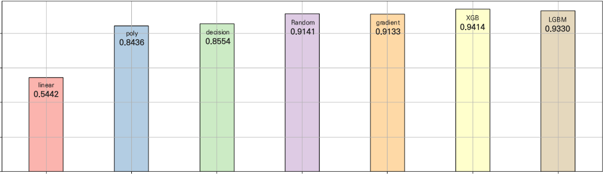

| model            | model   |
|:----------------:|:-------:|
| Linear           | 0.5442  |
| Polynomial       | 0.8436  |
| DecisionTree     | 0.8554  |
| RandomForest     | 0.9141  |
| GradientBoosting | 0.9133  |
| XGB              | 0.9414  |
| LGBM             | 0.9330  |

<br></br>

✔ 선형회귀 모델 보다 다중 회귀 모델이 성능이 더 우세함에 따라, 비선형 패턴을 띄고 있음을 확인함  

✔ 회귀 모델 중 XGBRegressor을 사용하였을 때, 가장 좋은 성능을 보임에 따라 해당 모델을 선택하는 것이 적합하다고 판단됨

<br></br>
<br></br>

## 3. 2Cycle
### ○ 이상치 제거
✔ StandardScaler를 통해 데이터 변환 후 이상치 제거

<details>
  <summary>code</summary>

  ```
  # 타겟 데이터 이상치 제거
  from sklearn.preprocessing import StandardScaler

  # 표준화 객체 생성
  std = StandardScaler()
  # 데이터 표준화 변환
  std_result = std.fit_transform(pre_c_df[['Concretecompressivestrength']])
  # 표준화 데이터 프레임 생성
  std_c_df = pd.DataFrame(std_result, columns=['Concretecompressivestrength'])

  # 타겟 데이터 이상치 제거
  std_c_df = pre_c_df[std_c_df.Concretecompressivestrength.between(-1.96, 1.96)]
  std_c_df

  # 이상치 제거후 유지되는 인덱스를 대조하여 원본 데이터 이상치 제거
  pstd_c_df = pre_c_df.iloc[std_c_df.index].reset_index(drop=True)
  pstd_c_df
  ```
</details>

<br></br>

### ○ 종속 변수 분포
✔ 이상치 제거 후 종속 변수 분포 확인

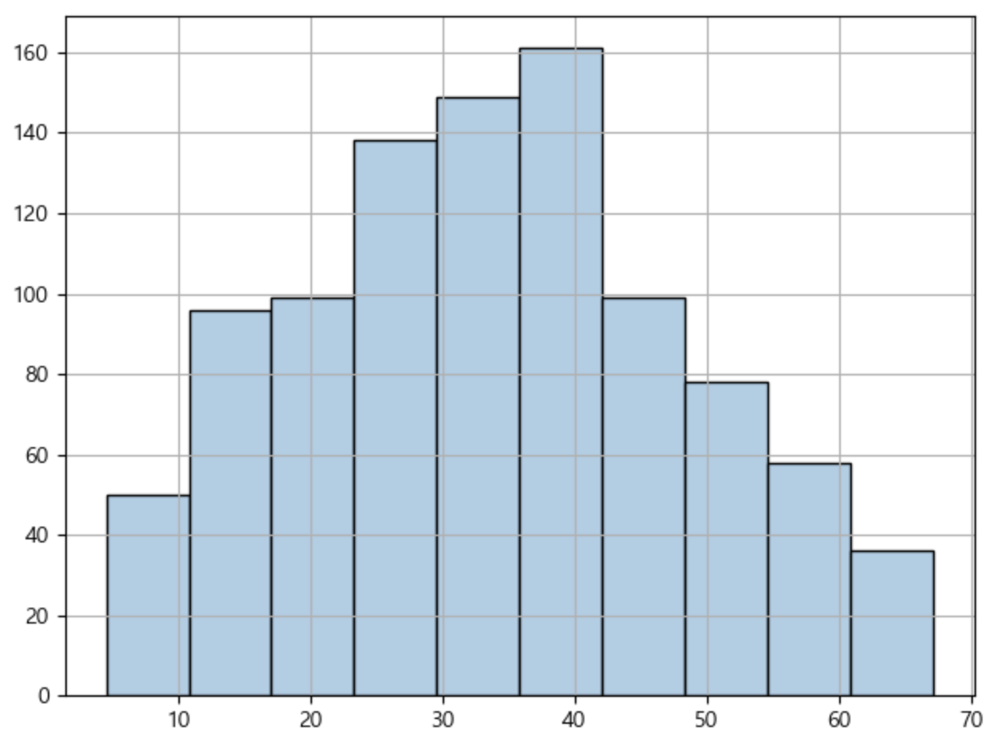
<details>
  <summary>code</summary>

  ```
  # 종속 변수 분포 확인
  pstd_c_df.Concretecompressivestrength.hist(color=cmap(np.array([1])), edgecolor='black')
  ```
</details>

<br></br>

### ○ 훈련 및 예측, 평가  
XGBRegressor  
MSE: 22.7336, RMSE: 4.7680, MSLE: 0.0295, RMSLE: 0.1717, R2: 0.8807


<details>
  <summary>code</summary>

  ```
from xgboost import XGBRegressor
from sklearn.model_selection import train_test_split

# 데이터 세트 분리
# 피처, 타겟 데이터 분리
features, targets = pstd_c_df.iloc[:, :-1], pstd_c_df.iloc[:, -1]

# 학습/테스트 및 문제/정답 데이터 세트 분리
X_train, X_test, y_train, y_test = \
train_test_split(features, targets, test_size=0.2, random_state=124)

# 회귀 모델 담기
xgb_r = XGBRegressor(random_state=124)

# 모델 학습
xgb_r.fit(X_train, y_train)

# 예측
prediction = xgb_r.predict(X_test)

# 모델명 출력 (모델명과 평가 결과가 같이 출력되도록)
print(xgb_r.__class__.__name__)

# 평가
get_evaluation(y_test, prediction)
  ```
</details>

<br></br>

### ○ 분석
✔ 이상치 제거 후 성능이 더 저하됨에 따라 이상치 제거를 진행하지 않기로 함

<br></br>
<br></br>

## 4. 3Cycle
### ○ 로그 변환

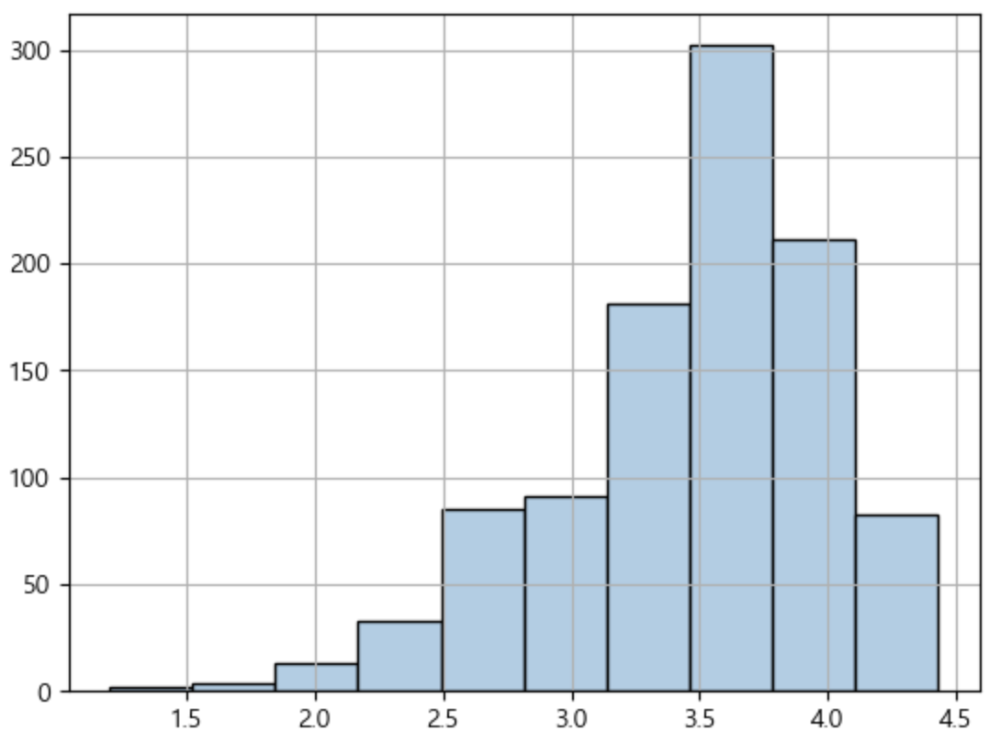
<details>
  <summary>code</summary>

  ```
  # 데이터 프레임 복제
  log_c_df = pre_c_df.copy()

  # 로그 변환
  log_c_df.Concretecompressivestrength = np.log1p(log_c_df.Concretecompressivestrength)
  ```
</details>

<br></br>

### ○ 로그 변환 - 훈련 및 예측, 평가  
XGBRegressor  
MSE: 0.0193, RMSE: 0.1390, MSLE: 0.0012, RMSLE: 0.0344, R2: 0.9231

<details>
  <summary>code</summary>

  ```
  from xgboost import XGBRegressor
  from sklearn.model_selection import train_test_split

  # 데이터 세트 분리
  # 피처, 타겟 데이터 분리
  features, targets = log_c_df.iloc[:, :-1], log_c_df.iloc[:, -1]

  # 학습/테스트 및 문제/정답 데이터 세트 분리
  X_train, X_test, y_train, y_test = \
  train_test_split(features, targets, test_size=0.2, random_state=124)

  # 회귀 모델 담기
  xgb_r = XGBRegressor(random_state=124)

  # 모델 학습
  xgb_r.fit(X_train, y_train)

  # 예측
  prediction = xgb_r.predict(X_test)

  # 모델명 출력 (모델명과 평가 결과가 같이 출력되도록)
  print(xgb_r.__class__.__name__)

  # 평가
  get_evaluation(y_test, prediction)
  ```
</details>

<br></br>

### ○ PowerTransformer

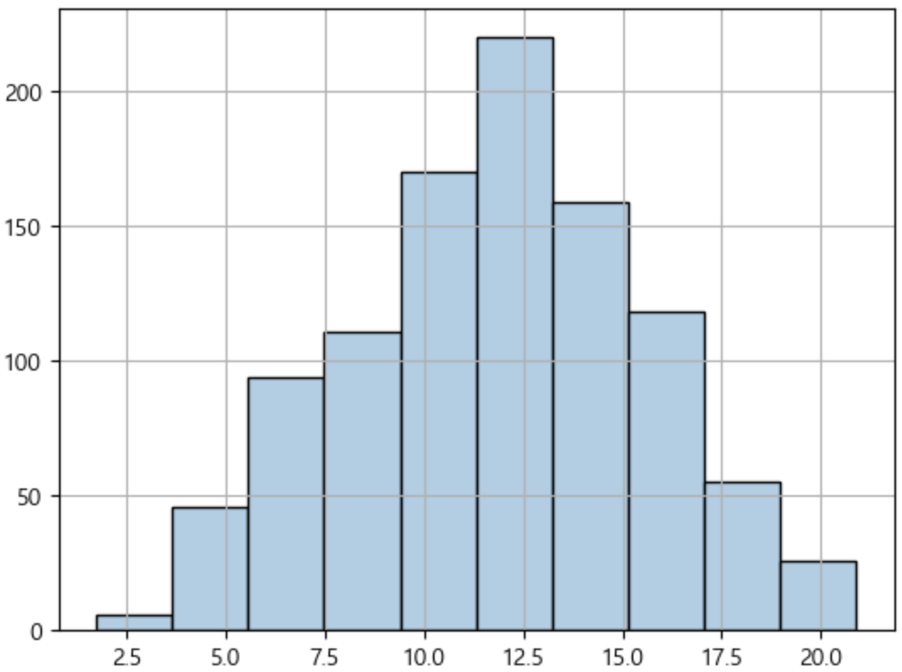
<details>
  <summary>code</summary>

  ```
  from sklearn.preprocessing import PowerTransformer

  # 정규분포에 가깝게 변환 객체 생성
  ptf = PowerTransformer(standardize=False)
  # 변환 후 결과 저장
  result = ptf.fit_transform(pre_c_df[['Concretecompressivestrength']])

  # 분포 확인
  pd.DataFrame(result).hist(color=cmap(np.array([1])), edgecolor='black')

  # 데이터 프레임 복제
  yeo_c_df = pre_c_df.copy()

  # 변환된 데이터로 새로운 타겟 데이터 생성
  yeo_c_df['Target_yeo'] = result

  # 사용이 끝난 컬럼 제거
  yeo_c_df = yeo_c_df.drop(labels='Concretecompressivestrength', axis=1)
  ```
</details>

<br></br>

### ○ PowerTransformer - 훈련 및 예측, 평가  
XGBRegressor  
MSE: 0.8112, RMSE: 0.9007, MSLE: 0.0067, RMSLE: 0.0821, R2: 0.9390

<details>
  <summary>code</summary>

  ```
  from xgboost import XGBRegressor
  from sklearn.model_selection import train_test_split

  # 데이터 세트 분리
  # 피처, 타겟 데이터 분리
  features, targets = yeo_c_df.iloc[:, :-1], yeo_c_df.iloc[:, -1]

  # 학습/테스트 및 문제/정답 데이터 세트 분리
  X_train, X_test, y_train, y_test = \
  train_test_split(features, targets, test_size=0.2, random_state=124)

  # 회귀 모델 담기
  xgb_r = XGBRegressor(random_state=124)

  # 모델 학습
  xgb_r.fit(X_train, y_train)

  # 예측
  prediction = xgb_r.predict(X_test)

  # 모델명 출력 (모델명과 평가 결과가 같이 출력되도록)
  print(xgb_r.__class__.__name__)

  # 평가
  get_evaluation(y_test, prediction)
  ```
</details>

<br></br>

### ○ 분석
✔ 로그 및 PowerTransformer 진행 후 성능이 더 저하됨에 따라 변환을 진행하지 않기로 함

<br></br>
<br></br>

## 5. 4Cycle
### ○ OLS

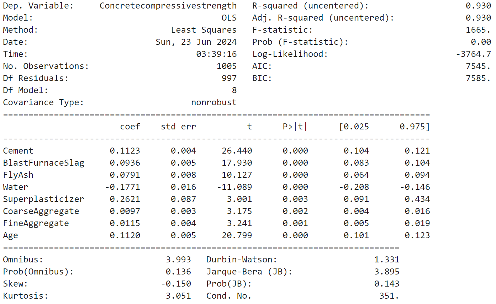

<details>
  <summary>code</summary>

  ```
  from statsmodels.api import OLS

  # 데이터 세트 분리
  # 피처, 타겟 데이터 분리
  features, targets = pre_c_df.iloc[:, :-1], pre_c_df.iloc[:, -1]

  # OLS 객체 생성
  model = OLS(targets, features)
  # 모델 훈련 및 정보 출력
  print(model.fit().summary())
  ```
</details>

<br></br>

### ○ VIF

| vif_score | features          |
|:---------:|:-----------------:|
| 15.155077 | Cement            |
| 3.261879  | BlastFurnaceSlag  |
| 4.171453  | FlyAsh            |
| 81.395278 | Water             |
| 5.171809  | Superplasticizer  |
| 84.738626 | CoarseAggregate   |
| 72.495779 | FineAggregate     |


<details>
  <summary>code</summary>

  ```
  from statsmodels.stats.outliers_influence import variance_inflation_factor

  def get_vif(features):
      vif = pd.DataFrame()
      vif['vif_score'] = [variance_inflation_factor(features, i) for i in range(features.shape[1])]
      vif['features'] = features.columns
      return vif

  # VIF 확인
  get_vif(features)
  ```
</details>

<br></br>

### ○ 상관관계

| features         | score     |
|:----------------:|:---------:|
| Cement           | 0.488283  |
| Superplasticizer | 0.344225  |
| Age              | 0.337371  |
| BlastFurnaceSlag | 0.103370  |
| FlyAsh           | -0.080648 |
| CoarseAggregate  | -0.144710 |
| FineAggregate    | -0.186457 |
| Water            | -0.269606 |


<details>
  <summary>code</summary>

  ```
  # 상관관계 확인
  pre_c_df.corr()['Concretecompressivestrength'].sort_values(ascending=False)[1:]
  ```
</details>

<br></br>

### ○ 상관관계 (히트맵)

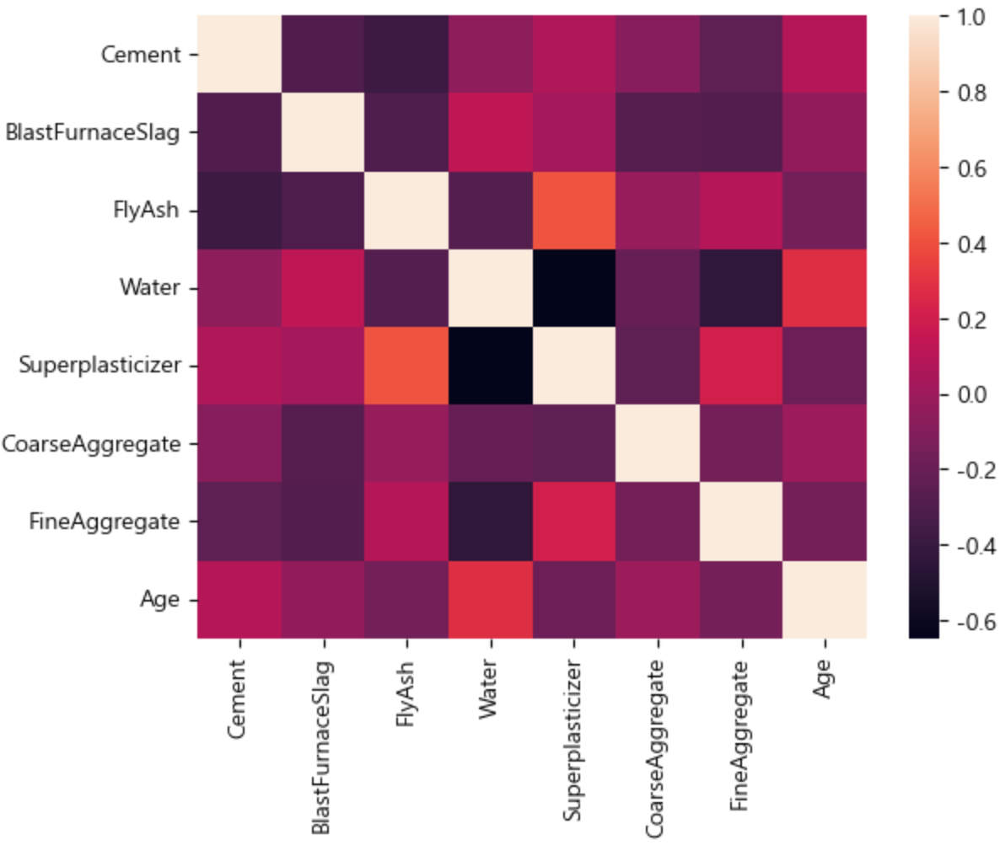


<details>
  <summary>code</summary>

  ```
  import seaborn as sns

  # 상관관계 히트맵 확인
  sns.heatmap(features.corr())
  ```
</details>

<br></br>

### ○ 분석
✔ FineAggregate, CoarseAggregate, Water이 다중공선성 문제가 있는 것으로 나타났음

✔ 종속변수와 상관관계를 확인한 결과 상관관계가 낮아 제거하여 진행

<br></br>

### ○ 훈련 및 예측, 평가  
XGBRegressor  
MSE: 23.6387, RMSE: 4.8620, MSLE: 0.0231, RMSLE: 0.1518, R2: 0.9073

<details>
  <summary>code</summary>

  ```
  from xgboost import XGBRegressor
  from sklearn.model_selection import train_test_split

  # 데이터 세트 분리
  # 피처, 타겟 데이터 분리
  features, targets = df_m_df.iloc[:, :-1], df_m_df.iloc[:, -1]

  # 학습/테스트 및 문제/정답 데이터 세트 분리
  X_train, X_test, y_train, y_test = \
  train_test_split(features, targets, test_size=0.2, random_state=124)

  # 회귀 모델 담기
  xgb_r = XGBRegressor(random_state=124)

  # 모델 학습
  xgb_r.fit(X_train, y_train)

  # 예측
  prediction = xgb_r.predict(X_test)

  # 모델명 출력 (모델명과 평가 결과가 같이 출력되도록)
  print(xgb_r.__class__.__name__)

  # 평가
  get_evaluation(y_test, prediction)
  ```
</details>

<br></br>

### ○ 분석
✔ 다중공선성이 나타나는 피처 제거 후 성능이 저하된 것을 확인하였지만,  
  다중공선성 문제가 해결되었으며, 여전히 높은 성능을 보이고 있기 때문에 높은 신뢰를 가진 회귀 모델이라 판단함

<br></br>
<br></br>

## 6. 5Cycle
### ○ GridSearchCV
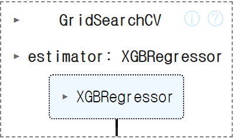


<details>
  <summary>code</summary>

  ```
  from sklearn.model_selection import train_test_split
  from xgboost import XGBRegressor
  from sklearn.model_selection import GridSearchCV
  from sklearn.model_selection import KFold

  # 데이터 세트 분리
  # 피처, 타겟 데이터 분리
  features, targets = df_m_df.iloc[:, :-1], df_m_df.iloc[:, -1]

  # 문제/정답 및 학습/훈련 데이터 분리
  X_train, X_test, y_train, y_test = \
  train_test_split(features, targets, test_size=0.2, random_state=124)

  # 검증 데이터 분리
  val_X_train, val_X_test, val_y_train, val_y_test = \
  train_test_split(X_train, y_train, test_size=0.2, random_state=124)

  # 회귀 모델 담기
  k_xgb_r = XGBRegressor(random_state=124)

  # 파라미터 값 조정
  parameters = {'learning_rate': [0.1, 0.15, 0.2, 0.3], 'n_estimators': [150, 200, 250]}

  # 교차검증
  # n_splits: 데이터를 몇 개의 폴드로 나눌지를 결정 (일반적으로 5 또는 10)
  # shuffle: 분할 전 데이터 혼합 여부 
  kfold = KFold(n_splits=10, random_state=124, shuffle=True)

  # 학습 및 교차 검증 모델 설정
  grid_xgb_r = GridSearchCV(k_xgb_r, param_grid=parameters, cv=kfold, n_jobs=-1)

  # 훈련
  grid_xgb_r.fit(X_train, y_train)
  ```
</details>

<br></br>

### ○ 최적의 파라미터

| learning_rate | n_estimators |
|:--------------:|:-----------------:|
| 0.15              | 150                |

<details>
  <summary>code</summary>

  ```
  # 훈련 결과 확인
  result_df = pd.DataFrame(grid_xgb_r.cv_results_)[['params', 'mean_test_score', 'rank_test_score']]
  display(result_df)
  ```
</details>

<br></br>

### ○ 예측 및 평가  
MSE: 21.6055, RMSE: 4.6482, MSLE: 0.0222, RMSLE: 0.1491, R2: 0.9153

<details>
  <summary>code</summary>

  ```
  # 최적의 모델 담기
  kf_xgb_r = grid_xgb_r.best_estimator_

  # 예측
  prediction = kf_xgb_r.predict(X_test)

  # 평가
  get_evaluation(y_test, prediction)
  ```
</details>

<br></br>

### ○ 분석
✔ 최적의 하이퍼파라미터 값을 찾아 훈련한 결과 성능이 향상된 것을 확인함

<br></br>

### ○ cross val score
[0.72064804,  0.62894302,  0.71859504,  0.82879229, -0.92092035]

<details>
  <summary>code</summary>

  ```
  from sklearn.model_selection import cross_val_score

  # 점수 확인
  score = cross_val_score(kf_xgb_r, features, targets)
  score
  ```
</details>

<br></br>

### ○ 과적합 확인
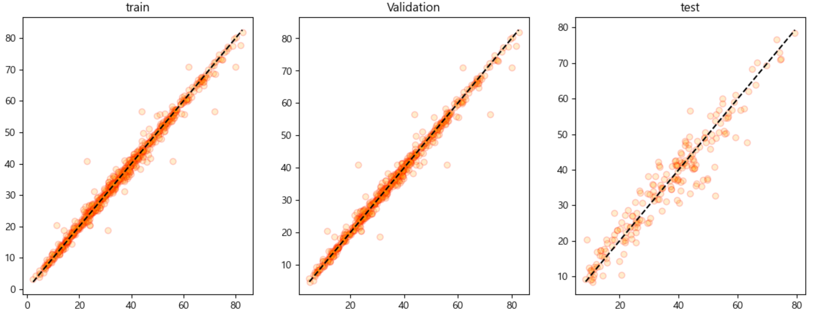

<br>

train  
MSE: 3.2217, RMSE: 1.7949, MSLE: 0.0033, RMSLE: 0.0574, R2: 0.9879

<br>

validation  
MSE: 3.6369, RMSE: 1.9071, MSLE: 0.0035, RMSLE: 0.0594, R2: 0.9861

<br>

test  
MSE: 21.6055, RMSE: 4.6482, MSLE: 0.0222, RMSLE: 0.1491, R2: 0.9153 


<details>
  <summary>code</summary>

  ```
  import matplotlib.pyplot as plt

  fig, ax = plt.subplots(1, 3, figsize=(14, 5))

  # 예측
  prediction = kf_xgb_r.predict(X_train)
  # 평가
  get_evaluation(y_train, prediction)

  ax[0].scatter(y_train, prediction, edgecolors='red', c='orange', alpha=0.2)
  ax[0].plot([y_train.min(), y_train.max()], [y_train.min(), y_train.max()], 'k--')
  ax[0].set_title('train')

  # 예측
  prediction = kf_xgb_r.predict(val_X_train)
  # 평가
  get_evaluation(val_y_train, prediction)

  ax[1].scatter(val_y_train, prediction, edgecolors='red', c='orange', alpha=0.2)
  ax[1].plot([val_y_train.min(), val_y_train.max()], [val_y_train.min(), val_y_train.max()], 'k--')
  ax[1].set_title('Validation')

  # 예측
  prediction = kf_xgb_r.predict(X_test)
  # 평가
  get_evaluation(y_test, prediction)

  ax[2].scatter(y_test, prediction, edgecolors='red', c='orange', alpha=0.2)
  ax[2].plot([y_test.min(), y_test.max()], [y_test.min(), y_test.max()], 'k--')
  ax[2].set_title('test')

  plt.show()
  ```
</details>

<br></br>

### ○ 분석
✔ 훈련 데이터 보다 테스트 데이터의 성능이 더 저하됨에 따라 과적합이 발생했다고 판단함

✔ 규제를 주어 과적합을 해소하기로 함

<br></br>
<br></br>

## 7. 6Cycle
### ○ lasso

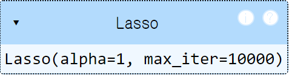

<details>
  <summary>code</summary>

  ```
  import numpy as np
  from sklearn.linear_model import Lasso
  from sklearn.model_selection import train_test_split

  # 데이터 세트 분리
  # 피처, 타겟 데이터 분리
  features, targets = yeo_c_df.iloc[:, :-1], yeo_c_df.iloc[:, -1]

  # 문제/정답 및 학습/훈련 데이터 분리
  X_train, X_test, y_train, y_test = \
  train_test_split(features, targets, test_size=0.2, random_state=124)

  # 검증 데이터 분리
  val_X_train, val_X_test, val_y_train, val_y_test = \
  train_test_split(X_train, y_train, test_size=0.2, random_state=124)

  # 라소 개체 생성
  lasso = Lasso(alpha=1, max_iter=10000)

  # 훈련
  lasso.fit(X_train, y_train)
  ```
</details>

<br></br>

### ○ lasso - 과적합 확인
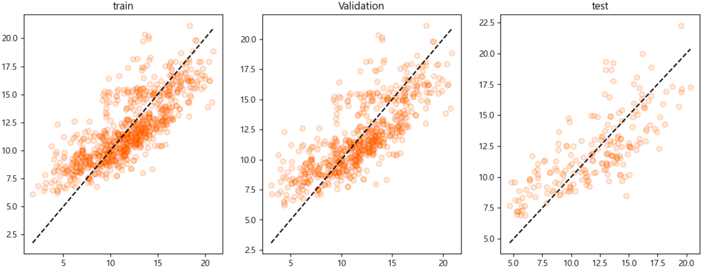

<br>

train  
MSE: 5.5366, RMSE: 2.3530, MSLE: 0.0458, RMSLE: 0.2139, R2: 0.6032

<br>

validation  
MSE: 5.5250, RMSE: 2.3505, MSLE: 0.0432, RMSLE: 0.2078, R2: 0.5891

<br>

test  
MSE: 6.1886, RMSE: 2.4877, MSLE: 0.0428, RMSLE: 0.2069, R2: 0.5346


<details>
  <summary>code</summary>

  ```
  import matplotlib.pyplot as plt

  fig, ax = plt.subplots(1, 3, figsize=(14, 5))

  # 예측
  prediction = lasso.predict(X_train)
  # 평가
  get_evaluation(y_train, prediction)

  ax[0].scatter(y_train, prediction, edgecolors='red', c='orange', alpha=0.2)
  ax[0].plot([y_train.min(), y_train.max()], [y_train.min(), y_train.max()], 'k--')
  ax[0].set_title('train')

  # 예측
  prediction = lasso.predict(val_X_train)
  # 평가
  get_evaluation(val_y_train, prediction)

  ax[1].scatter(val_y_train, prediction, edgecolors='red', c='orange', alpha=0.2)
  ax[1].plot([val_y_train.min(), val_y_train.max()], [val_y_train.min(), val_y_train.max()], 'k--')
  ax[1].set_title('Validation')

  # 예측
  prediction = lasso.predict(X_test)
  # 평가
  get_evaluation(y_test, prediction)

  ax[2].scatter(y_test, prediction, edgecolors='red', c='orange', alpha=0.2)
  ax[2].plot([y_test.min(), y_test.max()], [y_test.min(), y_test.max()], 'k--')
  ax[2].set_title('test')

  plt.show()
  ```
</details>

<br></br>

### ○ ridge

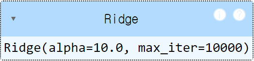

<details>
  <summary>code</summary>

  ```
  import numpy as np
  from sklearn.linear_model import Ridge
  from sklearn.model_selection import train_test_split

  # 데이터 세트 분리
  # 피처, 타겟 데이터 분리
  features, targets = df_m_df.iloc[:, :-1], df_m_df.iloc[:, -1]

  # 문제/정답 및 학습/훈련 데이터 분리
  X_train, X_test, y_train, y_test = \
  train_test_split(features, targets, test_size=0.2, random_state=124)

  # 검증 데이터 분리
  val_X_train, val_X_test, val_y_train, val_y_test = \
  train_test_split(X_train, y_train, test_size=0.2, random_state=124)

  # 릿지 객체 생성
  ridge = Ridge(alpha=1e+1, max_iter=10000)
  # 훈련
  ridge.fit(X_train, y_train)
  ```
</details>

<br></br>

### ○ ridge - 과적합 확인
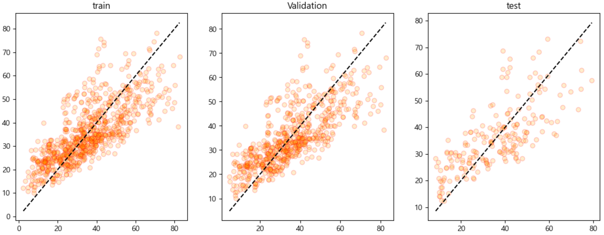

<br>

train  
MSE: 115.2205, RMSE: 10.7341, MSLE: 0.1195, RMSLE: 0.3456, R2: 0.5689

<br>

validation  
MSE: 114.9983, RMSE: 10.7237, MSLE: 0.1140, RMSLE: 0.3376, R2: 0.5598

<br>

test  
MSE: 120.7493, RMSE: 10.9886, MSLE: 0.1119, RMSLE: 0.3345, R2: 0.5264

<details>
  <summary>code</summary>

  ```
  import matplotlib.pyplot as plt

  fig, ax = plt.subplots(1, 3, figsize=(14, 5))

  # 예측
  prediction = ridge.predict(X_train)
  # 평가
  get_evaluation(y_train, prediction)

  ax[0].scatter(y_train, prediction, edgecolors='red', c='orange', alpha=0.2)
  ax[0].plot([y_train.min(), y_train.max()], [y_train.min(), y_train.max()], 'k--')
  ax[0].set_title('train')

  # 예측
  prediction = ridge.predict(val_X_train)
  # 평가
  get_evaluation(val_y_train, prediction)

  ax[1].scatter(val_y_train, prediction, edgecolors='red', c='orange', alpha=0.2)
  ax[1].plot([val_y_train.min(), val_y_train.max()], [val_y_train.min(), val_y_train.max()], 'k--')
  ax[1].set_title('Validation')

  # 예측
  prediction = ridge.predict(X_test)
  # 평가
  get_evaluation(y_test, prediction)

  ax[2].scatter(y_test, prediction, edgecolors='red', c='orange', alpha=0.2)
  ax[2].plot([y_test.min(), y_test.max()], [y_test.min(), y_test.max()], 'k--')
  ax[2].set_title('test')

  plt.show()
  ```
</details>

<br></br>

### ○ 분석
✔ 규제 진행 시 성능이 많이 저하되는 것을 확인함

✔ 편향을 추가하고 하이퍼 파라미터 값을 조정하여 과적합을 해소하기로 함

<br></br>
<br></br>

## 8. 7Cycle
### ○ 편향 추가
✔ 데이터가 모두 1인 편향 컬럼 추가

<details>
  <summary>code</summary>

  ```
  # 편향 추가를 위해 데이터 프레임 복제
  bias_m_df = df_m_df.copy()

  # 편향 열 추가
  bias_m_df['bias'] = 1
  bias_m_df
  ```
</details>

<br></br>

### ○ 훈련

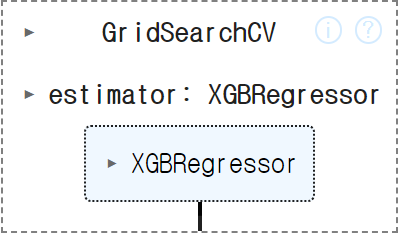

<details>
  <summary>code</summary>

  ```
  from sklearn.model_selection import train_test_split
  from xgboost import XGBRegressor
  from sklearn.model_selection import GridSearchCV
  from sklearn.model_selection import KFold

  # 데이터 세트 분리
  # 피처, 타겟 데이터 분리
  features, targets = bias_m_df.iloc[:, :-1], bias_m_df.iloc[:, -1]

  # 문제/정답 및 학습/훈련 데이터 분리
  X_train, X_test, y_train, y_test = \
  train_test_split(features, targets, test_size=0.2, random_state=124)

  # 검증 데이터 분리
  val_X_train, val_X_test, val_y_train, val_y_test = \
  train_test_split(X_train, y_train, test_size=0.2, random_state=124)

  # 회귀 모델 담기
  # reg_lambda: L2 규제
  k_xgb_r = XGBRegressor(random_state=124, reg_lambda=0.5)

  # 파라미터 값 조정
  # max_depth: 최대 트리 깊이 설정, 트리 값을 줄여서 깊이 제한
  # min_child_weight: 최소 가중치 합 지정, 값을 높여 세부적으로 나뉘는 것을 방지하고 과적합을 방지함
  parameters = {'max_depth': [1, 3], 'min_child_weight': [1, 3, 5], 'learning_rate': [0.15], 'n_estimators': [150, 200, 250]}

  # 교차검증
  # n_splits: 데이터를 몇 개의 폴드로 나눌지를 결정 (일반적으로 5 또는 10)
  # shuffle: 분할 전 데이터 혼합 여부 
  kfold = KFold(n_splits=10, random_state=124, shuffle=True)

  # 학습 및 교차 검증 모델 설정
  grid_xgb_r = GridSearchCV(k_xgb_r, param_grid=parameters, cv=kfold, n_jobs=-1)

  # 훈련
  grid_xgb_r.fit(X_train, y_train)
  ```
</details>

### ○ 최적의 파라미터

| reg_lambda | max_depth | min_child_weight | learning_rate | n_estimators |
|:--------------:|:-----------------:|:------------:|:--------------:|:-----------------:|
| 0.5              | 3                | 1           | 0.15              | 150                |

<details>
  <summary>code</summary>

  ```
  # 훈련 결과 확인
  result_df = pd.DataFrame(grid_xgb_r.cv_results_)[['params', 'mean_test_score', 'rank_test_score']]
  display(result_df)
  ```
</details>

<br></br>

### ○ 예측 및 평가  
MSE: 22.7202, RMSE: 4.7666, MSLE: 0.0265, RMSLE: 0.1626, R2: 0.9109

<details>
  <summary>code</summary>

  ```
  # 최적의 모델 담기
  kf_xgb_r = grid_xgb_r.best_estimator_

  # 예측
  prediction = kf_xgb_r.predict(X_test)

  # 평가
  get_evaluation(y_test, prediction)
  ```
</details>

<br></br>

### ○ 과적합 확인


<br>

train  
MSE: 8.8999, RMSE: 2.9833, MSLE: 0.0094, RMSLE: 0.0968, R2: 0.9667

<br>

validation  
MSE: 9.5972, RMSE: 3.0979, MSLE: 0.0096, RMSLE: 0.0980, R2: 0.9633

<br>

test  
MSE: 22.7202, RMSE: 4.7666, MSLE: 0.0265, RMSLE: 0.1626, R2: 0.9109


<details>
  <summary>code</summary>

  ```
  import matplotlib.pyplot as plt

  fig, ax = plt.subplots(1, 3, figsize=(14, 5))

  # 예측
  prediction = kf_xgb_r.predict(X_train)
  # 평가
  get_evaluation(y_train, prediction)

  ax[0].scatter(y_train, prediction, edgecolors='red', c='orange', alpha=0.2)
  ax[0].plot([y_train.min(), y_train.max()], [y_train.min(), y_train.max()], 'k--')
  ax[0].set_title('train')

  # 예측
  prediction = kf_xgb_r.predict(val_X_train)
  # 평가
  get_evaluation(val_y_train, prediction)

  ax[1].scatter(val_y_train, prediction, edgecolors='red', c='orange', alpha=0.2)
  ax[1].plot([val_y_train.min(), val_y_train.max()], [val_y_train.min(), val_y_train.max()], 'k--')
  ax[1].set_title('Validation')

  # 예측
  prediction = kf_xgb_r.predict(X_test)
  # 평가
  get_evaluation(y_test, prediction)

  ax[2].scatter(y_test, prediction, edgecolors='red', c='orange', alpha=0.2)
  ax[2].plot([y_test.min(), y_test.max()], [y_test.min(), y_test.max()], 'k--')
  ax[2].set_title('test')

  plt.show()
  ```
</details>

<br></br>

### ○ 분석
✔ 편향 추가 및 하이퍼파라미터 조정 결과 테스트 데이터 성능은 거의 유사하고,  
  훈련 데이터의 성능이 많이 저하된 것으로 보아 어느정도 과적합이 해소됐다고 판단함

<br></br>
<br></br>
<br></br>
<br></br>
<br></br>

# Ⅳ 결론
✔ 다중공선성 문제해결 및 과적합이 해소된 7Cycle 모델을 채택함