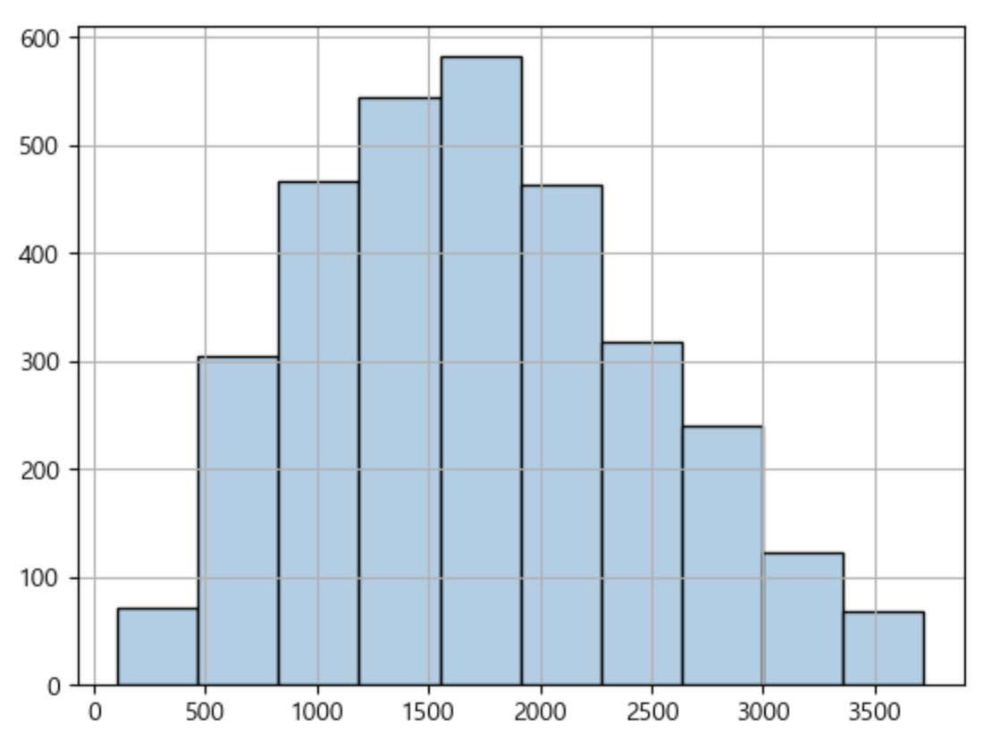
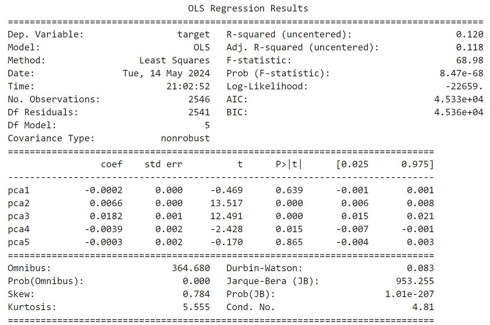
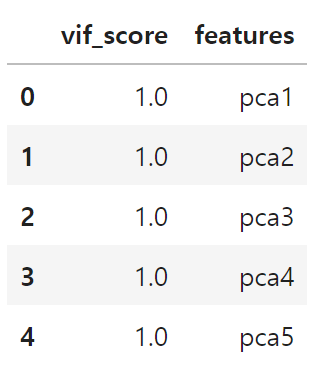

<br></br>

<div>
  <hr>
    <div style='text-align: center'>
    <b>
      <p style='font-size: 30px'>USA Residential Building Energy Consumption Survey <br> Regression Project</p> 
    </b>
    <span style='font-size: 25px'>미국 주거용 건물 에너지 소비 회귀 분석</span>
    </div>
  <hr>
    <div style='text-align: center'>
      <br></br>
      <br></br>
      <br></br>
      <br></br>
      <br></br>
      <br></br>
      <br></br>
      <span style='font-size: 25px'>2024. 05. 15.</span>
      <br></br>
      <br></br>
      <br></br>
      <br></br>
      <span style='font-size: 20px'>코리아IT 아카데미 - 송서경</span>
    </div>
</div>

<br></br>
<br></br>
<br></br>
<hr>
<br></br>
<br></br>
<br></br>

<h1> □ 목차</h1>
<div>
    <a style="color: inherit;" href='#Ⅰ. 개요'>
      <p style='font-size: 23px'>Ⅰ. 개요</p> <br>
    </a>
    <p style='font-size: 20px; margin-left: 20px; margin-top: -30px;'>1. 목적</p>
    <p style='font-size: 20px; margin-left: 20px;'>2. 분석 방법</p>
    <br></br>
    <a style="color: inherit;" href='#Ⅱ. 분석 결과'>
      <p style='font-size: 23px'>Ⅱ. 분석 결과</p> <br>
    </a>
      <p style='font-size: 20px; margin-left: 20px; margin-top: -30px;'>1. 데이터 탐색</p>
    <p style='font-size: 20px; margin-left: 20px;'>2. 데이터 전처리</p>
    <p style='font-size: 20px; margin-left: 20px;'>3. 훈련</p>
    <br></br>
    <a style="color: inherit;" href='#Ⅲ. 평가'>
      <p style='font-size: 23px'>Ⅲ. 평가</p> <br>
    </a>
    <p style='font-size: 20px; margin-left: 20px; margin-top: -30px;'>1. 평가 및 개선</p>
</div>

<br></br>
<br></br>
<br></br>
<br></br>
<br></br>

<h1 id="Ⅰ. 개요">Ⅰ. 개요</h1>

## 1. 데이터 정보
### □ 의료 보험비 데이터 세트
#### ○ 데이터 출처
kaggle - USA Residential Building Energy Consumption Survey  
https://www.kaggle.com/datasets/claytonmiller/2015-residential-energy-consumption-survey

<br></br>

#### ○ 데이터 정보
- 파일이름: 미국 주거용 건물 에너지 소비 데이터 세트
- 파일 형식: CSV 파일
- 구분: 회귀 데이터 세트
- 형태: 5686 rows × 759 columns

<br></br>
<br></br>

## 2. 목적
### □ 분석 목적
○ 다양한 지표와 에너지 소비를 탐색하고 에너지 소비량을 예측하는 모델 생성

<br></br>
<br></br>

## 3. 분석 방법
### □ 분석 절차
#### ○ 분석 프로세스
<table>
  <tr>
      <td>데이터 탐색</td>
      <td>데이터 전처리</td>
      <td>데이터 훈련</td>
      <td>데이터 평가</td>
  </tr>
  <tr>
      <td>데이터 이해, 문제 인식 및 해결안 도출</td>
      <td>전처리를 통한 데이터의 질 향상</td>
      <td>데이터 훈련을 통해 예측 모델 구축</td>
      <td>데이터 품질 측정 및 개선</td>
  </tr>
</table>

<br></br>
<br></br>

### □ 분석 방법
#### ○ 탐색
- 데이터 정보 확인을 통한 데이터 이해, 문제 인식 및 해결안 도출

<br></br>

#### ○ 전처리
- 불필요한 데이터 제거, 결측치, 이상치 등 제거를 통한 데이터 질 향상

<br></br>

#### ○ 훈련
- 데이터 훈련 모델을 통한 예측 모델 구축
<table>
  <tr>
      <td>연번</td>
      <td>모델</td>
  </tr>
  <tr>
      <td>1</td>
      <td>PCA</td>
  </tr>
    <tr>
      <td>2</td>
      <td>GradientBoostingRegressor</td>
  </tr>
</table>

<br></br>

#### ○ 평가
- OLS, VIF 등 다양한 평가 지표를 통한 데이터 품질 측정 및 개선
- 데이터 평가 점수 산출 방식
<table>
  <tr>
      <td>연번</td>
      <td> 평가지표</td>
      <td>산출 코드</td>
  </tr>
  <tr>
      <td>1</td>
      <td>MSE</td>
      <td>mean_squared_error(y_test, prediction)</td>
  </tr>
  <tr>
      <td>2</td>
      <td>RMSE</td>
      <td>np.sqrt(MSE)</td>
  </tr>
  <tr>
      <td>3</td>
      <td>MSLE</td>
      <td>mean_squared_log_error(y_test, prediction)</td>
  </tr>
  <tr>
      <td>4</td>
      <td>RMSLE</td>
      <td>np.sqrt(MSLE)</td>
  </tr>
  <tr>
      <td>5</td>
      <td>R2</td>
      <td>r2_score(y_test, prediction)</td>
  </tr>
</table>

<br></br>
<br></br>
<br></br>
<br></br>
<br></br>

<h1 id="Ⅱ. 분석 결과">Ⅱ. 분석 결과</h1>

## 1. 데이터 탐색
### □ 데이터 기본 정보
#### ○ 데이터 정보
- 5686개 데이터가 존재하며, 759개의 열로 이루어짐
- float64 262개, int64 493개, object 4개 열이 존재함

<br></br>

#### ○ 데이터 결측치, 중복행
- 데이터 결측치 확인 결과 결측치가 2382개 존재하므로 중복행 제거를 진행함
- 중복행 확인 결과 중복행이 존재하지 않으므로 중복행 제거를 진행함

<br></br>
<br></br>
<br></br>

## 2. 데이터 전처리
### □ 데이터 전처리
#### ○ 결측치 제거
```
# 결측치 제거
pre_r_df = pre_r_df[~pre_r_df.isna().any(axis=1)].reset_index(drop=True)
```

- 2382개의 결측치 데이터를 제거함

<br></br>

#### ○ LabelEncoder
```
from sklearn.preprocessing import LabelEncoder

# 데이터 프레임 복제
enc_r_df = pre_r_df.copy()
encoders = {}

# 문자열 컬럼 추출
columns = columns = ['METROMICRO', 'UATYP10', 'CLIMATE_REGION_PUB', 'IECC_CLIMATE_PUB']

# 반복하여 컬럼 인코딩 처리:
for column in columns:
    # 레이블인코더 객체 생성
    encoder = LabelEncoder()

    # 문자열 데이터 정수로 형변환
    result = encoder.fit_transform(enc_r_df[column])

    # 형변환 값으로 대체
    enc_r_df[column] = result

    # 원본 데이터 담기
    encoders[column] = encoder.classes_
```

- LabelEncoder를 통해 METROMICRO', 'UATYP10', 'CLIMATE_REGION_PUB', 'IECC_CLIMATE_PUB'의 데이터 값을 object에서 int로 형변환

<br></br>

#### ○ 이상치 제거
```
# 타겟 데이터 이상치 제거
from sklearn.preprocessing import StandardScaler

# 표준화 객체 생성
std = StandardScaler()

# 데이터 표준화 변환
result = std.fit_transform(enc_r_df)

# 표준화 데이터 프레임 생성
std_r_df = pd.DataFrame(result, columns=enc_r_df.columns)

for column in std_r_df.columns:
    # 타겟 데이터 이상치 제거
    copy_std_r_df = std_r_df[std_r_df[column].between(-1.96, 1.96)]

# 이상치 제거후 유지되는 인덱스를 대조하여 원본 데이터 이상치 제거
enc_r_df = enc_r_df.iloc[copy_std_r_df.index].reset_index(drop=True)
```


- 타겟 데이터 이상치 제거 후 분포가 고르게 나타나는 것을 확인함

<br></br>

#### ○ 차원축소
##### ○ OLS


##### ○ VIF


##### ○ 상관관계

<table>
    <tr>
        <td>연번</td>
        <td>컬럼</td>
        <td>상관관계</td>
    </tr>
    <tr>
        <td>1</td>
        <td>pca2</td>
        <td>0.635905</td>
    </tr>
    <tr>
        <td>2</td>
        <td>pca3</td>
        <td>0.587651</td>
    </tr>
    <tr>
        <td>3</td>
        <td>pca5</td>
        <td>-0.008009</td>
    </tr>
    <tr>
        <td>4</td>
        <td>pca1</td>
        <td>-0.022059</td>
    </tr>
    <tr>
        <td>5</td>
        <td>pca4</td>
        <td>-0.114211</td>
    </tr>
</table>

- 5차원으로 축소 후 OLS 성능지표에서는 전반적인 수치가 열세한 것을 확인함
- 하지만, 다중 공산성, 독립변수 간 상관관계의 문제가 없는 것으로 나타남

<br></br>
<br></br>
<br></br>

## 3. 데이터 훈련
### □ 데이터 훈련
```
from sklearn.model_selection import train_test_split
from sklearn.ensemble import GradientBoostingRegressor
from sklearn.model_selection import KFold
from sklearn.model_selection import GridSearchCV

from sklearn.pipeline import Pipeline
from sklearn.decomposition import PCA 

# 데이터 세트 분리
# 피처, 타겟 데이터 분리
features, targets = enc_r_df.iloc[:, :-1], enc_r_df.iloc[:, -1]

# 문제/정답 및 학습/훈련 데이터 분리
X_train, X_test, y_train, y_test = \
train_test_split(features, targets, test_size=0.2, random_state=124)

# 검증 데이터 분리
val_X_train, val_X_test, val_y_train, val_y_test = \
train_test_split(X_train, y_train, test_size=0.2, random_state=124)

# 파이프 라인 구축
pipe = Pipeline([('pca', PCA(n_components=5)), ('gb_r', GradientBoostingRegressor(random_state=124))])

# 파라미터 값 조정
parameters = {
    'gb_r__n_estimators': [55, 60, 65],
    'gb_r__learning_rate': [0.1],
    'gb_r__max_depth': [4],
    'gb_r__min_samples_split': [39, 40, 41]
}

# 교차검증
kfold = KFold(n_splits=5, random_state=124, shuffle=True)

# 학습 및 교차 검증 모델 설정
gb_r = GridSearchCV(pipe, param_grid=parameters, cv=kfold, n_jobs=-1)

# 훈련
gb_r.fit(X_train, y_train)
```

- PCA로 차원 축소 후 GradientBoostingRegressor 모델을 사용함
- KFold와 GridSearchCV를 통해 파라미터 값을 조정하여 훈련 진행

<br></br>
<br></br>
<br></br>
<br></br>
<br></br>

<h1 id="Ⅲ. 평가">Ⅲ. 평가</h1>

## 1. 데이터 훈련 결과 및 평가
### □ 데이터 훈련 평가
#### ○ cross val score
```
[0.80220132, 0.78268966, 0.79400824, 0.74974108, 0.77718848]
```
- cross val score은 0.7811으로 나타남

<br></br>

#### ○ 데이터 훈련 결과


- 과적합 확인을 위해 예측값과 실제값을 비교하였을 때 과적합 문제가 없다고 판단됨.
- PCA 5차원으로 축소한 GradientBoostingRegressor의 모델이 가장 적합하다는 것을 확인함.