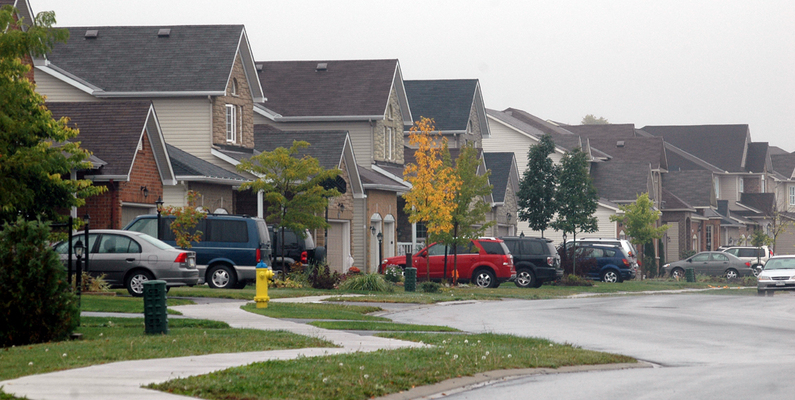
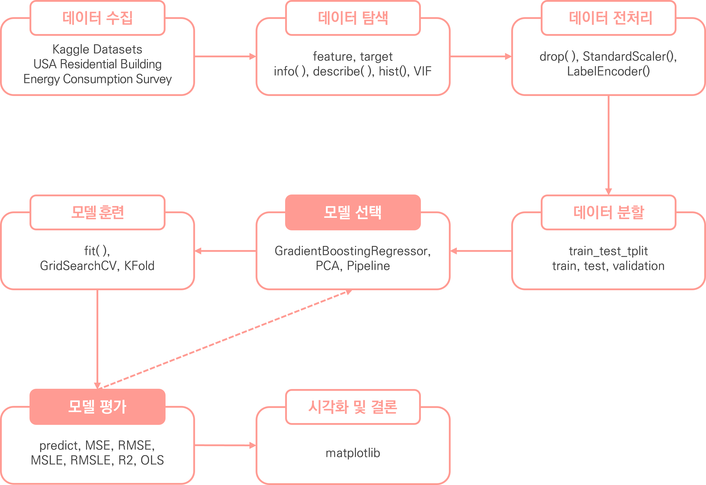
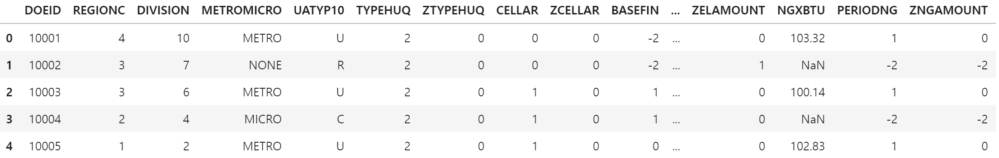
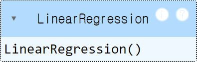
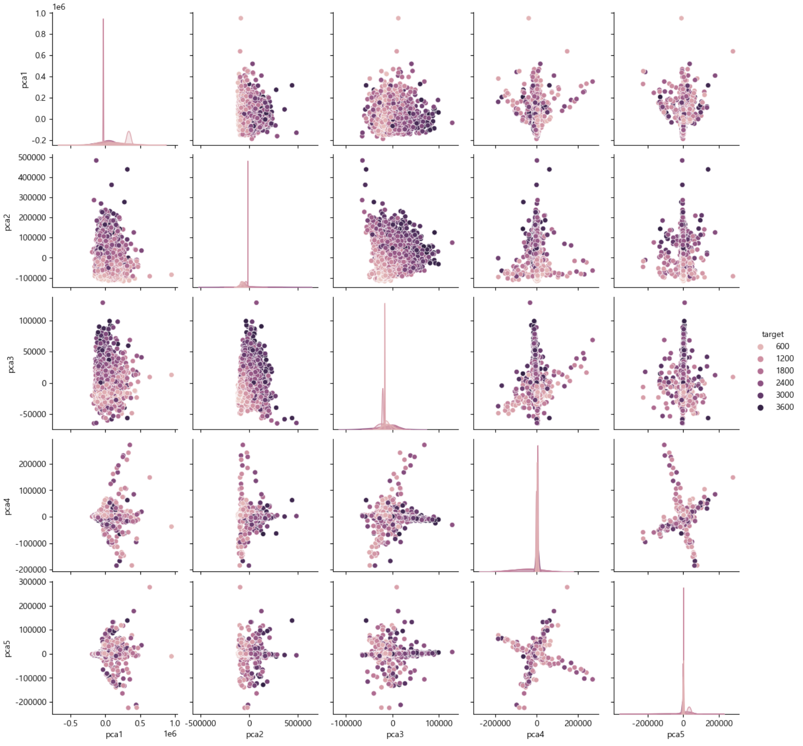

# USA Residential Building Energy Consumption Survey Regression Project
미국 주거용 건물 에너지 소비 회귀 분석

<br>



<br>

2024.05.15.

<br></br>
<br></br>
<br></br>
<br></br>
<br></br>

# Ⅰ. 프로젝트 개요
## 1. 프로젝트 목표
미래 에너지 수요 충족 및 건물 설계를 개선하기 위해 미국 주거용 건물 에너지 소비를 예측하는 머신러닝 모델 구현

<br></br>
<br></br>

## 2. 프로젝트 기대효과
✔ 효율적인 에너지 관리 및 절감  
에너지 소비를 예측하여 소비 패턴을 이해하고 에너지 공급을 효율적으로 관리

<br>

✔ 건물 설계 최적화  
에너지 소비 예측 모델을 통해 에너지 효율성을 고려한 설계 개선하여 장기적인 에너지 비용 절감 및 지속 가능한 건물 촉진

<br></br>
<br></br>

## 3. 데이터 흐름
### ○ 데이터 분석 프로세스

<br>




<br></br>
<br></br>

## 4. 데이터 수집
✔ 데이터 정보  
Kaggle의 USA Residential Building Energy Consumption Survey 데이터 세트 활용 (CSV 파일)  
https://www.kaggle.com/datasets/claytonmiller/2015-residential-energy-consumption-survey

<br>

✔ 총 데이터 개수: 5686개 데이터

<br>

✔ feature (758개 feature)

<br>

✔ target (1개 target)

<br></br>
<br></br>
<br></br>
<br></br>
<br></br>

# Ⅱ. 데이터 탐색 및 전처리

## 1. 데이터 탐색
✔ head


<details>
  <summary>code</summary>

  ```
  # 상위 5개 데이터 확인
  r_df.head()
  ```
</details>

<br></br>

✔ tail


<details>
  <summary>code</summary>

  ```
  # 하위 5개 데이터 확인
  r_df.tail()
  ```
</details>

<br>

- 상/하위 다섯개 데이터를 확인한 결과 인덱스 외 고유의 ID 확인
- object 형식의 데이터 확인
- 결측치가 확인


<br></br>
<br></br>

## 2. 전처리
### ○ 결측치
✔ 2382개 결측치 제거

<details>
  <summary>결측치 확인 code</summary>

  ```
  # 결측치 확인
  pre_r_df.isna().sum().sum()
  ```
</details>
<details>
  <summary>결측치 제거 code</summary>

  ```
  # 결측치 제거
  pre_r_df = pre_r_df[~pre_r_df.isna().any(axis=1)].reset_index(drop=True)
  ```
</details>

<br></br>

### ○ null 데이터
✔ null 값은 존재하지 않는 것으로 확인

<details>
  <summary>code</summary>

  ```
  # null 값 확인
  pre_r_df.isnull().sum().sum()
  ```
</details>

<br></br>

### ○ 중복행
✔ 중복행은 존재하지 않는 것으로 확인

<details>
  <summary>code</summary>

  ```
  # 중복행 확인
  pre_r_df.duplicated().sum()
  ```
</details>

<br></br>

### ○ 컬럼 제거
✔ 불필요한 ID 컬럼 제거 (DOEID)

<details>
  <summary>code</summary>

  ```
  # 불필요한 컬럼 제거
  pre_r_df = pre_r_df.drop(labels='DOEID', axis=1)
  ```
</details>

<br></br>

### ○ LabelEncoder
✔ 데이터 정보 확인 결과 object 형식의 4개 열이 확인됨  
✔ LabelEncoder를 통해 정수로 변환함

<details>
  <summary>oject 확인 code</summary>

  ```
  # 오브젝트 형태를 띄는 열 찾기
  object_columns = pre_r_df.select_dtypes(include=['object']).columns
  object_columns
  ```
</details>
<details>
  <summary>컬럼 고유 값 확인 code</summary>

  ```
  # object 컬럼의 고유 값 확인
  columns = ['METROMICRO', 'UATYP10', 'CLIMATE_REGION_PUB', 'IECC_CLIMATE_PUB']

  for column in columns:
      print(pre_r_df[column].unique())
  ```
</details>
<details>
  <summary>LabelEncoder code</summary>

  ```
  from sklearn.preprocessing import LabelEncoder

  # 데이터 프레임 복제
  enc_r_df = pre_r_df.copy()
  encoders = {}

  # 문자열 컬럼 추출
  columns = columns = ['METROMICRO', 'UATYP10', 'CLIMATE_REGION_PUB', 'IECC_CLIMATE_PUB']

  # 반복하여 컬럼 인코딩 처리:
  for column in columns:
      # 레이블인코더 객체 생성
      encoder = LabelEncoder()
      # 문자열 데이터 정수로 형변환
      result = encoder.fit_transform(enc_r_df[column])
      # 형변환 값으로 대체
      enc_r_df[column] = result
      # 원본 데이터 담기
      encoders[column] = encoder.classes_

  encoders
  ```
</details>

<br></br>
<br></br>
<br></br>
<br></br>
<br></br>

# Ⅲ 머신러닝
## 1. 평가 지표
<table>
  <tr>
      <td>연번</td>
      <td> 평가지표</td>
      <td>산출 코드</td>
  </tr>
  <tr>
      <td>1</td>
      <td>MSE</td>
      <td>mean_squared_error(y_test, prediction)</td>
  </tr>
  <tr>
      <td>2</td>
      <td>RMSE</td>
      <td>np.sqrt(MSE)</td>
  </tr>
  <tr>
      <td>3</td>
      <td>R2</td>
      <td>r2_score(y_test, prediction)</td>
  </tr>
</table>

<details>
  <summary>code</summary>

  ```
  import numpy as np
  from sklearn.metrics import mean_squared_log_error, mean_squared_error, r2_score

  def get_evaluation(y_test, prediction):
      MSE = mean_squared_error(y_test, prediction)
      RMSE = np.sqrt(MSE)
      R2 = r2_score(y_test, prediction)
      print('MSE: {:.4f}, RMSE: {:.4f}, R2: {:.4f}'\
          .format(MSE, RMSE, R2))
  ```
</details>

<br></br>
<br></br>

## 2. 1Cycle
### ○ 훈련



<details>
  <summary>code</summary>

  ```
  import numpy as np
  from sklearn.linear_model import LinearRegression
  from sklearn.model_selection import train_test_split

  # 데이터 세트 분리
  # 피처, 타겟 데이터 분리
  features, targets = enc_r_df.iloc[:, :-1], enc_r_df.iloc[:, -1]

  # 학습/테스트 및 문제/정답 데이터 세트 분리
  X_train, X_test, y_train, y_test = \
  train_test_split(features, targets, test_size=0.2, random_state=124)

  # 선형 회귀 모델
  l_r = LinearRegression()
  # 훈련
  l_r.fit(X_train, y_train)
  ```
</details>

<br></br>

### ○ 예측 및 평가  
MSE: 0.0267, RMSE: 0.1635, R2: 1.0000
<details>
  <summary>code</summary>

  ```
  # 예측
  prediction = l_r.predict(X_test)
  # 평가
  get_evaluation(y_test, prediction)
  ```
</details>

<br></br>

### ○ 분석
- LinearRegression을 통한 학습 결과 R2 점수가 1.0로 보이고 있음
- 추가적인 전처리 과정을 통해 수치를 조정a해보려 함

<br></br>
<br></br>

## 3. 2Cycle
### ○ 이상치 제거
✔ StandardScaler를 통해 데이터 변환 후 이상치 제거

<details>
  <summary>code</summary>

  ```
  # 타겟 데이터 이상치 제거
  from sklearn.preprocessing import StandardScaler

  dro_r_df = enc_r_df.copy()

  # 표준화 객체 생성
  std = StandardScaler()
  # 데이터 표준화 변환
  result = std.fit_transform(dro_r_df)
  # 표준화 데이터 프레임 생성
  std_r_df = pd.DataFrame(result, columns=dro_r_df.columns)

  for column in std_r_df.columns:
      # 타겟 데이터 이상치 제거
      copy_std_r_df = std_r_df[std_r_df[column].between(-1.96, 1.96)]

  # 이상치 제거후 유지되는 인덱스를 대조하여 원본 데이터 이상치 제거
  dro_r_df = dro_r_df.iloc[copy_std_r_df.index].reset_index(drop=True)
  dro_r_df
  ```
</details>

<br></br>

### ○ 종속 변수 분포
✔ 이상치 제거 후 종속 변수 분포 확인


<details>
  <summary>code</summary>

  ```
  # 타겟 컬럼 분포 확인
  dro_r_df.target.hist(color=cmap(np.array([1])), edgecolor='black')
  ```
</details>

<br></br>

### ○ 훈련


<details>
  <summary>code</summary>

  ```
  import numpy as np
  from sklearn.linear_model import LinearRegression
  from sklearn.model_selection import train_test_split

  # 데이터 세트 분리
  # 피처, 타겟 데이터 분리
  features, targets = dro_r_df.iloc[:, :-1], dro_r_df.iloc[:, -1]

  # 학습/테스트 및 문제/정답 데이터 세트 분리
  X_train, X_test, y_train, y_test = \
  train_test_split(features, targets, test_size=0.2, random_state=124)

  # 선형 회귀 모델
  l_r = LinearRegression()
  # 훈련
  l_r.fit(X_train, y_train)
  ```
</details>


<br></br>

### ○ 예측 및 평가  
MSE: 0.0001, RMSE: 0.0076, R2: 1.0000
<details>
  <summary>code</summary>

  ```
  # 예측
  prediction = l_r.predict(X_test)
  # 평가
  get_evaluation(y_test, prediction)
  ```
</details>

<br></br>

### ○ 분석
✔  이상치 제거 후에도 R2 점수가 동일하게 1.0으로 나타남  
✔  이상치 제거 후 종속 변수의 분포가 정규분포 모양에 가까워짐에 따라 이상치를 제거하여 진행

<br></br>
<br></br>

## 4. 3Cycle
### ○ 차원축소



<br>

✔ 차원축소 후 보존율이 약 0.5964으로 나옴에 따라 차원 축소 후에도 데이터 상당 부분이 유지됨을 알 수 있음
✔ 몇몇 데이터가 다른 데이터와 떨어져있지만, 전반적으로 고르게 분포되어 있음

<details>
  <summary>데이터 분리 code</summary>

  ```
  import numpy as np
  from sklearn.linear_model import LinearRegression
  from sklearn.model_selection import train_test_split

  # 데이터 세트 분리
  # 피처, 타겟 데이터 분리
  features, targets = dro_r_df.iloc[:, :-1], dro_r_df.iloc[:, -1]

  # 학습/테스트 및 문제/정답 데이터 세트 분리
  X_train, X_test, y_train, y_test = \
  train_test_split(features, targets, test_size=0.2, random_state=124)

  # 학습 및 테스트 데이터로 병합
  train_df = pd.concat([X_train, y_train], axis=1).reset_index(drop=True)
  test_df = pd.concat([X_test, y_test], axis=1).reset_index(drop=True)
  ```
</details>
<details>
  <summary>차원축소 code</summary>

  ```
  from sklearn.decomposition import PCA

  # 차원 축소 객체 생성
  # n_components: 얼마나 차원축소할 건지 작성
  pca = PCA(n_components=5)

  # 타겟을 제외하고 피처만 차원 축소
  pca_train = pca.fit_transform(train_df.iloc[:, :-1])
  pca_test = pca.fit_transform(test_df.iloc[:, :-1])

  # 크기 확인
  print(pca_train.shape, pca_test.shape)
  ```
</details>
<details>
  <summary>데이터 프레임 생성 code</summary>

  ```
  # train
  # 컬럼명 설정
  pca_columns = [f'pca{i + 1}' for i in range(pca_train.shape[1])]

  # 차원 축소 데이터 프레임 생성
  pca_train_df = pd.DataFrame(pca_train, columns=pca_columns)
  # 타겟 데이터 추가
  pca_train_df.loc[:, 'target'] = train_df['target']

  # test
  # 컬럼명 설정
  pca_columns = [f'pca{i + 1}' for i in range(pca_test.shape[1])]

  # 차원 축소 데이터 프레임 생성
  pca_test_df = pd.DataFrame(pca_test, columns=pca_columns)
  # 타겟 데이터 추가
  pca_test_df.loc[:, 'target'] = test_df['target']
  ```
</details>
<details>
  <summary>보존율 확인 code</summary>

  ```
  # 보존율 확인
  # 각각의 피처가 얼만큼 설명하고 있는지
  print(pca.explained_variance_ratio_)
  print(pca.explained_variance_ratio_.sum())
  ```
</details>

<br></br>

### ○ 선형 회귀
